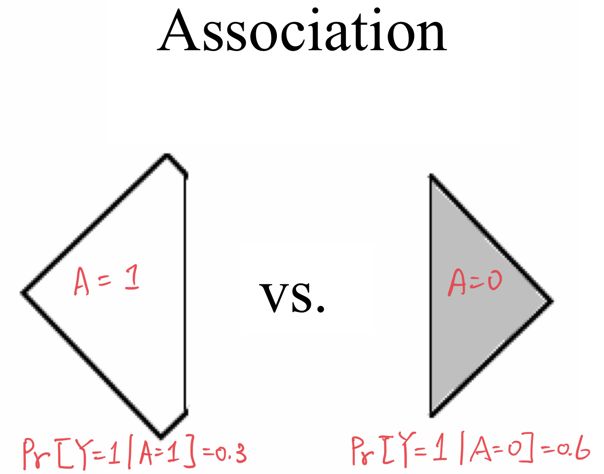
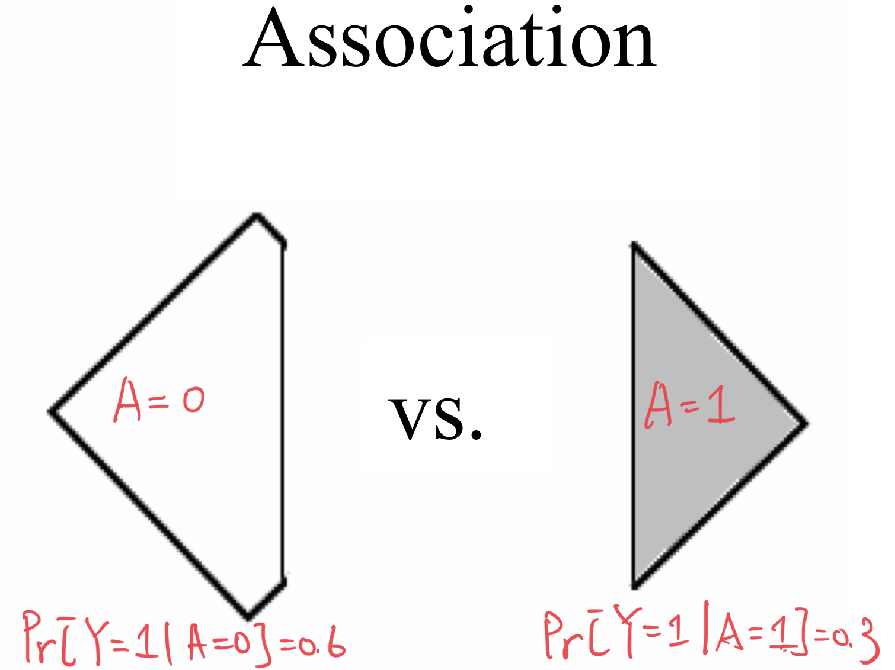
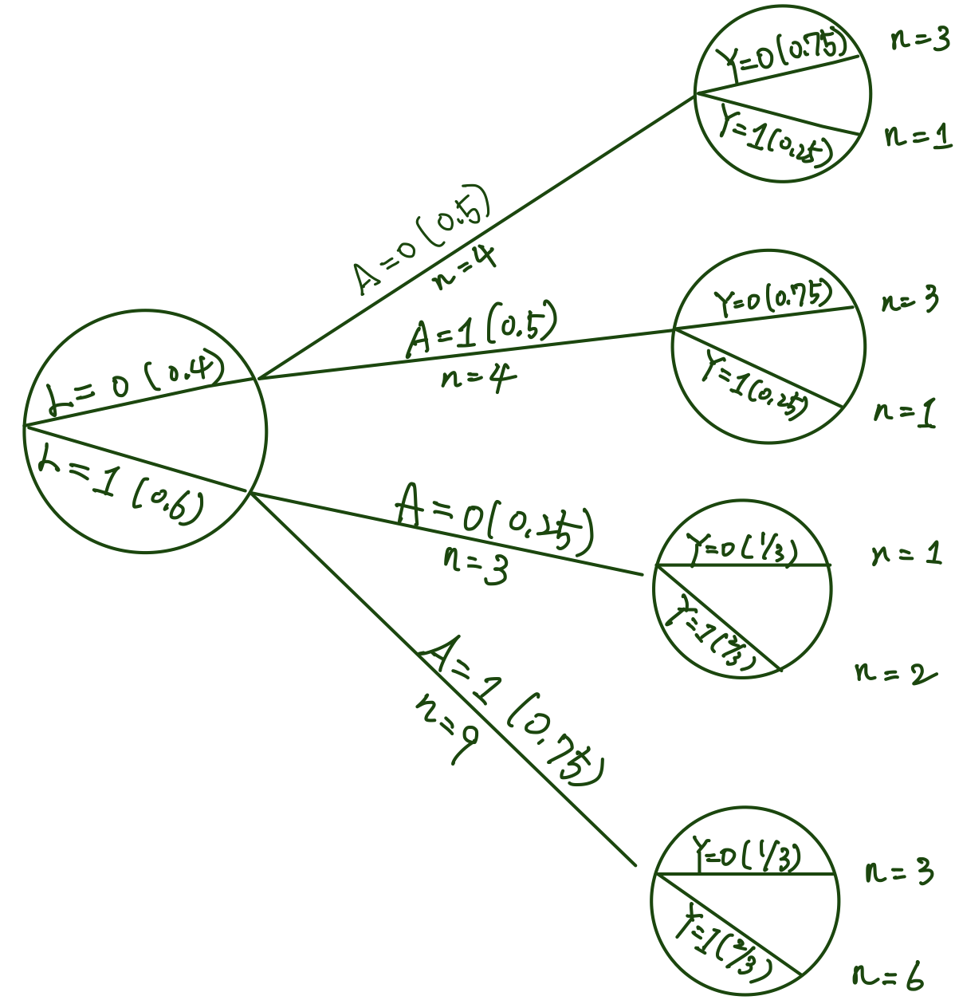
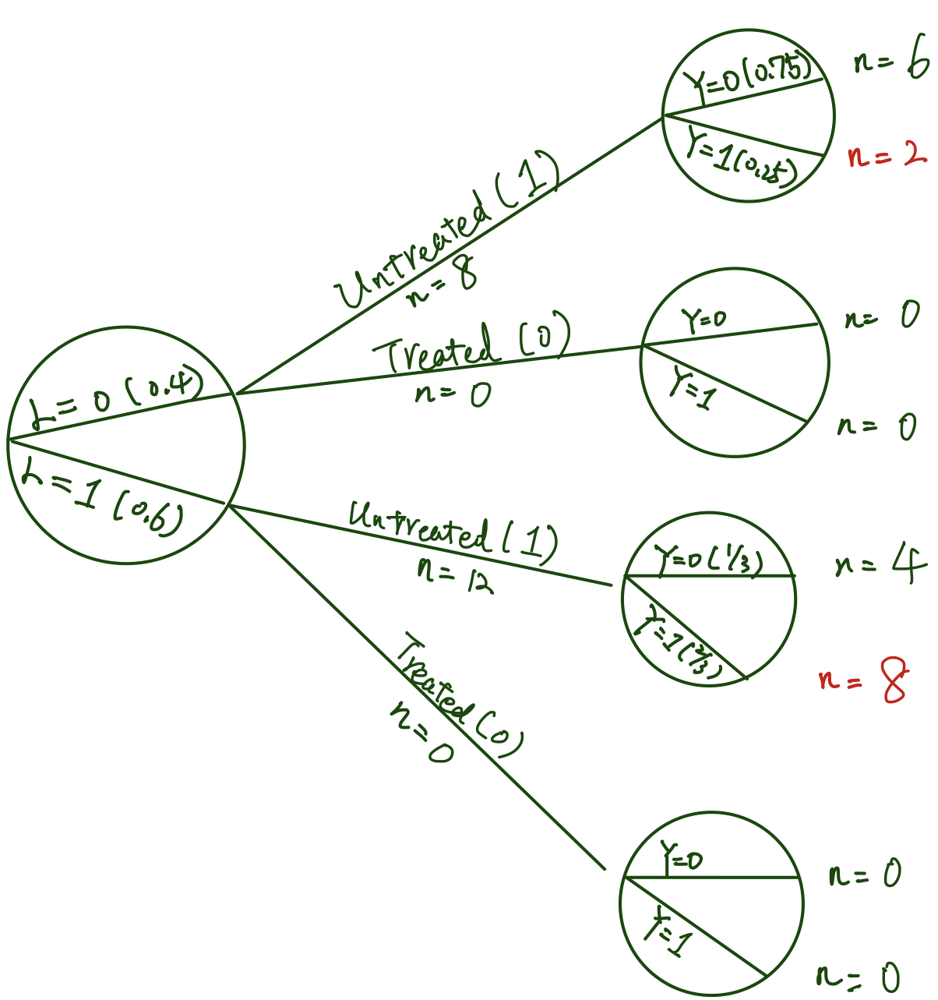
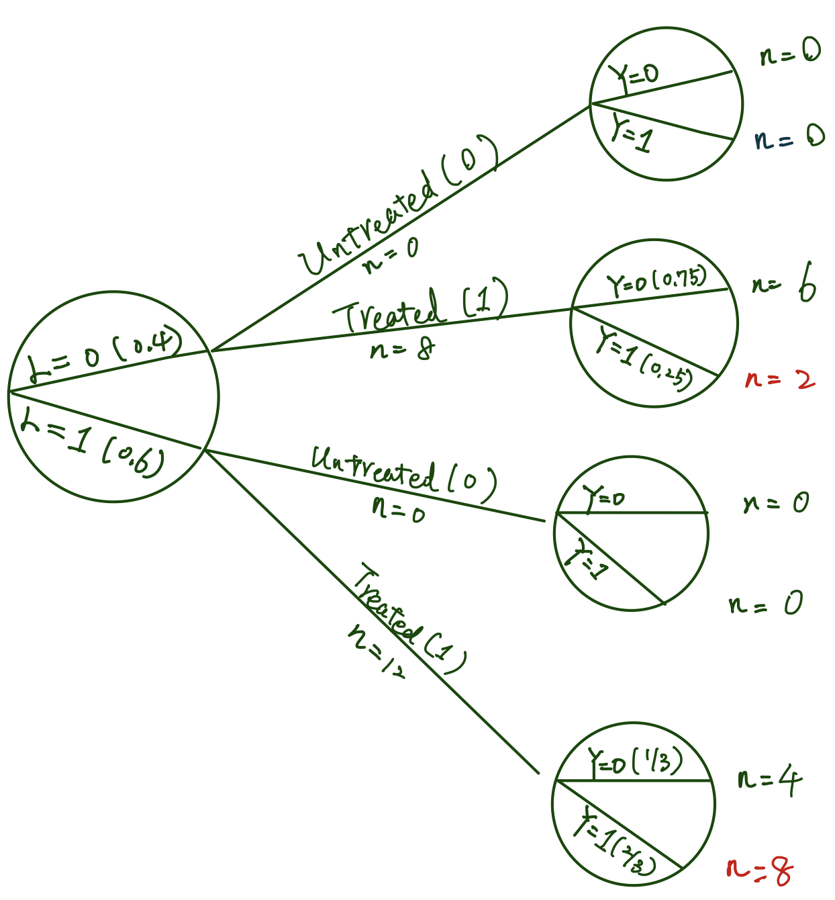
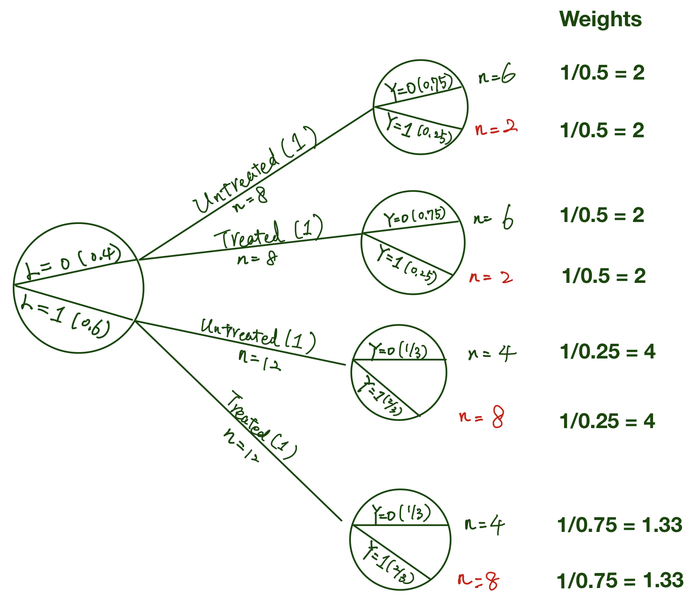

class: middle, inverse, center

# Chapter 1 <br> Definition


---
class: middle

## Outline

.large[
- Purpose
1. Individual causal effect
2. Average causal effects
3. Measures of causal effect
4. Random variability
5. Causation versus association
]

---
class: middle

## Purpose

.full-width[.content-box-red[.bold[
To introduce the **mathematical notation** <br> that could formalize the causal intuition.
]]]

---
class: middle

## Individual causal effect (1)

.full-width[.content-box-red[.bold[
We compare (mentally) the outcome <br> **when an action $A$ is taken** <br> with the outcome <br> **when the action $A$ is withheld.**
]]]

.med[
- Zeus is waiting for a heart transplant. 
  - He dies five days later after receiving a new heart
  - He survives five days later if he did not had transplant
  - We say **the heart transplant caused** Zeus's death.
]

---
class: middle

## Individual causal effect (2)

.full-width[.content-box-red[.bold[
We compare (mentally) the outcome <br> **when an action $A$ is taken** <br> with the outcome <br> **when the action $A$ is withheld.**
]]]

.med[
- Hera is also waiting for a heart transplant. 
  - She survives five days later after heart transplant
  - She also survives five days later if she did not had transplant
  - We say **the heart transplant has no causal effect**.
]

---
class: middle
## Individual causal effect (3)

.full-width[.content-box-red[.bold[
We compare (mentally) the outcome 
<br> **when an action $A$ is taken** 
<br> with the outcome 
<br> **when the action $A$ is withheld.** 
<br>  $A$ could be an intervention, an exposure, 
<br>  or a treatment.
]]]

---
class: middle
## Individual causal effect (4)

- Consider a dichotomous treatment variable $A$
    - 1 = treated
    - 0 = untreated
- And a dichotomous outcome variable $Y$
    - 1 = death
    - 0 = survival
- We define: 
    - $Y^{a = 1}$: the outcome that would be observed under treatment $a = 1$
    - $Y^{a = 0}$: $Y$ under treatment $a = 0$
 
---
class: middle
## Individual causal effect (5)

.pull-left[
- Zeus has: 
    - $Y^{a = 1} = 1$
    - $Y^{a = 0} = 0$
- Hera has: 
    - $Y^{a = 1} = 0$
    - $Y^{a = 0} = 0$
]

.pull-right[
- $Y^{a = 1} \neq Y^{a = 0}$ <br> then there is a <br> **causal effect**
- $Y^{a = 1}, Y^{a = 0}$ are <br> **potential or counterfactual outcomes**
]

???
- "Potential" because either of these two outcomes can be potentially observed
- "Counterfactual" because these outcomes represent situations that may not actually occur


---
class: middle
## Individual causal effect (6)


.full-width[.content-box-red[.bold[
**Consistency:**
<br> For each individual, one of the potential 
<br> outcomes will actually occur. 
<br> For example, Zeus was actually treated 
<br> $(A = 1)$, his counterfactual outcome 
<br> $Y^{a = 1} = 1$ is equal to what was observed. 
<br> $Y = Y^{a = 1} = 1$ is called **consistency**.
]]]


---
class: middle
## Average causal effect (1)

.full-width[.content-box-red[.bold[
We need three pieces of information: 
- an outcome of interest
- the action $a = 1, a= 0$ to be compared
- the counterfactual outcomes $Y^{a = 1}, Y^{a = 0}$
]]]

.med[Normally it is not possible to identify individual causal effects. We turn to an **aggregated causal effect**.]


---
class: middle
## Average causal effect (2)

.pull-left[
<style type="text/css">
.tg  {border-collapse:collapse;border-color:#bbb;border-spacing:0;}
.tg td{background-color:#E0FFEB;border-color:#bbb;border-style:solid;border-width:0px;color:#594F4F;
  font-family:Arial, sans-serif;font-size:14px;overflow:hidden;padding:10px 5px;word-break:normal;}
.tg th{background-color:#9DE0AD;border-color:#bbb;border-style:solid;border-width:0px;color:#493F3F;
  font-family:Arial, sans-serif;font-size:14px;font-weight:normal;overflow:hidden;padding:10px 5px;word-break:normal;}
.tg .tg-1wig{font-weight:bold;text-align:left;vertical-align:top}
.tg .tg-cyim{font-size:20px;text-align:left;vertical-align:top}
.tg .tg-bhpp{font-size:20px;font-weight:bold;text-align:left;vertical-align:top}
.tg .tg-0lax{text-align:left;vertical-align:top}
</style>
<table class="tg">
<thead>
  <tr>
    <th class="tg-0lax"></th>
    <th class="tg-1wig">\[\mathbf{Y^{a = 0}}\] </th>
    <th class="tg-1wig"> \[\mathbf{Y^{a = 1}}\] </th>
    <th class="tg-0lax"></th>
    <th class="tg-1wig"> \[\mathbf{Y^{a = 0}}\] </th>
    <th class="tg-1wig"> \[\mathbf{Y^{a = 1}}\] </th>
  </tr>
</thead>
<tbody>
  <tr>
    <td class="tg-bhpp">Rheia</td>
    <td class="tg-cyim">0</td>
    <td class="tg-cyim">1</td>
    <td class="tg-bhpp">Leto</td>
    <td class="tg-cyim">0</td>
    <td class="tg-cyim">1</td>
  </tr>
  <tr>
    <td class="tg-bhpp">Kronos</td>
    <td class="tg-cyim">1</td>
    <td class="tg-cyim">0</td>
    <td class="tg-bhpp">Ares</td>
    <td class="tg-cyim">1</td>
    <td class="tg-cyim">1</td>
  </tr>
  <tr>
    <td class="tg-bhpp">Demeter</td>
    <td class="tg-cyim">0</td>
    <td class="tg-cyim">0</td>
    <td class="tg-bhpp">Athena</td>
    <td class="tg-cyim">1</td>
    <td class="tg-cyim">1</td>
  </tr>
  <tr>
    <td class="tg-bhpp">Hades</td>
    <td class="tg-cyim">0</td>
    <td class="tg-cyim">0</td>
    <td class="tg-bhpp">Hephaestus</td>
    <td class="tg-cyim">0</td>
    <td class="tg-cyim">1</td>
  </tr>
  <tr>
    <td class="tg-bhpp">Hestia</td>
    <td class="tg-cyim">0</td>
    <td class="tg-cyim">0</td>
    <td class="tg-bhpp">Aphrodite</td>
    <td class="tg-cyim">0</td>
    <td class="tg-cyim">1</td>
  </tr>
  <tr>
    <td class="tg-bhpp">Poseidon</td>
    <td class="tg-cyim">1</td>
    <td class="tg-cyim">0</td>
    <td class="tg-bhpp">Cyclope</td>
    <td class="tg-cyim">0</td>
    <td class="tg-cyim">1</td>
  </tr>
  <tr>
    <td class="tg-bhpp">Hera</td>
    <td class="tg-cyim">0</td>
    <td class="tg-cyim">0</td>
    <td class="tg-bhpp">Persephone</td>
    <td class="tg-cyim">1</td>
    <td class="tg-cyim">1</td>
  </tr>
  <tr>
    <td class="tg-bhpp">Zeus</td>
    <td class="tg-cyim">0</td>
    <td class="tg-cyim">1</td>
    <td class="tg-bhpp">Hermes</td>
    <td class="tg-cyim">1</td>
    <td class="tg-cyim">0</td>
  </tr>
  <tr>
    <td class="tg-bhpp">Artemis</td>
    <td class="tg-cyim">1</td>
    <td class="tg-cyim">1</td>
    <td class="tg-bhpp">Hebe</td>
    <td class="tg-cyim">1</td>
    <td class="tg-cyim">0</td>
  </tr>
  <tr>
    <td class="tg-bhpp">Apollo</td>
    <td class="tg-cyim">1</td>
    <td class="tg-cyim">0</td>
    <td class="tg-bhpp">Dionysus</td>
    <td class="tg-cyim">1</td>
    <td class="tg-cyim">0</td>
  </tr>
</tbody>
</table>
]

.pull-right[.small[
- 10 out of 20 would have died if they had received the treatment
$\text{Pr}[\mathbf{Y}^{a = 1} = 1] = 10/20 \\ = 0.5$

- 10 out of 20 would have died if they if they had not received the treatment
$\text{Pr}[\mathbf{Y}^{a = 0} = 1] = 10/20 \\ = 0.5$
]]

---
class: middle
## Average causal effect (3)


.full-width[.content-box-red[.bold[
An **average causal effect** of treatment $A$ on outcome $Y$ is present if 

$$
\text{Pr}[\mathbf{Y}^{a = 1} = 1] \neq \text{Pr}[\mathbf{Y}^{a = 0} = 1]
$$
]]]

In the previous table, because $\text{Pr}[\mathbf{Y}^{a = 1} = 1] = \text{Pr}[\mathbf{Y}^{a = 0} = 1] = 0.5$, 
<br> we say that the average causal effect is null, or the
<br> **null hypothesis of no average causal effect is true**.


---
class: middle

## Measures of causal effect (1)

.full-width[.content-box-red[.bold[
These are equivalent ways of representing the causal null: 

- **Risk difference**: $\text{Pr}[\mathbf{Y}^{a = 1} = 1] - \text{Pr}[\mathbf{Y}^{a = 0} = 1] = 0$
- **Risk ratio**: 
$\frac{\text{Pr}[\mathbf{Y}^{a = 1} = 1]}{\text{Pr}[\mathbf{Y}^{a = 0} = 1]} = 1$
- **Odds ratio**: 
$\frac{\text{Pr}[\mathbf{Y}^{a = 1} = 1] / \text{Pr}[\mathbf{Y}^{a = 1} = 0]}{\text{Pr}[\mathbf{Y}^{a = 0} = 1]/\text{Pr}[\mathbf{Y}^{a = 0} = 0]} = 1$
]]]


---
class: middle

## Measures of causal effect (2)

.med[
- Causal risk difference, risk ratio, and odds ratio
    - quantify the strength of the same causal effect on **different scales**
    - also called **causal effects**
- Consider use different measures for different purposes:
    - 3 in a million vs. 1 in a million deaths
        - causal risk difference: 0.000002
        <br> the absolute number of cases of disease attributable to the treatment.
        - causal risk ratio: 3
        <br> how many times treatment relative to no treatment increases the risk
]


---
class: middle

## Measures of causal effect (3) - **Number needed to treat, NNT**

.full-width[.content-box-red[.bold[
.small[
Consider 100 million patients in which 
<br> 20 million would die within 5 years if treated $(a = 1)$
<br> 30 million would die within 5 years if untreated $(a = 0)$
<br> the causal risk difference is 
<br> $\text{Pr}[\mathbf{Y}^{a = 1} = 1] - \text{Pr}[\mathbf{Y}^{a = 0} = 1] = 0.2 - 0.3 = -0.1$
- If one treats the 100 million patients, there will be 10 million fewer deaths 
- One needs to treat 100 million patients to save 10 million lives, i.e. **treat 10 patients to save 1 life (= NNT)**
- NNT is equal to the inverse of the causal risk difference
]

]]]


---
class: middle

## Random variability

.med[
- The populations of interest are typically much larger. In practice, we only collect information on a sample of the population of interest.

- The "hat" over $\text{Pr}$ indicates that the sample proportion $\widehat{\text{Pr}}[\mathbf{Y}^{a} = 1]$ is an **estimator** of the corresponding population quantity $\text{Pr}[\mathbf{Y}^{a} = 1]$. 

- **The larger** the number of individuals in the sample, **the smaller** the difference between $\widehat{\text{Pr}}[\mathbf{Y}^{a} = 1]$ and $\text{Pr}[\mathbf{Y}^{a} = 1]$ is expected to be.

- The error due to sampling variability is random.
]


---
class: middle

## Causation versus association (1)

.pull-left[
.med[In the real world, we only can observe one of these (potential) outcomes because the individual is either treated or untreated.
- 7 died in 13 who were treated $(A=1)$ 
$\text{Pr}[Y = 1|A = 1] \\ = 7/13$
- $\text{Pr}[Y = 1|A = a]$ conditional probability
]
]


.pull-right[
<style type="text/css">
.tg  {border-collapse:collapse;border-color:#bbb;border-spacing:0;}
.tg td{background-color:#E0FFEB;border-color:#bbb;border-style:solid;border-width:0px;color:#594F4F;
  font-family:Arial, sans-serif;font-size:14px;overflow:hidden;padding:10px 5px;word-break:normal;}
.tg th{background-color:#9DE0AD;border-color:#bbb;border-style:solid;border-width:0px;color:#493F3F;
  font-family:Arial, sans-serif;font-size:14px;font-weight:normal;overflow:hidden;padding:10px 5px;word-break:normal;}
.tg .tg-1wig{font-weight:bold;text-align:left;vertical-align:top}
.tg .tg-0lax{text-align:left;vertical-align:top}
</style>
<table class="tg">
<thead>
  <tr>
    <th class="tg-0lax"></th>
    <th class="tg-1wig">A</th>
    <th class="tg-1wig">Y</th>
    <th class="tg-0lax"></th>
    <th class="tg-1wig">A</th>
    <th class="tg-1wig">Y</th>
  </tr>
</thead>
<tbody>
  <tr>
    <td class="tg-1wig">Rheia</td>
    <td class="tg-0lax">0</td>
    <td class="tg-0lax">0</td>
    <td class="tg-1wig">Leto</td>
    <td class="tg-0lax">0</td>
    <td class="tg-0lax">0</td>
  </tr>
  <tr>
    <td class="tg-1wig">Kronos</td>
    <td class="tg-0lax">0</td>
    <td class="tg-0lax">1</td>
    <td class="tg-1wig">Ares</td>
    <td class="tg-0lax">1</td>
    <td class="tg-0lax">1</td>
  </tr>
  <tr>
    <td class="tg-1wig">Demeter</td>
    <td class="tg-0lax">0</td>
    <td class="tg-0lax">0</td>
    <td class="tg-1wig">Athena</td>
    <td class="tg-0lax">1</td>
    <td class="tg-0lax">1</td>
  </tr>
  <tr>
    <td class="tg-1wig">Hades</td>
    <td class="tg-0lax">0</td>
    <td class="tg-0lax">0</td>
    <td class="tg-1wig">Hephaestus</td>
    <td class="tg-0lax">1</td>
    <td class="tg-0lax">1</td>
  </tr>
  <tr>
    <td class="tg-1wig">Hestia</td>
    <td class="tg-0lax">1</td>
    <td class="tg-0lax">0</td>
    <td class="tg-1wig">Aphrodite</td>
    <td class="tg-0lax">1</td>
    <td class="tg-0lax">1</td>
  </tr>
  <tr>
    <td class="tg-1wig">Poseidon</td>
    <td class="tg-0lax">1</td>
    <td class="tg-0lax">0</td>
    <td class="tg-1wig">Cyclope</td>
    <td class="tg-0lax">1</td>
    <td class="tg-0lax">1</td>
  </tr>
  <tr>
    <td class="tg-1wig">Hera</td>
    <td class="tg-0lax">1</td>
    <td class="tg-0lax">0</td>
    <td class="tg-1wig">Persephone</td>
    <td class="tg-0lax">1</td>
    <td class="tg-0lax">1</td>
  </tr>
  <tr>
    <td class="tg-1wig">Zeus</td>
    <td class="tg-0lax">1</td>
    <td class="tg-0lax">1</td>
    <td class="tg-1wig">Hermes</td>
    <td class="tg-0lax">1</td>
    <td class="tg-0lax">0</td>
  </tr>
  <tr>
    <td class="tg-1wig">Artemis</td>
    <td class="tg-0lax">0</td>
    <td class="tg-0lax">1</td>
    <td class="tg-1wig">Hebe</td>
    <td class="tg-0lax">1</td>
    <td class="tg-0lax">0</td>
  </tr>
  <tr>
    <td class="tg-1wig">Apollo</td>
    <td class="tg-0lax">0</td>
    <td class="tg-0lax">1</td>
    <td class="tg-1wig">Dionysus</td>
    <td class="tg-0lax">1</td>
    <td class="tg-0lax">0</td>
  </tr>
</tbody>
</table>
]


---
class: middle

## Causation versus association (2)


- When $\text{Pr}[Y = 1|A = 1] = \text{Pr}[Y = 1|A = 0]$ <br> we say that treatment $A$ and outcome $Y$ are **independent**: $A \perp \!\!\! \perp Y$ 

- We say that treatment $A$ is not associated with $Y$ or, $A$ does not predict $Y$.

- We also say that $A$ is associated with $Y$ if $\text{Pr}[Y = 1|A = 1] \neq \text{Pr}[Y = 1|A = 0]$

---
class: middle

## Association measures

Similarly, associational risk differences, risk ratio, and odds ratio can be defined as: 

.full-width[.content-box-red[.bold[
- **Risk difference**: $\text{Pr}[Y =1 | A= 1] - \text{Pr}[Y = 1| A= 0]$ 
- **Risk ratio**: $\frac{\text{Pr}[Y =1 | A= 1]}{\text{Pr}[Y = 1| A= 0]}$
- **Odds ratio**: $\frac{\text{Pr}[Y =1 | A= 1] / \text{Pr}[Y = 0 | A= 1]}{\text{Pr}[Y = 1| A= 0] / \text{Pr}[Y = 0| A= 0]}$
]]]


---
class: middle

## Causation versus association (3)

In our sample of 20 individuals, we found 

1. no causal effect, because <br> $\text{Pr}[\mathbf{Y}^{a = 1} = 1] - \text{Pr}[\mathbf{Y}^{a = 0} = 1] = 0.5 - 0.5 = 0$
2. an association because <br> $\text{Pr}[Y =1 | A= 1] - \text{Pr}[Y = 1| A= 0] \\ =7/13 - 3/7 = 0.11$ 


---
class: top, center
background-image: url("./fig/causalassociation.png")
background-position: 50% 50%
background-size: contain


---
class: middle

## Causation versus association (4)

1. **Causation**:a contrast between the whole white diamond (**all individuals treated**) and the whole grey diamond (**all individuals untreated**). <br> .blue[*"What would be the risk if everybody had been treated/untreated?"*]

2. Whereas **association**: a contrast between the white (**the treated**) and the grey (**the untreated**) <br> .blue[*"What is the risk in the treated/untreated?"*]


---
class: middle
## Association is not causation

In our example, 
- There was association because risk in the treated (= 7/13) was greater than risk in the untreated (3/7).
- There was no causation because risk if everybody treated was the same as the risk if everybody was untreated.


---
class: middle

## Association is not causation

Suppose that 5-year mortality for aspirin vs. no aspirin, 

- causal risk ratio is 0.5 
- associational risk ratio is 1.5 

This is possible because individuals at high risk of CVD death are preferentially prescribed aspirin. 
If a physician decides to withhold aspirin because those who treated had a greater risk of dying compared with untreated. This is a malpractice.


---
class: top, center, inverse
background-image: url("./fig/causalnotassociation.mp4")
background-position: 50% 50%
background-size: contain

---
class: middle, inverse, center

# Chapter 2 <br> Randomized Experiments


---
class: middle

## Outline

- Randomization

- Conditional randomization

- Standardization

- Inverse probability weighting


---
class: middle 

### Only one of the counterfactual outcome is known 

<style type="text/css">
.tg  {border-collapse:collapse;border-color:#bbb;border-spacing:0;}
.tg td{background-color:#E0FFEB;border-color:#bbb;border-style:solid;border-width:1px;color:#594F4F;
  font-family:Arial, sans-serif;font-size:16px;overflow:hidden;padding:10px 5px;word-break:normal;}
.tg th{background-color:#9DE0AD;border-color:#bbb;border-style:solid;border-width:1px;color:#493F3F;
  font-family:Arial, sans-serif;font-size:18px;font-weight:normal;overflow:hidden;padding:10px 5px;word-break:normal;}
.tg .tg-1wig{font-weight:bold;text-align:left;vertical-align:top}
.tg .tg-cmwg{background-color:#ffccc9;text-align:center;vertical-align:top}
.tg .tg-pbtr{background-color:#ffccc9;font-weight:bold;text-align:center;vertical-align:top}
.tg .tg-baqh{text-align:center;vertical-align:top}
.tg .tg-0lax{text-align:left;vertical-align:top}
.tg .tg-amwm{font-weight:bold;text-align:center;vertical-align:top}
.tg .tg-5qfb{background-color:#ffce93;font-weight:bold;text-align:center;vertical-align:top}
.tg .tg-ifcm{background-color:#ffce93;text-align:center;vertical-align:top}
</style>
<table class="tg">
<thead>
  <tr>
    <th class="tg-0lax"></th>
    <th class="tg-amwm"> \[A\] </th>
    <th class="tg-amwm">\[Y\]</th>
    <th class="tg-pbtr">\[Y^0\]</th>
    <th class="tg-5qfb">\[Y^1\]</th>
    <th class="tg-0lax"></th>
    <th class="tg-baqh">\[A\]</th>
    <th class="tg-amwm">\[Y\]</th>
    <th class="tg-pbtr">\[Y^0\]</th>
    <th class="tg-5qfb">\[Y^1\]</th>
  </tr>
</thead>
<tbody>
  <tr>
    <td class="tg-1wig">Rheia</td>
    <td class="tg-baqh">0</td>
    <td class="tg-baqh">0</td>
    <td class="tg-cmwg">0</td>
    <td class="tg-ifcm">?</td>
    <td class="tg-1wig">Leto</td>
    <td class="tg-baqh">0</td>
    <td class="tg-baqh">0</td>
    <td class="tg-cmwg">0</td>
    <td class="tg-ifcm">?</td>
  </tr>
  <tr>
    <td class="tg-1wig">Kronos</td>
    <td class="tg-baqh">0</td>
    <td class="tg-baqh">1</td>
    <td class="tg-cmwg">1</td>
    <td class="tg-ifcm">?</td>
    <td class="tg-1wig">Ares</td>
    <td class="tg-baqh">1</td>
    <td class="tg-baqh">1</td>
    <td class="tg-cmwg">?</td>
    <td class="tg-ifcm">1</td>
  </tr>
  <tr>
    <td class="tg-1wig">Demeter</td>
    <td class="tg-baqh">0</td>
    <td class="tg-baqh">0</td>
    <td class="tg-cmwg">0</td>
    <td class="tg-ifcm">?</td>
    <td class="tg-1wig">Athena</td>
    <td class="tg-baqh">1</td>
    <td class="tg-baqh">1</td>
    <td class="tg-cmwg">?</td>
    <td class="tg-ifcm">1</td>
  </tr>
  <tr>
    <td class="tg-1wig">Hades</td>
    <td class="tg-baqh">0</td>
    <td class="tg-baqh">0</td>
    <td class="tg-cmwg">0</td>
    <td class="tg-ifcm">?</td>
    <td class="tg-1wig">Hephaestus</td>
    <td class="tg-baqh">1</td>
    <td class="tg-baqh">1</td>
    <td class="tg-cmwg">?</td>
    <td class="tg-ifcm">1</td>
  </tr>
  <tr>
    <td class="tg-1wig">Hestia</td>
    <td class="tg-baqh">1</td>
    <td class="tg-baqh">0</td>
    <td class="tg-cmwg">?</td>
    <td class="tg-ifcm">0</td>
    <td class="tg-1wig">Aphrodite</td>
    <td class="tg-baqh">1</td>
    <td class="tg-baqh">1</td>
    <td class="tg-cmwg">?</td>
    <td class="tg-ifcm">1</td>
  </tr>
  <tr>
    <td class="tg-1wig">Poseidon</td>
    <td class="tg-baqh">1</td>
    <td class="tg-baqh">0</td>
    <td class="tg-cmwg">?</td>
    <td class="tg-ifcm">1</td>
    <td class="tg-1wig">Cyclope</td>
    <td class="tg-baqh">1</td>
    <td class="tg-baqh">1</td>
    <td class="tg-cmwg">?</td>
    <td class="tg-ifcm">1</td>
  </tr>
  <tr>
    <td class="tg-1wig">Hera</td>
    <td class="tg-baqh">1</td>
    <td class="tg-baqh">0</td>
    <td class="tg-cmwg">?</td>
    <td class="tg-ifcm">1</td>
    <td class="tg-1wig">Persephone</td>
    <td class="tg-baqh">1</td>
    <td class="tg-baqh">1</td>
    <td class="tg-cmwg">?</td>
    <td class="tg-ifcm">1</td>
  </tr>
  <tr>
    <td class="tg-1wig">Zeus</td>
    <td class="tg-baqh">1</td>
    <td class="tg-baqh">1</td>
    <td class="tg-cmwg">?</td>
    <td class="tg-ifcm">1</td>
    <td class="tg-1wig">Hermes</td>
    <td class="tg-baqh">1</td>
    <td class="tg-baqh">0</td>
    <td class="tg-cmwg">?</td>
    <td class="tg-ifcm">0</td>
  </tr>
  <tr>
    <td class="tg-1wig">Artemis</td>
    <td class="tg-baqh">0</td>
    <td class="tg-baqh">1</td>
    <td class="tg-cmwg">1</td>
    <td class="tg-ifcm">?</td>
    <td class="tg-1wig">Hebe</td>
    <td class="tg-baqh">1</td>
    <td class="tg-baqh">0</td>
    <td class="tg-cmwg">?</td>
    <td class="tg-ifcm">0</td>
  </tr>
  <tr>
    <td class="tg-1wig">Apollo</td>
    <td class="tg-baqh">0</td>
    <td class="tg-baqh">1</td>
    <td class="tg-cmwg">1</td>
    <td class="tg-ifcm">?</td>
    <td class="tg-1wig">Dionysus</td>
    <td class="tg-baqh">1</td>
    <td class="tg-baqh">0</td>
    <td class="tg-cmwg">?</td>
    <td class="tg-ifcm">0</td>
  </tr>
</tbody>
</table>

???
The data in this table can only good to compute association measures.


---
class: middle

## Randomization

- Randomized studies also can only generate data with missing values of the counterfactual outcomes

- However, randomization ensures that these missing values **occurred by chance**.


---
class: middle
## Exchangeability (1)

.full-width[.content-box-red[.bold[
An ideal randomized experiments ensures that the treatment groups are **exchangeable**.
]]]

.pull-halfleft[.med[
- Treatment in white 

- associational risk ratio: 0.3/0.6 = 0.5
- associational risk difference: 0.3 - 0.6 = -0.3

]]

.pull-halfright[.med[
- Treatment in grey

- associational risk ratio: 0.3/0.6 = 0.5
- associational risk difference: 0.3 - 0.6 = -0.3
]]


---
class: middle
## Exchangeability (2)


.pull-halfleft[.med[
- Treatment in white 

- associational risk ratio: 0.3/0.6 = 0.5
- associational risk difference: 0.3 - 0.6 = -0.3
]]

.pull-halfright[.med[
- Treatment in grey

- associational risk ratio: 0.3/0.6 = 0.5
- associational risk difference: 0.3 - 0.6 = -0.3
]]

---
class: midde
## Exchangeability (3)


.full-width[.content-box-red[.bold[
.small[
- The risk under potential treatment $a$ **among the treated** <br> $\text{Pr}[Y^a = 1 | A =1]$ equals
- The risk under potential treatment $a$ **among the untreated** <br>  $\text{Pr}[Y^a = 1 | A =0]$ equals 
- The risk under potential treatment $a$ **in the whole population** <br> $\text{Pr}[Y^a = 1]$

$$Y^a \perp \!\!\! \perp A \forall \text{ (= for all) } a$$

- The actual treatment $A$ **does not predict** the counterfactual outcome $Y^a$.

- Randomization is so highly valued since it is expected to produce this exchangeability.
]]]]

---
class: midde
## Why exchangeability is so great?


.med[
In the presence of exchangeability. **Association is Causation.**

- The counterfactual risk in the treatment group is equal to the counterfactual risk under treatment in the entire population.

$$\text{Pr}[Y^{a = 1} = 1 | A =1] = \text{Pr}[Y^{a = 1} = 1]$$

- And the counterfactual risk in the treatment group is equal to their observed actual outcome (by consistency).

$$\text{Pr}[Y^{a = 1} = 1 | A =1] = \text{Pr}[Y = 1 | A = 1]$$

- **The risk in the treated is the same as the risk as if everybody was treated.**
]

---
class: middle, 

## Conditional randomization

.pull-left[.med[
- $L$ is a prognostic factor  <br> (1 if critical condition,  <br>  0 otherwise)
- Conditional randomization design: 
    - Randomly select 75% from those who is in critical condition
    - Randomly select 50% from those who is in noncritical condition

]]

.pull-right[
<style type="text/css">
.tg  {border-collapse:collapse;border-color:#bbb;border-spacing:0;}
.tg td{background-color:#E0FFEB;border-color:#bbb;border-style:solid;border-width:1px;color:#594F4F;
  font-family:Arial, sans-serif;font-size:18px;overflow:hidden;padding:10px 5px;word-break:normal;}
.tg th{background-color:#9DE0AD;border-color:#bbb;border-style:solid;border-width:1px;color:#493F3F;
  font-family:Arial, sans-serif;font-size:18px;font-weight:normal;overflow:hidden;padding:10px 5px;word-break:normal;}
.tg .tg-c3ow{border-color:inherit;text-align:center;vertical-align:top}
.tg .tg-0pky{border-color:inherit;text-align:left;vertical-align:top}
.tg .tg-7btt{border-color:inherit;font-weight:bold;text-align:center;vertical-align:top}
.tg .tg-fymr{border-color:inherit;font-weight:bold;text-align:left;vertical-align:top}
</style>
<table class="tg">
<thead>
  <tr>
    <th class="tg-0pky"></th>
    <th class="tg-7btt">L</th>
    <th class="tg-7btt">A</th>
    <th class="tg-7btt">Y</th>
    <th class="tg-0pky"></th>
    <th class="tg-7btt">L</th>
    <th class="tg-7btt">A</th>
    <th class="tg-7btt">Y</th>
  </tr>
</thead>
<tbody>
  <tr>
    <td class="tg-fymr">Rheia</td>
    <td class="tg-c3ow">0</td>
    <td class="tg-c3ow">0</td>
    <td class="tg-c3ow">0</td>
    <td class="tg-fymr">Leto</td>
    <td class="tg-c3ow">1</td>
    <td class="tg-c3ow">0</td>
    <td class="tg-c3ow">0</td>
  </tr>
  <tr>
    <td class="tg-fymr">Kronos</td>
    <td class="tg-c3ow">0</td>
    <td class="tg-c3ow">0</td>
    <td class="tg-c3ow">1</td>
    <td class="tg-fymr">Ares</td>
    <td class="tg-c3ow">1</td>
    <td class="tg-c3ow">1</td>
    <td class="tg-c3ow">1</td>
  </tr>
  <tr>
    <td class="tg-fymr">Demeter</td>
    <td class="tg-c3ow">0</td>
    <td class="tg-c3ow">0</td>
    <td class="tg-c3ow">0</td>
    <td class="tg-fymr">Athena</td>
    <td class="tg-c3ow">1</td>
    <td class="tg-c3ow">1</td>
    <td class="tg-c3ow">1</td>
  </tr>
  <tr>
    <td class="tg-fymr">Hades</td>
    <td class="tg-c3ow">0</td>
    <td class="tg-c3ow">0</td>
    <td class="tg-c3ow">0</td>
    <td class="tg-fymr">Hephaestus</td>
    <td class="tg-c3ow">1</td>
    <td class="tg-c3ow">1</td>
    <td class="tg-c3ow">1</td>
  </tr>
  <tr>
    <td class="tg-fymr">Hestia</td>
    <td class="tg-c3ow">0</td>
    <td class="tg-c3ow">1</td>
    <td class="tg-c3ow">0</td>
    <td class="tg-fymr">Aphrodite</td>
    <td class="tg-c3ow">1</td>
    <td class="tg-c3ow">1</td>
    <td class="tg-c3ow">1</td>
  </tr>
  <tr>
    <td class="tg-fymr">Poseidon</td>
    <td class="tg-c3ow">0</td>
    <td class="tg-c3ow">1</td>
    <td class="tg-c3ow">0</td>
    <td class="tg-fymr">Cyclope</td>
    <td class="tg-c3ow">1</td>
    <td class="tg-c3ow">1</td>
    <td class="tg-c3ow">1</td>
  </tr>
  <tr>
    <td class="tg-fymr">Hera</td>
    <td class="tg-c3ow">0</td>
    <td class="tg-c3ow">1</td>
    <td class="tg-c3ow">0</td>
    <td class="tg-fymr">Persephone</td>
    <td class="tg-c3ow">1</td>
    <td class="tg-c3ow">1</td>
    <td class="tg-c3ow">1</td>
  </tr>
  <tr>
    <td class="tg-fymr">Zeus</td>
    <td class="tg-c3ow">0</td>
    <td class="tg-c3ow">1</td>
    <td class="tg-c3ow">1</td>
    <td class="tg-fymr">Hermes</td>
    <td class="tg-c3ow">1</td>
    <td class="tg-c3ow">1</td>
    <td class="tg-c3ow">0</td>
  </tr>
  <tr>
    <td class="tg-fymr">Artemis</td>
    <td class="tg-c3ow">1</td>
    <td class="tg-c3ow">0</td>
    <td class="tg-c3ow">1</td>
    <td class="tg-fymr">Hebe</td>
    <td class="tg-c3ow">1</td>
    <td class="tg-c3ow">1</td>
    <td class="tg-c3ow">0</td>
  </tr>
  <tr>
    <td class="tg-fymr">Apollo</td>
    <td class="tg-c3ow">1</td>
    <td class="tg-c3ow">0</td>
    <td class="tg-c3ow">1</td>
    <td class="tg-fymr">Dionysus</td>
    <td class="tg-c3ow">1</td>
    <td class="tg-c3ow">1</td>
    <td class="tg-c3ow">0</td>
  </tr>
</tbody>
</table>
]

---
class: middle

## Conditional exchangeability (1)

- Under the randomization conditional on $L$ design, we only have exchangeability property within each strata of the condition.
- Because it is two randomized experiment combined: 
    - one conducted in the subset of individuals in critical condition.
    - the other in the subset of individuals in noncritical condition.


---
class: middle

## Conditional exchangeability (2)

Among those who in critical condition $(L = 1)$,

$$\text{Pr}[Y^a = 1 | A = 1, L = 1] = \text{Pr}[Y^a = 1 | A = 0, L = 1]$$

Or, 

$$Y^a \perp \!\!\! \perp A |L = 1 \forall a$$

Read as: <br> " $Y^a$ (the potential outcomes) and $A$ (the actual treatment groups) are independent given $L = 1$." 


---
class: middle

## Conditional causal risk ratio 

- Because association is causation within each subset
- We can compute stratum-specific causal effect 
    - $\frac{\text{Pr}[Y = 1 | L = 1, A = 1]}{\text{Pr}[Y = 1 | L = 1, A = 0]}$ in critical condition.
    - $\frac{\text{Pr}[Y = 1 | L = 0, A = 1]}{\text{Pr}[Y = 1 | L = 0, A = 0]}$ in noncritical condition.
    - If stratum-specific RRs are different between subsets, we say that the effect of treatment is **modified** by $L$, or that there is *effect modification* by $L$

---
class: middle

## Standardization (1)

.pull-left[.between[
Among those in noncritical condition $(L = 0)$:
- The risk of death among the treated: 
<br> $\text{Pr}[Y = 1 | L = 0, A = 1] = 1/4$
- The risk of death among the untreated:
<br> $\text{Pr}[Y = 1 | L = 0, A = 0] = 1/4$

Among those in critical condition $(L = 1)$:
- The risk of death among the treated: 
<br> $\text{Pr}[Y = 1 | L = 1, A = 1] = 6/9 = \frac{2}{3}$
- The risk of death among the untreated:
<br> $\text{Pr}[Y = 1 | L = 1, A = 0] = 2/3$

]]

.pull-right[
<style type="text/css">
.tg  {border-collapse:collapse;border-color:#bbb;border-spacing:0;}
.tg td{background-color:#E0FFEB;border-color:#bbb;border-style:solid;border-width:1px;color:#594F4F;
  font-family:Arial, sans-serif;font-size:14px;overflow:hidden;padding:10px 5px;word-break:normal;}
.tg th{background-color:#9DE0AD;border-color:#bbb;border-style:solid;border-width:1px;color:#493F3F;
  font-family:Arial, sans-serif;font-size:14px;font-weight:normal;overflow:hidden;padding:10px 5px;word-break:normal;}
.tg .tg-02vm{background-color:#38fff8;border-color:#333333;text-align:center;vertical-align:top}
.tg .tg-2jdy{background-color:#fe996b;border-color:#333333;text-align:center;vertical-align:top}
.tg .tg-9ydz{border-color:#333333;font-weight:bold;text-align:center;vertical-align:top}
.tg .tg-2ral{background-color:#f8ff00;border-color:#333333;text-align:center;vertical-align:top}
.tg .tg-de2y{border-color:#333333;text-align:left;vertical-align:top}
.tg .tg-sn4r{border-color:#333333;font-weight:bold;text-align:left;vertical-align:top}
.tg .tg-amug{background-color:#cbcefb;border-color:#333333;text-align:center;vertical-align:top}
</style>
<table class="tg">
<thead>
  <tr>
    <th class="tg-de2y"></th>
    <th class="tg-9ydz">L</th>
    <th class="tg-9ydz">A</th>
    <th class="tg-9ydz">Y</th>
    <th class="tg-de2y"></th>
    <th class="tg-9ydz">L</th>
    <th class="tg-9ydz">A</th>
    <th class="tg-9ydz">Y</th>
  </tr>
</thead>
<tbody>
  <tr>
    <td class="tg-sn4r">Rheia</td>
    <td class="tg-2jdy">0</td>
    <td class="tg-2jdy">0</td>
    <td class="tg-2jdy">0</td>
    <td class="tg-sn4r">Leto</td>
    <td class="tg-02vm">1</td>
    <td class="tg-02vm">0</td>
    <td class="tg-02vm">0</td>
  </tr>
  <tr>
    <td class="tg-sn4r">Kronos</td>
    <td class="tg-2jdy">0</td>
    <td class="tg-2jdy">0</td>
    <td class="tg-2jdy">1</td>
    <td class="tg-sn4r">Ares</td>
    <td class="tg-amug">1</td>
    <td class="tg-amug">1</td>
    <td class="tg-amug">1</td>
  </tr>
  <tr>
    <td class="tg-sn4r">Demeter</td>
    <td class="tg-2jdy">0</td>
    <td class="tg-2jdy">0</td>
    <td class="tg-2jdy">0</td>
    <td class="tg-sn4r">Athena</td>
    <td class="tg-amug">1</td>
    <td class="tg-amug">1</td>
    <td class="tg-amug">1</td>
  </tr>
  <tr>
    <td class="tg-sn4r">Hades</td>
    <td class="tg-2jdy">0</td>
    <td class="tg-2jdy">0</td>
    <td class="tg-2jdy">0</td>
    <td class="tg-sn4r">Hephaestus</td>
    <td class="tg-amug">1</td>
    <td class="tg-amug">1</td>
    <td class="tg-amug">1</td>
  </tr>
  <tr>
    <td class="tg-sn4r">Hestia</td>
    <td class="tg-2ral">0</td>
    <td class="tg-2ral">1</td>
    <td class="tg-2ral">0</td>
    <td class="tg-sn4r">Aphrodite</td>
    <td class="tg-amug">1</td>
    <td class="tg-amug">1</td>
    <td class="tg-amug">1</td>
  </tr>
  <tr>
    <td class="tg-sn4r">Poseidon</td>
    <td class="tg-2ral">0</td>
    <td class="tg-2ral">1</td>
    <td class="tg-2ral">0</td>
    <td class="tg-sn4r">Cyclope</td>
    <td class="tg-amug">1</td>
    <td class="tg-amug">1</td>
    <td class="tg-amug">1</td>
  </tr>
  <tr>
    <td class="tg-sn4r">Hera</td>
    <td class="tg-2ral">0</td>
    <td class="tg-2ral">1</td>
    <td class="tg-2ral">0</td>
    <td class="tg-sn4r">Persephone</td>
    <td class="tg-amug">1</td>
    <td class="tg-amug">1</td>
    <td class="tg-amug">1</td>
  </tr>
  <tr>
    <td class="tg-sn4r">Zeus</td>
    <td class="tg-2ral">0</td>
    <td class="tg-2ral">1</td>
    <td class="tg-2ral">1</td>
    <td class="tg-sn4r">Hermes</td>
    <td class="tg-amug">1</td>
    <td class="tg-amug">1</td>
    <td class="tg-amug">0</td>
  </tr>
  <tr>
    <td class="tg-sn4r">Artemis</td>
    <td class="tg-02vm">1</td>
    <td class="tg-02vm">0</td>
    <td class="tg-02vm">1</td>
    <td class="tg-sn4r">Hebe</td>
    <td class="tg-amug">1</td>
    <td class="tg-amug">1</td>
    <td class="tg-amug">0</td>
  </tr>
  <tr>
    <td class="tg-sn4r">Apollo</td>
    <td class="tg-02vm">1</td>
    <td class="tg-02vm">0</td>
    <td class="tg-02vm">1</td>
    <td class="tg-sn4r">Dionysus</td>
    <td class="tg-amug">1</td>
    <td class="tg-amug">1</td>
    <td class="tg-amug">0</td>
  </tr>
</tbody>
</table>
]

---
class: middle

## Standardization (2) - the combined causal risk ratio

$$
\frac{\text{Pr}[Y^{a = 1} = 1]}{\text{Pr}[Y^{a = 0} = 1]}
$$

.med[
- The numerator is the risk if all 20 individuals had been treated
    - $\frac{1}{4}$ in 8 non-critical; and $\frac{2}{3}$ in 12 critical:
      - $\frac{1}{4} \times \frac{8}{20} + \frac{2}{3} \times \frac{12}{20} =0.5$
- The denominatior is the risk if all 20 individuals had been untreated
    - $\frac{1}{4}$ in 8 non-critical; and $\frac{2}{3}$ in 12 critical:
      - $\frac{1}{4} \times \frac{8}{20} + \frac{2}{3} \times \frac{12}{20} =0.5$
]


---
class: middle

## Standardization (3) - the combined causal risk ratio

$$
\frac{\text{Pr}[Y^{a = 1} = 1]}{\text{Pr}[Y^{a = 0} = 1]} = 0.5/0.5 = 1
$$


.full-width[.content-box-red[.bold[
.small[
More formally, <br>
$\text{Pr}[Y^{a} = 1]$ is **the weighted average of the stratum-specific risks**, the weights is the proportion of individuals in each subset: 
<br> $$\text{Pr}[Y^{a} = 1] = \text{Pr}[Y^a = 1|L = 0]\text{Pr}[L = 0] \\+ \text{Pr}[Y^a = 1|L = 1]\text{Pr}[L = 1]$$
This is known in epidemiology as **standardization**.

]]]]

---
class: middle

## Inverse probability weighting

---
class: middle

##  Inverse probability weighting (1)

So far, 

- the causal risk ratio was computed in a conditionally randomized experiment via standardization. 

From this slide, 

- we compute this same causal risk ratio via inverse probability weighting.


---
class: middle

##  Data as a probability tree:


.pull-left[
<style type="text/css">
.tg  {border-collapse:collapse;border-color:#bbb;border-spacing:0;}
.tg td{background-color:#E0FFEB;border-color:#bbb;border-style:solid;border-width:1px;color:#594F4F;
  font-family:Arial, sans-serif;font-size:14px;overflow:hidden;padding:10px 5px;word-break:normal;}
.tg th{background-color:#9DE0AD;border-color:#bbb;border-style:solid;border-width:1px;color:#493F3F;
  font-family:Arial, sans-serif;font-size:14px;font-weight:normal;overflow:hidden;padding:10px 5px;word-break:normal;}
.tg .tg-02vm{background-color:#38fff8;border-color:#333333;text-align:center;vertical-align:top}
.tg .tg-2jdy{background-color:#fe996b;border-color:#333333;text-align:center;vertical-align:top}
.tg .tg-9ydz{border-color:#333333;font-weight:bold;text-align:center;vertical-align:top}
.tg .tg-2ral{background-color:#f8ff00;border-color:#333333;text-align:center;vertical-align:top}
.tg .tg-de2y{border-color:#333333;text-align:left;vertical-align:top}
.tg .tg-sn4r{border-color:#333333;font-weight:bold;text-align:left;vertical-align:top}
.tg .tg-amug{background-color:#cbcefb;border-color:#333333;text-align:center;vertical-align:top}
</style>
<table class="tg">
<thead>
  <tr>
    <th class="tg-de2y"></th>
    <th class="tg-9ydz">L</th>
    <th class="tg-9ydz">A</th>
    <th class="tg-9ydz">Y</th>
    <th class="tg-de2y"></th>
    <th class="tg-9ydz">L</th>
    <th class="tg-9ydz">A</th>
    <th class="tg-9ydz">Y</th>
  </tr>
</thead>
<tbody>
  <tr>
    <td class="tg-sn4r">Rheia</td>
    <td class="tg-2jdy">0</td>
    <td class="tg-2jdy">0</td>
    <td class="tg-2jdy">0</td>
    <td class="tg-sn4r">Leto</td>
    <td class="tg-02vm">1</td>
    <td class="tg-02vm">0</td>
    <td class="tg-02vm">0</td>
  </tr>
  <tr>
    <td class="tg-sn4r">Kronos</td>
    <td class="tg-2jdy">0</td>
    <td class="tg-2jdy">0</td>
    <td class="tg-2jdy">1</td>
    <td class="tg-sn4r">Ares</td>
    <td class="tg-amug">1</td>
    <td class="tg-amug">1</td>
    <td class="tg-amug">1</td>
  </tr>
  <tr>
    <td class="tg-sn4r">Demeter</td>
    <td class="tg-2jdy">0</td>
    <td class="tg-2jdy">0</td>
    <td class="tg-2jdy">0</td>
    <td class="tg-sn4r">Athena</td>
    <td class="tg-amug">1</td>
    <td class="tg-amug">1</td>
    <td class="tg-amug">1</td>
  </tr>
  <tr>
    <td class="tg-sn4r">Hades</td>
    <td class="tg-2jdy">0</td>
    <td class="tg-2jdy">0</td>
    <td class="tg-2jdy">0</td>
    <td class="tg-sn4r">Hephaestus</td>
    <td class="tg-amug">1</td>
    <td class="tg-amug">1</td>
    <td class="tg-amug">1</td>
  </tr>
  <tr>
    <td class="tg-sn4r">Hestia</td>
    <td class="tg-2ral">0</td>
    <td class="tg-2ral">1</td>
    <td class="tg-2ral">0</td>
    <td class="tg-sn4r">Aphrodite</td>
    <td class="tg-amug">1</td>
    <td class="tg-amug">1</td>
    <td class="tg-amug">1</td>
  </tr>
  <tr>
    <td class="tg-sn4r">Poseidon</td>
    <td class="tg-2ral">0</td>
    <td class="tg-2ral">1</td>
    <td class="tg-2ral">0</td>
    <td class="tg-sn4r">Cyclope</td>
    <td class="tg-amug">1</td>
    <td class="tg-amug">1</td>
    <td class="tg-amug">1</td>
  </tr>
  <tr>
    <td class="tg-sn4r">Hera</td>
    <td class="tg-2ral">0</td>
    <td class="tg-2ral">1</td>
    <td class="tg-2ral">0</td>
    <td class="tg-sn4r">Persephone</td>
    <td class="tg-amug">1</td>
    <td class="tg-amug">1</td>
    <td class="tg-amug">1</td>
  </tr>
  <tr>
    <td class="tg-sn4r">Zeus</td>
    <td class="tg-2ral">0</td>
    <td class="tg-2ral">1</td>
    <td class="tg-2ral">1</td>
    <td class="tg-sn4r">Hermes</td>
    <td class="tg-amug">1</td>
    <td class="tg-amug">1</td>
    <td class="tg-amug">0</td>
  </tr>
  <tr>
    <td class="tg-sn4r">Artemis</td>
    <td class="tg-02vm">1</td>
    <td class="tg-02vm">0</td>
    <td class="tg-02vm">1</td>
    <td class="tg-sn4r">Hebe</td>
    <td class="tg-amug">1</td>
    <td class="tg-amug">1</td>
    <td class="tg-amug">0</td>
  </tr>
  <tr>
    <td class="tg-sn4r">Apollo</td>
    <td class="tg-02vm">1</td>
    <td class="tg-02vm">0</td>
    <td class="tg-02vm">1</td>
    <td class="tg-sn4r">Dionysus</td>
    <td class="tg-amug">1</td>
    <td class="tg-amug">1</td>
    <td class="tg-amug">0</td>
  </tr>
</tbody>
</table>
]


```{r echo=FALSE,  dpi=275}

```


---
class: middle 

### Use the prob tree to compute the causal risk ratio (1)


.pull-left[.med[
- The denominator of the causal risk ratio, $\text{Pr}[Y^{a = 0} = 1]$ 
<br> is the counterfactual risk 
<br> of death **had everybody remained untreated**.
- $\text{Pr}[Y^{a = 0} = 1] \\= (2 + 8)/20 = 0.5$
]]


```{r echo=FALSE,  dpi=275}

```


---
class: middle 

### Use the prob tree to compute the causal risk ratio (2)


.pull-left[.med[
- The numerator of the causal risk ratio, $\text{Pr}[Y^{a = 1} = 1]$ 
<br> is the counterfactual risk 
<br> of death **had everybody remained treated**.
- $\text{Pr}[Y^{a = 1} = 1] \\= (2 + 8)/20 = 0.5$
- The causal risk ratio is
<br> $0.5 / 0.5 = 1$
]]


```{r echo=FALSE,  dpi=285}

```


---
class: top, left
background-image: url("./fig/Tree weights.png")
background-position: 60% 50%
background-size: contain

## How did this work?


---
class: middle


##  Inverse probability weighting (3)

.full-width[.content-box-red[.bold[.med[
This is called **inverse probability weighting (IPW)**. 

- The pseudo-population is created by weighting each individual in the population by the **inverse of the conditional probability of receiving treatments** 

- IPW yielded the same result as standardization. 
<br>In fact, they are mathematically equivalent. 

]]]]


<!-- ```{r echo=FALSE,  dpi=285} -->
<!--  -->
<!-- ``` -->


---
class: middle, inverse, center

# Chapter 3 <br> Observational Studies
