class: middle, inverse, center

# Chapter 1 <br> Definition


---
class: middle

## Outline

.large[
- Purpose
1. Individual causal effect
2. Average causal effects
3. Measures of causal effect
4. Random variability
5. Causation versus association
]

---
class: middle

## Purpose

.full-width[.content-box-red[.bold[
To introduce the **mathematical notation** <br> that could formalize the causal intuition.
]]]

---
class: middle

## Individual causal effect (1)

.full-width[.content-box-red[.bold[
We compare (mentally) the outcome <br> **when an action $A$ is taken** <br> with the outcome <br> **when the action $A$ is withheld.**
]]]

.med[
- Zeus is waiting for a heart transplant. 
  - He dies five days later after receiving a new heart
  - He survives five days later if he did not had transplant
  - We say **the heart transplant caused** Zeus's death.
]

---
class: middle

## Individual causal effect (2)

.full-width[.content-box-red[.bold[
We compare (mentally) the outcome <br> **when an action $A$ is taken** <br> with the outcome <br> **when the action $A$ is withheld.**
]]]

.med[
- Hera is also waiting for a heart transplant. 
  - She survives five days later after heart transplant
  - She also survives five days later if she did not had transplant
  - We say **the heart transplant has no causal effect**.
]

---
class: middle
## Individual causal effect (3)

.full-width[.content-box-red[.bold[
We compare (mentally) the outcome 
<br> **when an action $A$ is taken** 
<br> with the outcome 
<br> **when the action $A$ is withheld.** 
<br>  $A$ could be an intervention, an exposure, 
<br>  or a treatment.
]]]

---
class: middle
## Individual causal effect (4)

- Consider a dichotomous treatment variable $A$
    - 1 = treated
    - 0 = untreated
- And a dichotomous outcome variable $Y$
    - 1 = death
    - 0 = survival
- We define: 
    - $Y^{a = 1}$: the outcome that would be observed under treatment $a = 1$
    - $Y^{a = 0}$: $Y$ under treatment $a = 0$
 
---
class: middle
## Individual causal effect (5)

.pull-left[
- Zeus has: 
    - $Y^{a = 1} = 1$
    - $Y^{a = 0} = 0$
- Hera has: 
    - $Y^{a = 1} = 0$
    - $Y^{a = 0} = 0$
]

.pull-right[
- $Y^{a = 1} \neq Y^{a = 0}$ <br> then there is a <br> **causal effect**
- $Y^{a = 1}, Y^{a = 0}$ are <br> **potential or counterfactual outcomes**
]

???
- "Potential" because either of these two outcomes can be potentially observed
- "Counterfactual" because these outcomes represent situations that may not actually occur


---
class: middle
## Individual causal effect (6)


.full-width[.content-box-red[.bold[
**Consistency:**
<br> For each individual, one of the potential 
<br> outcomes will actually occur. 
<br> For example, Zeus was actually treated 
<br> $(A = 1)$, his counterfactual outcome 
<br> $Y^{a = 1} = 1$ is equal to what was observed. 
<br> $Y = Y^{a = 1} = 1$ is called **consistency**.
]]]


---
class: middle
## Average causal effect (1)

.full-width[.content-box-red[.bold[
We need three pieces of information: 
- an outcome of interest
- the action $a = 1, a= 0$ to be compared
- the counterfactual outcomes $Y^{a = 1}, Y^{a = 0}$
]]]

.med[Normally it is not possible to identify individual causal effects. We turn to an **aggregated causal effect**.]


---
class: middle
## Average causal effect (2)

.pull-left[
<style type="text/css">
.tg  {border-collapse:collapse;border-color:#bbb;border-spacing:0;}
.tg td{background-color:#E0FFEB;border-color:#bbb;border-style:solid;border-width:0px;color:#594F4F;
  font-family:Arial, sans-serif;font-size:14px;overflow:hidden;padding:10px 5px;word-break:normal;}
.tg th{background-color:#9DE0AD;border-color:#bbb;border-style:solid;border-width:0px;color:#493F3F;
  font-family:Arial, sans-serif;font-size:14px;font-weight:normal;overflow:hidden;padding:10px 5px;word-break:normal;}
.tg .tg-1wig{font-weight:bold;text-align:left;vertical-align:top}
.tg .tg-cyim{font-size:20px;text-align:left;vertical-align:top}
.tg .tg-bhpp{font-size:20px;font-weight:bold;text-align:left;vertical-align:top}
.tg .tg-0lax{text-align:left;vertical-align:top}
</style>
<table class="tg">
<thead>
  <tr>
    <th class="tg-0lax"></th>
    <th class="tg-1wig">\[\mathbf{Y^{a = 0}}\] </th>
    <th class="tg-1wig"> \[\mathbf{Y^{a = 1}}\] </th>
    <th class="tg-0lax"></th>
    <th class="tg-1wig"> \[\mathbf{Y^{a = 0}}\] </th>
    <th class="tg-1wig"> \[\mathbf{Y^{a = 1}}\] </th>
  </tr>
</thead>
<tbody>
  <tr>
    <td class="tg-bhpp">Rheia</td>
    <td class="tg-cyim">0</td>
    <td class="tg-cyim">1</td>
    <td class="tg-bhpp">Leto</td>
    <td class="tg-cyim">0</td>
    <td class="tg-cyim">1</td>
  </tr>
  <tr>
    <td class="tg-bhpp">Kronos</td>
    <td class="tg-cyim">1</td>
    <td class="tg-cyim">0</td>
    <td class="tg-bhpp">Ares</td>
    <td class="tg-cyim">1</td>
    <td class="tg-cyim">1</td>
  </tr>
  <tr>
    <td class="tg-bhpp">Demeter</td>
    <td class="tg-cyim">0</td>
    <td class="tg-cyim">0</td>
    <td class="tg-bhpp">Athena</td>
    <td class="tg-cyim">1</td>
    <td class="tg-cyim">1</td>
  </tr>
  <tr>
    <td class="tg-bhpp">Hades</td>
    <td class="tg-cyim">0</td>
    <td class="tg-cyim">0</td>
    <td class="tg-bhpp">Hephaestus</td>
    <td class="tg-cyim">0</td>
    <td class="tg-cyim">1</td>
  </tr>
  <tr>
    <td class="tg-bhpp">Hestia</td>
    <td class="tg-cyim">0</td>
    <td class="tg-cyim">0</td>
    <td class="tg-bhpp">Aphrodite</td>
    <td class="tg-cyim">0</td>
    <td class="tg-cyim">1</td>
  </tr>
  <tr>
    <td class="tg-bhpp">Poseidon</td>
    <td class="tg-cyim">1</td>
    <td class="tg-cyim">0</td>
    <td class="tg-bhpp">Cyclope</td>
    <td class="tg-cyim">0</td>
    <td class="tg-cyim">1</td>
  </tr>
  <tr>
    <td class="tg-bhpp">Hera</td>
    <td class="tg-cyim">0</td>
    <td class="tg-cyim">0</td>
    <td class="tg-bhpp">Persephone</td>
    <td class="tg-cyim">1</td>
    <td class="tg-cyim">1</td>
  </tr>
  <tr>
    <td class="tg-bhpp">Zeus</td>
    <td class="tg-cyim">0</td>
    <td class="tg-cyim">1</td>
    <td class="tg-bhpp">Hermes</td>
    <td class="tg-cyim">1</td>
    <td class="tg-cyim">0</td>
  </tr>
  <tr>
    <td class="tg-bhpp">Artemis</td>
    <td class="tg-cyim">1</td>
    <td class="tg-cyim">1</td>
    <td class="tg-bhpp">Hebe</td>
    <td class="tg-cyim">1</td>
    <td class="tg-cyim">0</td>
  </tr>
  <tr>
    <td class="tg-bhpp">Apollo</td>
    <td class="tg-cyim">1</td>
    <td class="tg-cyim">0</td>
    <td class="tg-bhpp">Dionysus</td>
    <td class="tg-cyim">1</td>
    <td class="tg-cyim">0</td>
  </tr>
</tbody>
</table>
]

.pull-right[.small[
- 10 out of 20 would have died if they had received the treatment
$\text{Pr}[\mathbf{Y}^{a = 1} = 1] = 10/20 \\ = 0.5$

- 10 out of 20 would have died if they if they had not received the treatment
$\text{Pr}[\mathbf{Y}^{a = 0} = 1] = 10/20 \\ = 0.5$
]]

---
class: middle
## Average causal effect (3)


.full-width[.content-box-red[.bold[
An **average causal effect** of treatment $A$ on outcome $Y$ is present if 

$$
\text{Pr}[\mathbf{Y}^{a = 1} = 1] \neq \text{Pr}[\mathbf{Y}^{a = 0} = 1]
$$
]]]

In the previous table, because $\text{Pr}[\mathbf{Y}^{a = 1} = 1] = \text{Pr}[\mathbf{Y}^{a = 0} = 1] = 0.5$, 
<br> we say that the average causal effect is null, or the
<br> **null hypothesis of no average causal effect is true**.


---
class: middle

## Measures of causal effect (1)

.full-width[.content-box-red[.bold[
These are equivalent ways of representing the causal null: 

- **Risk difference**: $\text{Pr}[\mathbf{Y}^{a = 1} = 1] - \text{Pr}[\mathbf{Y}^{a = 0} = 1] = 0$
- **Risk ratio**: 
$\frac{\text{Pr}[\mathbf{Y}^{a = 1} = 1]}{\text{Pr}[\mathbf{Y}^{a = 0} = 1]} = 1$
- **Odds ratio**: 
$\frac{\text{Pr}[\mathbf{Y}^{a = 1} = 1] / \text{Pr}[\mathbf{Y}^{a = 1} = 0]}{\text{Pr}[\mathbf{Y}^{a = 0} = 1]/\text{Pr}[\mathbf{Y}^{a = 0} = 0]} = 1$
]]]


---
class: middle

## Measures of causal effect (2)

.med[
- Causal risk difference, risk ratio, and odds ratio
    - quantify the strength of the same causal effect on **different scales**
    - also called **causal effects**
- Consider use different measures for different purposes:
    - 3 in a million vs. 1 in a million deaths
        - causal risk difference: 0.000002
        <br> the absolute number of cases of disease attributable to the treatment.
        - causal risk ratio: 3
        <br> how many times treatment relative to no treatment increases the risk
]


---
class: middle

## Measures of causal effect (3) - **Number needed to treat, NNT**

.full-width[.content-box-red[.bold[
.small[
Consider 100 million patients in which 
<br> 20 million would die within 5 years if treated $(a = 1)$
<br> 30 million would die within 5 years if untreated $(a = 0)$
<br> the causal risk difference is 
<br> $\text{Pr}[\mathbf{Y}^{a = 1} = 1] - \text{Pr}[\mathbf{Y}^{a = 0} = 1] = 0.2 - 0.3 = -0.1$
- If one treats the 100 million patients, there will be 10 million fewer deaths 
- One needs to treat 100 million patients to save 10 million lives, i.e. **treat 10 patients to save 1 life (= NNT)**
- NNT is equal to the inverse of the causal risk difference
]

]]]


---
class: middle

## Random variability

.med[
- The populations of interest are typically much larger. In practice, we only collect information on a sample of the population of interest.

- The "hat" over $\text{Pr}$ indicates that the sample proportion $\widehat{\text{Pr}}[\mathbf{Y}^{a} = 1]$ is an **estimator** of the corresponding population quantity $\text{Pr}[\mathbf{Y}^{a} = 1]$. 

- **The larger** the number of individuals in the sample, **the smaller** the difference between $\widehat{\text{Pr}}[\mathbf{Y}^{a} = 1]$ and $\text{Pr}[\mathbf{Y}^{a} = 1]$ is expected to be.

- The error due to sampling variability is random.
]


---
class: middle

## Causation versus association (1)

.pull-left[
.med[In the real world, we only can observe one of these (potential) outcomes because the individual is either treated or untreated.
- 7 died in 13 who were treated $(A=1)$ 
$\text{Pr}[Y = 1|A = 1] \\ = 7/13$
- $\text{Pr}[Y = 1|A = a]$ conditional probability
]
]


.pull-right[
<style type="text/css">
.tg  {border-collapse:collapse;border-color:#bbb;border-spacing:0;}
.tg td{background-color:#E0FFEB;border-color:#bbb;border-style:solid;border-width:0px;color:#594F4F;
  font-family:Arial, sans-serif;font-size:14px;overflow:hidden;padding:10px 5px;word-break:normal;}
.tg th{background-color:#9DE0AD;border-color:#bbb;border-style:solid;border-width:0px;color:#493F3F;
  font-family:Arial, sans-serif;font-size:14px;font-weight:normal;overflow:hidden;padding:10px 5px;word-break:normal;}
.tg .tg-1wig{font-weight:bold;text-align:left;vertical-align:top}
.tg .tg-0lax{text-align:left;vertical-align:top}
</style>
<table class="tg">
<thead>
  <tr>
    <th class="tg-0lax"></th>
    <th class="tg-1wig">A</th>
    <th class="tg-1wig">Y</th>
    <th class="tg-0lax"></th>
    <th class="tg-1wig">A</th>
    <th class="tg-1wig">Y</th>
  </tr>
</thead>
<tbody>
  <tr>
    <td class="tg-1wig">Rheia</td>
    <td class="tg-0lax">0</td>
    <td class="tg-0lax">0</td>
    <td class="tg-1wig">Leto</td>
    <td class="tg-0lax">0</td>
    <td class="tg-0lax">0</td>
  </tr>
  <tr>
    <td class="tg-1wig">Kronos</td>
    <td class="tg-0lax">0</td>
    <td class="tg-0lax">1</td>
    <td class="tg-1wig">Ares</td>
    <td class="tg-0lax">1</td>
    <td class="tg-0lax">1</td>
  </tr>
  <tr>
    <td class="tg-1wig">Demeter</td>
    <td class="tg-0lax">0</td>
    <td class="tg-0lax">0</td>
    <td class="tg-1wig">Athena</td>
    <td class="tg-0lax">1</td>
    <td class="tg-0lax">1</td>
  </tr>
  <tr>
    <td class="tg-1wig">Hades</td>
    <td class="tg-0lax">0</td>
    <td class="tg-0lax">0</td>
    <td class="tg-1wig">Hephaestus</td>
    <td class="tg-0lax">1</td>
    <td class="tg-0lax">1</td>
  </tr>
  <tr>
    <td class="tg-1wig">Hestia</td>
    <td class="tg-0lax">1</td>
    <td class="tg-0lax">0</td>
    <td class="tg-1wig">Aphrodite</td>
    <td class="tg-0lax">1</td>
    <td class="tg-0lax">1</td>
  </tr>
  <tr>
    <td class="tg-1wig">Poseidon</td>
    <td class="tg-0lax">1</td>
    <td class="tg-0lax">0</td>
    <td class="tg-1wig">Cyclope</td>
    <td class="tg-0lax">1</td>
    <td class="tg-0lax">1</td>
  </tr>
  <tr>
    <td class="tg-1wig">Hera</td>
    <td class="tg-0lax">1</td>
    <td class="tg-0lax">0</td>
    <td class="tg-1wig">Persephone</td>
    <td class="tg-0lax">1</td>
    <td class="tg-0lax">1</td>
  </tr>
  <tr>
    <td class="tg-1wig">Zeus</td>
    <td class="tg-0lax">1</td>
    <td class="tg-0lax">1</td>
    <td class="tg-1wig">Hermes</td>
    <td class="tg-0lax">1</td>
    <td class="tg-0lax">0</td>
  </tr>
  <tr>
    <td class="tg-1wig">Artemis</td>
    <td class="tg-0lax">0</td>
    <td class="tg-0lax">1</td>
    <td class="tg-1wig">Hebe</td>
    <td class="tg-0lax">1</td>
    <td class="tg-0lax">0</td>
  </tr>
  <tr>
    <td class="tg-1wig">Apollo</td>
    <td class="tg-0lax">0</td>
    <td class="tg-0lax">1</td>
    <td class="tg-1wig">Dionysus</td>
    <td class="tg-0lax">1</td>
    <td class="tg-0lax">0</td>
  </tr>
</tbody>
</table>
]


---
class: middle

## Causation versus association (2)


- When $\text{Pr}[Y = 1|A = 1] = \text{Pr}[Y = 1|A = 0]$ <br> we say that treatment $A$ and outcome $Y$ are **independent**: $A \perp \!\!\! \perp Y$ 

- We say that treatment $A$ is not associated with $Y$ or, $A$ does not predict $Y$.

- We also say that $A$ is associated with $Y$ if $\text{Pr}[Y = 1|A = 1] \neq \text{Pr}[Y = 1|A = 0]$

---
class: middle

## Association measures

Similarly, associational risk differences, risk ratio, and odds ratio can be defined as: 

.full-width[.content-box-red[.bold[
- **Risk difference**: $\text{Pr}[Y =1 | A= 1] - \text{Pr}[Y = 1| A= 0]$ 
- **Risk ratio**: $\frac{\text{Pr}[Y =1 | A= 1]}{\text{Pr}[Y = 1| A= 0]}$
- **Odds ratio**: $\frac{\text{Pr}[Y =1 | A= 1] / \text{Pr}[Y = 0 | A= 1]}{\text{Pr}[Y = 1| A= 0] / \text{Pr}[Y = 0| A= 0]}$
]]]


---
class: middle

## Causation versus association (3)

In our sample of 20 individuals, we found 

1. no causal effect, because <br> $\text{Pr}[\mathbf{Y}^{a = 1} = 1] - \text{Pr}[\mathbf{Y}^{a = 0} = 1] = 0.5 - 0.5 = 0$
2. an association because <br> $\text{Pr}[Y =1 | A= 1] - \text{Pr}[Y = 1| A= 0] \\ =7/13 - 3/7 = 0.11$ 


---
class: top, center
background-image: url("./fig/causalassociation.png")
background-position: 50% 50%
background-size: contain


---
class: middle

## Causation versus association (4)

1. **Causation**:a contrast between the whole white diamond (**all individuals treated**) and the whole grey diamond (**all individuals untreated**). <br> .blue[*"What would be the risk if everybody had been treated/untreated?"*]

2. Whereas **association**: a contrast between the white (**the treated**) and the grey (**the untreated**) <br> .blue[*"What is the risk in the treated/untreated?"*]


---
class: middle
## Association is not causation

In our example, 
- There was association because risk in the treated (= 7/13) was greater than risk in the untreated (3/7).
- There was no causation because risk if everybody treated was the same as the risk if everybody was untreated.


---
class: middle

## Association is not causation

Suppose that 5-year mortality for aspirin vs. no aspirin, 

- causal risk ratio is 0.5 
- associational risk ratio is 1.5 

This is possible because individuals at high risk of CVD death are preferentially prescribed aspirin. 
If a physician decides to withhold aspirin because those who treated had a greater risk of dying compared with untreated. This is a malpractice.


---
class: top, center, inverse
background-image: url("./fig/causalnotassociation.mp4")
background-position: 50% 50%
background-size: contain

---
class: middle, inverse, center

# Chapter 2 <br> Randomized Experiments


---
class: middle

## Outline

- Randomization

- Conditional randomization

- Standardization

- Inverse probability weighting


---
class: middle 

### Only one of the counterfactual outcome is known 

<style type="text/css">
.tg  {border-collapse:collapse;border-color:#bbb;border-spacing:0;}
.tg td{background-color:#E0FFEB;border-color:#bbb;border-style:solid;border-width:1px;color:#594F4F;
  font-family:Arial, sans-serif;font-size:16px;overflow:hidden;padding:10px 5px;word-break:normal;}
.tg th{background-color:#9DE0AD;border-color:#bbb;border-style:solid;border-width:1px;color:#493F3F;
  font-family:Arial, sans-serif;font-size:18px;font-weight:normal;overflow:hidden;padding:10px 5px;word-break:normal;}
.tg .tg-1wig{font-weight:bold;text-align:left;vertical-align:top}
.tg .tg-cmwg{background-color:#ffccc9;text-align:center;vertical-align:top}
.tg .tg-pbtr{background-color:#ffccc9;font-weight:bold;text-align:center;vertical-align:top}
.tg .tg-baqh{text-align:center;vertical-align:top}
.tg .tg-0lax{text-align:left;vertical-align:top}
.tg .tg-amwm{font-weight:bold;text-align:center;vertical-align:top}
.tg .tg-5qfb{background-color:#ffce93;font-weight:bold;text-align:center;vertical-align:top}
.tg .tg-ifcm{background-color:#ffce93;text-align:center;vertical-align:top}
</style>
<table class="tg">
<thead>
  <tr>
    <th class="tg-0lax"></th>
    <th class="tg-amwm"> \[A\] </th>
    <th class="tg-amwm">\[Y\]</th>
    <th class="tg-pbtr">\[Y^0\]</th>
    <th class="tg-5qfb">\[Y^1\]</th>
    <th class="tg-0lax"></th>
    <th class="tg-baqh">\[A\]</th>
    <th class="tg-amwm">\[Y\]</th>
    <th class="tg-pbtr">\[Y^0\]</th>
    <th class="tg-5qfb">\[Y^1\]</th>
  </tr>
</thead>
<tbody>
  <tr>
    <td class="tg-1wig">Rheia</td>
    <td class="tg-baqh">0</td>
    <td class="tg-baqh">0</td>
    <td class="tg-cmwg">0</td>
    <td class="tg-ifcm">?</td>
    <td class="tg-1wig">Leto</td>
    <td class="tg-baqh">0</td>
    <td class="tg-baqh">0</td>
    <td class="tg-cmwg">0</td>
    <td class="tg-ifcm">?</td>
  </tr>
  <tr>
    <td class="tg-1wig">Kronos</td>
    <td class="tg-baqh">0</td>
    <td class="tg-baqh">1</td>
    <td class="tg-cmwg">1</td>
    <td class="tg-ifcm">?</td>
    <td class="tg-1wig">Ares</td>
    <td class="tg-baqh">1</td>
    <td class="tg-baqh">1</td>
    <td class="tg-cmwg">?</td>
    <td class="tg-ifcm">1</td>
  </tr>
  <tr>
    <td class="tg-1wig">Demeter</td>
    <td class="tg-baqh">0</td>
    <td class="tg-baqh">0</td>
    <td class="tg-cmwg">0</td>
    <td class="tg-ifcm">?</td>
    <td class="tg-1wig">Athena</td>
    <td class="tg-baqh">1</td>
    <td class="tg-baqh">1</td>
    <td class="tg-cmwg">?</td>
    <td class="tg-ifcm">1</td>
  </tr>
  <tr>
    <td class="tg-1wig">Hades</td>
    <td class="tg-baqh">0</td>
    <td class="tg-baqh">0</td>
    <td class="tg-cmwg">0</td>
    <td class="tg-ifcm">?</td>
    <td class="tg-1wig">Hephaestus</td>
    <td class="tg-baqh">1</td>
    <td class="tg-baqh">1</td>
    <td class="tg-cmwg">?</td>
    <td class="tg-ifcm">1</td>
  </tr>
  <tr>
    <td class="tg-1wig">Hestia</td>
    <td class="tg-baqh">1</td>
    <td class="tg-baqh">0</td>
    <td class="tg-cmwg">?</td>
    <td class="tg-ifcm">0</td>
    <td class="tg-1wig">Aphrodite</td>
    <td class="tg-baqh">1</td>
    <td class="tg-baqh">1</td>
    <td class="tg-cmwg">?</td>
    <td class="tg-ifcm">1</td>
  </tr>
  <tr>
    <td class="tg-1wig">Poseidon</td>
    <td class="tg-baqh">1</td>
    <td class="tg-baqh">0</td>
    <td class="tg-cmwg">?</td>
    <td class="tg-ifcm">1</td>
    <td class="tg-1wig">Cyclope</td>
    <td class="tg-baqh">1</td>
    <td class="tg-baqh">1</td>
    <td class="tg-cmwg">?</td>
    <td class="tg-ifcm">1</td>
  </tr>
  <tr>
    <td class="tg-1wig">Hera</td>
    <td class="tg-baqh">1</td>
    <td class="tg-baqh">0</td>
    <td class="tg-cmwg">?</td>
    <td class="tg-ifcm">1</td>
    <td class="tg-1wig">Persephone</td>
    <td class="tg-baqh">1</td>
    <td class="tg-baqh">1</td>
    <td class="tg-cmwg">?</td>
    <td class="tg-ifcm">1</td>
  </tr>
  <tr>
    <td class="tg-1wig">Zeus</td>
    <td class="tg-baqh">1</td>
    <td class="tg-baqh">1</td>
    <td class="tg-cmwg">?</td>
    <td class="tg-ifcm">1</td>
    <td class="tg-1wig">Hermes</td>
    <td class="tg-baqh">1</td>
    <td class="tg-baqh">0</td>
    <td class="tg-cmwg">?</td>
    <td class="tg-ifcm">0</td>
  </tr>
  <tr>
    <td class="tg-1wig">Artemis</td>
    <td class="tg-baqh">0</td>
    <td class="tg-baqh">1</td>
    <td class="tg-cmwg">1</td>
    <td class="tg-ifcm">?</td>
    <td class="tg-1wig">Hebe</td>
    <td class="tg-baqh">1</td>
    <td class="tg-baqh">0</td>
    <td class="tg-cmwg">?</td>
    <td class="tg-ifcm">0</td>
  </tr>
  <tr>
    <td class="tg-1wig">Apollo</td>
    <td class="tg-baqh">0</td>
    <td class="tg-baqh">1</td>
    <td class="tg-cmwg">1</td>
    <td class="tg-ifcm">?</td>
    <td class="tg-1wig">Dionysus</td>
    <td class="tg-baqh">1</td>
    <td class="tg-baqh">0</td>
    <td class="tg-cmwg">?</td>
    <td class="tg-ifcm">0</td>
  </tr>
</tbody>
</table>

???
The data in this table can only good to compute association measures.


---
class: middle

## Randomization

- Randomized studies also can only generate data with missing values of the counterfactual outcomes

- However, randomization ensures that these missing values **occurred by chance**.

As a result, effect measures can be computed - **consistently estimated** - in randomized experiments despite the missing data.

---
class: middle
## Exchangeability (1)

.full-width[.content-box-red[.bold[
An ideal randomized experiments ensures that the treatment groups are **exchangeable**.
]]]

.pull-halfleft[.med[
- Treatment in white 

- associational risk ratio: 0.3/0.6 = 0.5
- associational risk difference: 0.3 - 0.6 = -0.3

]]

.pull-halfright[.med[
- Treatment in grey

- associational risk ratio: 0.3/0.6 = 0.5
- associational risk difference: 0.3 - 0.6 = -0.3
]]

???

- If we randomly assign group labels. 
- We will have the same results of association measures both ways.
- Because we believe that the proportion of deaths among treated or untreated no matter who was treated are the same. 
- So in the study, who was actually treated or untreated does not change the results of our observations $\text{Pr}[Y =1 | A = 0]$
- We call this feature as "exchangeability".

---
class: middle
## Exchangeability (2)


.pull-halfleft[.med[
- Treatment in white 

- associational risk ratio: 0.3/0.6 = 0.5
- associational risk difference: 0.3 - 0.6 = -0.3
]]

.pull-halfright[.med[
- Treatment in grey

- associational risk ratio: 0.3/0.6 = 0.5
- associational risk difference: 0.3 - 0.6 = -0.3
]]


???

- This exchangeability means that the risk of death in the white would have been the same as the risk of death in the grey had individuals in the white received the treatment given to the grey.


---
class: midde
## Exchangeability (3)


.full-width[.content-box-red[.bold[
.small[
- The risk under potential treatment $a$ **among the treated** <br> $\text{Pr}[Y^a = 1 | A =1]$ equals
- The risk under potential treatment $a$ **among the untreated** <br>  $\text{Pr}[Y^a = 1 | A =0]$ equals 
- The risk under potential treatment $a$ **in the whole population** <br> $\text{Pr}[Y^a = 1]$

$$Y^a \perp \!\!\! \perp A \forall \text{ (= for all) } a$$

- The actual treatment $A$ **does not predict** the counterfactual outcome $Y^a$.

- Randomization is so highly valued since it is expected to produce this exchangeability.
]]]]


???

- Which means that the risk (here is the proportion of death) under potential treatment does not depend on whether individuals were actually treated or not. 

---
class: midde
## Why exchangeability is so great?


.med[
In the presence of exchangeability. **Association is Causation.**

- The counterfactual risk in the treatment group is equal to the counterfactual risk under treatment in the entire population.

$$\text{Pr}[Y^{a = 1} = 1 | A =1] = \text{Pr}[Y^{a = 1} = 1]$$

- And the counterfactual risk in the treatment group is equal to their observed actual outcome (by consistency).

$$\text{Pr}[Y^{a = 1} = 1 | A =1] = \text{Pr}[Y = 1 | A = 1]$$

- **The risk in the treated is the same as the risk as if everybody had been treated.**
]

---
class: middle, 

## Conditional randomization

.pull-left[.med[
- $L$ is a prognostic factor  <br> (1 if critical condition,  <br>  0 otherwise)
- Conditional randomization design: 
    - Randomly select 50% from those who is in noncritical condition
    - Randomly select 75% from those who is in critical condition

]]

.pull-right[
<style type="text/css">
.tg  {border-collapse:collapse;border-color:#bbb;border-spacing:0;}
.tg td{background-color:#E0FFEB;border-color:#bbb;border-style:solid;border-width:1px;color:#594F4F;
  font-family:Arial, sans-serif;font-size:18px;overflow:hidden;padding:10px 5px;word-break:normal;}
.tg th{background-color:#9DE0AD;border-color:#bbb;border-style:solid;border-width:1px;color:#493F3F;
  font-family:Arial, sans-serif;font-size:18px;font-weight:normal;overflow:hidden;padding:10px 5px;word-break:normal;}
.tg .tg-c3ow{border-color:inherit;text-align:center;vertical-align:top}
.tg .tg-0pky{border-color:inherit;text-align:left;vertical-align:top}
.tg .tg-7btt{border-color:inherit;font-weight:bold;text-align:center;vertical-align:top}
.tg .tg-fymr{border-color:inherit;font-weight:bold;text-align:left;vertical-align:top}
</style>
<table class="tg">
<thead>
  <tr>
    <th class="tg-0pky"></th>
    <th class="tg-7btt">L</th>
    <th class="tg-7btt">A</th>
    <th class="tg-7btt">Y</th>
    <th class="tg-0pky"></th>
    <th class="tg-7btt">L</th>
    <th class="tg-7btt">A</th>
    <th class="tg-7btt">Y</th>
  </tr>
</thead>
<tbody>
  <tr>
    <td class="tg-fymr">Rheia</td>
    <td class="tg-c3ow">0</td>
    <td class="tg-c3ow">0</td>
    <td class="tg-c3ow">0</td>
    <td class="tg-fymr">Leto</td>
    <td class="tg-c3ow">1</td>
    <td class="tg-c3ow">0</td>
    <td class="tg-c3ow">0</td>
  </tr>
  <tr>
    <td class="tg-fymr">Kronos</td>
    <td class="tg-c3ow">0</td>
    <td class="tg-c3ow">0</td>
    <td class="tg-c3ow">1</td>
    <td class="tg-fymr">Ares</td>
    <td class="tg-c3ow">1</td>
    <td class="tg-c3ow">1</td>
    <td class="tg-c3ow">1</td>
  </tr>
  <tr>
    <td class="tg-fymr">Demeter</td>
    <td class="tg-c3ow">0</td>
    <td class="tg-c3ow">0</td>
    <td class="tg-c3ow">0</td>
    <td class="tg-fymr">Athena</td>
    <td class="tg-c3ow">1</td>
    <td class="tg-c3ow">1</td>
    <td class="tg-c3ow">1</td>
  </tr>
  <tr>
    <td class="tg-fymr">Hades</td>
    <td class="tg-c3ow">0</td>
    <td class="tg-c3ow">0</td>
    <td class="tg-c3ow">0</td>
    <td class="tg-fymr">Hephaestus</td>
    <td class="tg-c3ow">1</td>
    <td class="tg-c3ow">1</td>
    <td class="tg-c3ow">1</td>
  </tr>
  <tr>
    <td class="tg-fymr">Hestia</td>
    <td class="tg-c3ow">0</td>
    <td class="tg-c3ow">1</td>
    <td class="tg-c3ow">0</td>
    <td class="tg-fymr">Aphrodite</td>
    <td class="tg-c3ow">1</td>
    <td class="tg-c3ow">1</td>
    <td class="tg-c3ow">1</td>
  </tr>
  <tr>
    <td class="tg-fymr">Poseidon</td>
    <td class="tg-c3ow">0</td>
    <td class="tg-c3ow">1</td>
    <td class="tg-c3ow">0</td>
    <td class="tg-fymr">Cyclope</td>
    <td class="tg-c3ow">1</td>
    <td class="tg-c3ow">1</td>
    <td class="tg-c3ow">1</td>
  </tr>
  <tr>
    <td class="tg-fymr">Hera</td>
    <td class="tg-c3ow">0</td>
    <td class="tg-c3ow">1</td>
    <td class="tg-c3ow">0</td>
    <td class="tg-fymr">Persephone</td>
    <td class="tg-c3ow">1</td>
    <td class="tg-c3ow">1</td>
    <td class="tg-c3ow">1</td>
  </tr>
  <tr>
    <td class="tg-fymr">Zeus</td>
    <td class="tg-c3ow">0</td>
    <td class="tg-c3ow">1</td>
    <td class="tg-c3ow">1</td>
    <td class="tg-fymr">Hermes</td>
    <td class="tg-c3ow">1</td>
    <td class="tg-c3ow">1</td>
    <td class="tg-c3ow">0</td>
  </tr>
  <tr>
    <td class="tg-fymr">Artemis</td>
    <td class="tg-c3ow">1</td>
    <td class="tg-c3ow">0</td>
    <td class="tg-c3ow">1</td>
    <td class="tg-fymr">Hebe</td>
    <td class="tg-c3ow">1</td>
    <td class="tg-c3ow">1</td>
    <td class="tg-c3ow">0</td>
  </tr>
  <tr>
    <td class="tg-fymr">Apollo</td>
    <td class="tg-c3ow">1</td>
    <td class="tg-c3ow">0</td>
    <td class="tg-c3ow">1</td>
    <td class="tg-fymr">Dionysus</td>
    <td class="tg-c3ow">1</td>
    <td class="tg-c3ow">1</td>
    <td class="tg-c3ow">0</td>
  </tr>
</tbody>
</table>
]

---
class: middle

## Conditional exchangeability (1)

- Under the randomization conditional on $L$ design, we only have exchangeability property within each strata of the condition.
- Because it is two randomized experiment combined: 
    - one conducted in the subset of individuals in critical condition.
    - the other in the subset of individuals in noncritical condition.


---
class: middle

## Conditional exchangeability (2)

Among those who in critical condition $(L = 1)$,

$$\text{Pr}[Y^a = 1 | A = 1, L = 1] = \text{Pr}[Y^a = 1 | A = 0, L = 1]$$

Or, 

A
Read as: <br> " $Y^a$ (the potential outcomes) and $A$ (the actual treatment groups) are independent given $L = 1$." 


---
class: middle

## Conditional causal risk ratio 

- Because association is causation within each subset
- We can compute stratum-specific causal effect 
    - $\frac{\text{Pr}[Y = 1 | L = 1, A = 1]}{\text{Pr}[Y = 1 | L = 1, A = 0]}$ in critical condition.
    - $\frac{\text{Pr}[Y = 1 | L = 0, A = 1]}{\text{Pr}[Y = 1 | L = 0, A = 0]}$ in noncritical condition.
    - If stratum-specific RRs are different between subsets, we say that the effect of treatment is **modified** by $L$, or that there is *effect modification* by $L$

---
class: middle

## Standardization (1)

.pull-left[.between[
Among those in noncritical condition $(L = 0)$:
- The risk of death among the treated: 
<br> $\text{Pr}[Y = 1 | L = 0, A = 1] = 1/4$
- The risk of death among the untreated:
<br> $\text{Pr}[Y = 1 | L = 0, A = 0] = 1/4$

Among those in critical condition $(L = 1)$:
- The risk of death among the treated: 
<br> $\text{Pr}[Y = 1 | L = 1, A = 1] = 6/9 = \frac{2}{3}$
- The risk of death among the untreated:
<br> $\text{Pr}[Y = 1 | L = 1, A = 0] = 2/3$

]]

.pull-right[
<style type="text/css">
.tg  {border-collapse:collapse;border-color:#bbb;border-spacing:0;}
.tg td{background-color:#E0FFEB;border-color:#bbb;border-style:solid;border-width:1px;color:#594F4F;
  font-family:Arial, sans-serif;font-size:14px;overflow:hidden;padding:10px 5px;word-break:normal;}
.tg th{background-color:#9DE0AD;border-color:#bbb;border-style:solid;border-width:1px;color:#493F3F;
  font-family:Arial, sans-serif;font-size:14px;font-weight:normal;overflow:hidden;padding:10px 5px;word-break:normal;}
.tg .tg-02vm{background-color:#38fff8;border-color:#333333;text-align:center;vertical-align:top}
.tg .tg-2jdy{background-color:#fe996b;border-color:#333333;text-align:center;vertical-align:top}
.tg .tg-9ydz{border-color:#333333;font-weight:bold;text-align:center;vertical-align:top}
.tg .tg-2ral{background-color:#f8ff00;border-color:#333333;text-align:center;vertical-align:top}
.tg .tg-de2y{border-color:#333333;text-align:left;vertical-align:top}
.tg .tg-sn4r{border-color:#333333;font-weight:bold;text-align:left;vertical-align:top}
.tg .tg-amug{background-color:#cbcefb;border-color:#333333;text-align:center;vertical-align:top}
</style>
<table class="tg">
<thead>
  <tr>
    <th class="tg-de2y"></th>
    <th class="tg-9ydz">L</th>
    <th class="tg-9ydz">A</th>
    <th class="tg-9ydz">Y</th>
    <th class="tg-de2y"></th>
    <th class="tg-9ydz">L</th>
    <th class="tg-9ydz">A</th>
    <th class="tg-9ydz">Y</th>
  </tr>
</thead>
<tbody>
  <tr>
    <td class="tg-sn4r">Rheia</td>
    <td class="tg-2jdy">0</td>
    <td class="tg-2jdy">0</td>
    <td class="tg-2jdy">0</td>
    <td class="tg-sn4r">Leto</td>
    <td class="tg-02vm">1</td>
    <td class="tg-02vm">0</td>
    <td class="tg-02vm">0</td>
  </tr>
  <tr>
    <td class="tg-sn4r">Kronos</td>
    <td class="tg-2jdy">0</td>
    <td class="tg-2jdy">0</td>
    <td class="tg-2jdy">1</td>
    <td class="tg-sn4r">Ares</td>
    <td class="tg-amug">1</td>
    <td class="tg-amug">1</td>
    <td class="tg-amug">1</td>
  </tr>
  <tr>
    <td class="tg-sn4r">Demeter</td>
    <td class="tg-2jdy">0</td>
    <td class="tg-2jdy">0</td>
    <td class="tg-2jdy">0</td>
    <td class="tg-sn4r">Athena</td>
    <td class="tg-amug">1</td>
    <td class="tg-amug">1</td>
    <td class="tg-amug">1</td>
  </tr>
  <tr>
    <td class="tg-sn4r">Hades</td>
    <td class="tg-2jdy">0</td>
    <td class="tg-2jdy">0</td>
    <td class="tg-2jdy">0</td>
    <td class="tg-sn4r">Hephaestus</td>
    <td class="tg-amug">1</td>
    <td class="tg-amug">1</td>
    <td class="tg-amug">1</td>
  </tr>
  <tr>
    <td class="tg-sn4r">Hestia</td>
    <td class="tg-2ral">0</td>
    <td class="tg-2ral">1</td>
    <td class="tg-2ral">0</td>
    <td class="tg-sn4r">Aphrodite</td>
    <td class="tg-amug">1</td>
    <td class="tg-amug">1</td>
    <td class="tg-amug">1</td>
  </tr>
  <tr>
    <td class="tg-sn4r">Poseidon</td>
    <td class="tg-2ral">0</td>
    <td class="tg-2ral">1</td>
    <td class="tg-2ral">0</td>
    <td class="tg-sn4r">Cyclope</td>
    <td class="tg-amug">1</td>
    <td class="tg-amug">1</td>
    <td class="tg-amug">1</td>
  </tr>
  <tr>
    <td class="tg-sn4r">Hera</td>
    <td class="tg-2ral">0</td>
    <td class="tg-2ral">1</td>
    <td class="tg-2ral">0</td>
    <td class="tg-sn4r">Persephone</td>
    <td class="tg-amug">1</td>
    <td class="tg-amug">1</td>
    <td class="tg-amug">1</td>
  </tr>
  <tr>
    <td class="tg-sn4r">Zeus</td>
    <td class="tg-2ral">0</td>
    <td class="tg-2ral">1</td>
    <td class="tg-2ral">1</td>
    <td class="tg-sn4r">Hermes</td>
    <td class="tg-amug">1</td>
    <td class="tg-amug">1</td>
    <td class="tg-amug">0</td>
  </tr>
  <tr>
    <td class="tg-sn4r">Artemis</td>
    <td class="tg-02vm">1</td>
    <td class="tg-02vm">0</td>
    <td class="tg-02vm">1</td>
    <td class="tg-sn4r">Hebe</td>
    <td class="tg-amug">1</td>
    <td class="tg-amug">1</td>
    <td class="tg-amug">0</td>
  </tr>
  <tr>
    <td class="tg-sn4r">Apollo</td>
    <td class="tg-02vm">1</td>
    <td class="tg-02vm">0</td>
    <td class="tg-02vm">1</td>
    <td class="tg-sn4r">Dionysus</td>
    <td class="tg-amug">1</td>
    <td class="tg-amug">1</td>
    <td class="tg-amug">0</td>
  </tr>
</tbody>
</table>
]


???

- As one example, you may be interested in the average causal effect in the entire population, rather than in the stratum-specific average causal effects. 
- IF you do not expect to have information about L for making a decision in the future (for example, the variable L is expensive to measure on everybody), we can use two ways to have the same results. The first way is called standardization. 


---
class: middle

## Standardization (2) - the combined causal risk ratio

$$
\frac{\text{Pr}[Y^{a = 1} = 1]}{\text{Pr}[Y^{a = 0} = 1]}
$$

.med[
- The numerator is the risk if all 20 individuals had been treated
    - $\frac{1}{4}$ in 8 non-critical; and $\frac{2}{3}$ in 12 critical:
      - $\frac{1}{4} \times \frac{8}{20} + \frac{2}{3} \times \frac{12}{20} =0.5$
- The denominatior is the risk if all 20 individuals had been untreated
    - $\frac{1}{4}$ in 8 non-critical; and $\frac{2}{3}$ in 12 critical:
      - $\frac{1}{4} \times \frac{8}{20} + \frac{2}{3} \times \frac{12}{20} =0.5$
]


---
class: middle

## Standardization (3) - the combined causal risk ratio

$$
\frac{\text{Pr}[Y^{a = 1} = 1]}{\text{Pr}[Y^{a = 0} = 1]} = 0.5/0.5 = 1
$$


.full-width[.content-box-red[.bold[
.small[
More formally, <br>
$\text{Pr}[Y^{a} = 1]$ is **the weighted average of the stratum-specific risks**, the weights is the proportion of individuals in each subset: 
<br> $$\text{Pr}[Y^{a} = 1] = \text{Pr}[Y^a = 1|L = 0]\text{Pr}[L = 0] \\+ \text{Pr}[Y^a = 1|L = 1]\text{Pr}[L = 1]$$
This is known in epidemiology as **standardization**.

]]]]

---
class: middle, center, inverse

## Inverse probability weighting

---
class: middle

##  Inverse probability weighting (1)

So far, 

- the causal risk ratio was computed in a conditionally randomized experiment via standardization. 

From this slide, 

- we compute this same causal risk ratio via inverse probability weighting.


---
class: middle

##  Data as a probability tree:


.pull-left[
<style type="text/css">
.tg  {border-collapse:collapse;border-color:#bbb;border-spacing:0;}
.tg td{background-color:#E0FFEB;border-color:#bbb;border-style:solid;border-width:1px;color:#594F4F;
  font-family:Arial, sans-serif;font-size:14px;overflow:hidden;padding:10px 5px;word-break:normal;}
.tg th{background-color:#9DE0AD;border-color:#bbb;border-style:solid;border-width:1px;color:#493F3F;
  font-family:Arial, sans-serif;font-size:14px;font-weight:normal;overflow:hidden;padding:10px 5px;word-break:normal;}
.tg .tg-02vm{background-color:#38fff8;border-color:#333333;text-align:center;vertical-align:top}
.tg .tg-2jdy{background-color:#fe996b;border-color:#333333;text-align:center;vertical-align:top}
.tg .tg-9ydz{border-color:#333333;font-weight:bold;text-align:center;vertical-align:top}
.tg .tg-2ral{background-color:#f8ff00;border-color:#333333;text-align:center;vertical-align:top}
.tg .tg-de2y{border-color:#333333;text-align:left;vertical-align:top}
.tg .tg-sn4r{border-color:#333333;font-weight:bold;text-align:left;vertical-align:top}
.tg .tg-amug{background-color:#cbcefb;border-color:#333333;text-align:center;vertical-align:top}
</style>
<table class="tg">
<thead>
  <tr>
    <th class="tg-de2y"></th>
    <th class="tg-9ydz">L</th>
    <th class="tg-9ydz">A</th>
    <th class="tg-9ydz">Y</th>
    <th class="tg-de2y"></th>
    <th class="tg-9ydz">L</th>
    <th class="tg-9ydz">A</th>
    <th class="tg-9ydz">Y</th>
  </tr>
</thead>
<tbody>
  <tr>
    <td class="tg-sn4r">Rheia</td>
    <td class="tg-2jdy">0</td>
    <td class="tg-2jdy">0</td>
    <td class="tg-2jdy">0</td>
    <td class="tg-sn4r">Leto</td>
    <td class="tg-02vm">1</td>
    <td class="tg-02vm">0</td>
    <td class="tg-02vm">0</td>
  </tr>
  <tr>
    <td class="tg-sn4r">Kronos</td>
    <td class="tg-2jdy">0</td>
    <td class="tg-2jdy">0</td>
    <td class="tg-2jdy">1</td>
    <td class="tg-sn4r">Ares</td>
    <td class="tg-amug">1</td>
    <td class="tg-amug">1</td>
    <td class="tg-amug">1</td>
  </tr>
  <tr>
    <td class="tg-sn4r">Demeter</td>
    <td class="tg-2jdy">0</td>
    <td class="tg-2jdy">0</td>
    <td class="tg-2jdy">0</td>
    <td class="tg-sn4r">Athena</td>
    <td class="tg-amug">1</td>
    <td class="tg-amug">1</td>
    <td class="tg-amug">1</td>
  </tr>
  <tr>
    <td class="tg-sn4r">Hades</td>
    <td class="tg-2jdy">0</td>
    <td class="tg-2jdy">0</td>
    <td class="tg-2jdy">0</td>
    <td class="tg-sn4r">Hephaestus</td>
    <td class="tg-amug">1</td>
    <td class="tg-amug">1</td>
    <td class="tg-amug">1</td>
  </tr>
  <tr>
    <td class="tg-sn4r">Hestia</td>
    <td class="tg-2ral">0</td>
    <td class="tg-2ral">1</td>
    <td class="tg-2ral">0</td>
    <td class="tg-sn4r">Aphrodite</td>
    <td class="tg-amug">1</td>
    <td class="tg-amug">1</td>
    <td class="tg-amug">1</td>
  </tr>
  <tr>
    <td class="tg-sn4r">Poseidon</td>
    <td class="tg-2ral">0</td>
    <td class="tg-2ral">1</td>
    <td class="tg-2ral">0</td>
    <td class="tg-sn4r">Cyclope</td>
    <td class="tg-amug">1</td>
    <td class="tg-amug">1</td>
    <td class="tg-amug">1</td>
  </tr>
  <tr>
    <td class="tg-sn4r">Hera</td>
    <td class="tg-2ral">0</td>
    <td class="tg-2ral">1</td>
    <td class="tg-2ral">0</td>
    <td class="tg-sn4r">Persephone</td>
    <td class="tg-amug">1</td>
    <td class="tg-amug">1</td>
    <td class="tg-amug">1</td>
  </tr>
  <tr>
    <td class="tg-sn4r">Zeus</td>
    <td class="tg-2ral">0</td>
    <td class="tg-2ral">1</td>
    <td class="tg-2ral">1</td>
    <td class="tg-sn4r">Hermes</td>
    <td class="tg-amug">1</td>
    <td class="tg-amug">1</td>
    <td class="tg-amug">0</td>
  </tr>
  <tr>
    <td class="tg-sn4r">Artemis</td>
    <td class="tg-02vm">1</td>
    <td class="tg-02vm">0</td>
    <td class="tg-02vm">1</td>
    <td class="tg-sn4r">Hebe</td>
    <td class="tg-amug">1</td>
    <td class="tg-amug">1</td>
    <td class="tg-amug">0</td>
  </tr>
  <tr>
    <td class="tg-sn4r">Apollo</td>
    <td class="tg-02vm">1</td>
    <td class="tg-02vm">0</td>
    <td class="tg-02vm">1</td>
    <td class="tg-sn4r">Dionysus</td>
    <td class="tg-amug">1</td>
    <td class="tg-amug">1</td>
    <td class="tg-amug">0</td>
  </tr>
</tbody>
</table>
]


```{r echo=FALSE,  dpi=275}
knitr::include_graphics("fig/Tree00.png")
```


---
class: middle 

### Use the prob tree to compute the causal risk ratio (1)


.pull-left[.med[
- The denominator of the causal risk ratio, $\text{Pr}[Y^{a = 0} = 1]$ 
<br> is the counterfactual risk 
<br> of death **had everybody remained untreated**.
- $\text{Pr}[Y^{a = 0} = 1] \\= (2 + 8)/20 = 0.5$
]]


```{r echo=FALSE,  dpi=275}
knitr::include_graphics("fig/Tree01.png")
```


---
class: middle 

### Use the prob tree to compute the causal risk ratio (2)


.pull-left[.med[
- The numerator of the causal risk ratio, $\text{Pr}[Y^{a = 1} = 1]$ 
<br> is the counterfactual risk 
<br> of death **had everybody remained treated**.
- $\text{Pr}[Y^{a = 1} = 1] \\= (2 + 8)/20 = 0.5$
- The causal risk ratio is
<br> $0.5 / 0.5 = 1$
]]


```{r echo=FALSE,  dpi=285}
knitr::include_graphics("fig/Tree02.png")
```


---
class: top, left
background-image: url("./fig/Tree weights.png")
background-position: 60% 50%
background-size: contain

## How did this work?

???

- The two trees in the previous figures can be combined together as shown here. 
- This pooled population is twice as large as the original study sample, is called pseudo-population. 

- If we look carefully that in the first arm of treatment, four untreated individuals with non-critical condition are now used to create a 8 members of the psudo-population. That means each of them receives a weight of 2, which is equal to the inverse of 0.5.

- Similarly, the 9 treated individuals with critical condition are used to create a 12 member of the pseudo-population. Each of them receives a weight of 1.33 = 1/0.75

---
class: middle


##  Inverse probability weighting (3)

.full-width[.content-box-red[.bold[.med[
This is called **inverse probability weighting (IPW)**. 

- The pseudo-population is created by weighting each individual in the population by the **inverse of the conditional probability of receiving treatments** 

- IPW yielded the same result as standardization. 
<br>In fact, they are mathematically equivalent. 

]]]]

---
class: middle

# Summary

- Both standardization and IP weighting simulate what would have been observed if the variable $L$ had not been used to decide the probability of treatment, we often say that these methods **adjust/control for $L$**.
- However, we cannot always do randomized control study. Frequently, we turn to observational study for answers. 

---
class: middle, inverse, center

# Chapter 3 <br> Observational Studies

---
class: middle

# Purpose

> Much human knowledge is derived from observational studies. 

.full-width[.content-box-red[.bold[
This Chapter reviews some conditions under which observational studies lead to valid causal inference.]]]


---
class: middle 

## Identifiability conditions (1)

Observational associations studies are **less convincing** (than randomized experiment) to be given a causal interpretation. Because,

- In reality, patients who actually received the heart transplant were more likely to have a severe heart condition.
- Then if they had not received transplant they would haven been expected to have **greater** death risk compared to those who actually did not receive the heart transplant. 


---
class: middle

## Identifiability conditions (2)

- If there was a true beneficial effect of heart transplant on mortality then the associational risk ratio would be **smaller than 1**);

- If greater mortality risk in those who received heart transplant was true then the associational risk ratio would be **greater than 1**.

- An associational risk ratio of say, 1.1 from an observational study would be biased (compromised between the above two situations).

---
class: middle

## Identifiability conditions (3)

.full-width[.content-box-red[.bold[
We need three conditions for an observational study to be conceptualized as a conditional randomized experiment:
- Consistency (Slide [**No. 10**](https://wangcc.me/CausalInference01/#10))
- Exchangeability (Slide [**No. 31-34**](https://wangcc.me/CausalInference01/#31))
- Positivity: <br> Prob of receiving every value of treatment (conditional on $L$) is $> 0$.
]]]

---
class: middle 
## Identifiability conditions (4)

.pull-left[
- If the same data (now shown $\rightarrow$) are from an observational study.
- And the three conditions holds 
- We can also compute the associational risk ratio = 1 and interpret it as a causal risk ratio
]

.pull-right[
<style type="text/css">
.tg  {border-collapse:collapse;border-color:#bbb;border-spacing:0;}
.tg td{background-color:#E0FFEB;border-color:#bbb;border-style:solid;border-width:1px;color:#594F4F;
  font-family:Arial, sans-serif;font-size:14px;overflow:hidden;padding:10px 5px;word-break:normal;}
.tg th{background-color:#9DE0AD;border-color:#bbb;border-style:solid;border-width:1px;color:#493F3F;
  font-family:Arial, sans-serif;font-size:14px;font-weight:normal;overflow:hidden;padding:10px 5px;word-break:normal;}
.tg .tg-02vm{background-color:#38fff8;border-color:#333333;text-align:center;vertical-align:top}
.tg .tg-2jdy{background-color:#fe996b;border-color:#333333;text-align:center;vertical-align:top}
.tg .tg-9ydz{border-color:#333333;font-weight:bold;text-align:center;vertical-align:top}
.tg .tg-2ral{background-color:#f8ff00;border-color:#333333;text-align:center;vertical-align:top}
.tg .tg-de2y{border-color:#333333;text-align:left;vertical-align:top}
.tg .tg-sn4r{border-color:#333333;font-weight:bold;text-align:left;vertical-align:top}
.tg .tg-amug{background-color:#cbcefb;border-color:#333333;text-align:center;vertical-align:top}
</style>
<table class="tg">
<thead>
  <tr>
    <th class="tg-de2y"></th>
    <th class="tg-9ydz">L</th>
    <th class="tg-9ydz">A</th>
    <th class="tg-9ydz">Y</th>
    <th class="tg-de2y"></th>
    <th class="tg-9ydz">L</th>
    <th class="tg-9ydz">A</th>
    <th class="tg-9ydz">Y</th>
  </tr>
</thead>
<tbody>
  <tr>
    <td class="tg-sn4r">Rheia</td>
    <td class="tg-2jdy">0</td>
    <td class="tg-2jdy">0</td>
    <td class="tg-2jdy">0</td>
    <td class="tg-sn4r">Leto</td>
    <td class="tg-02vm">1</td>
    <td class="tg-02vm">0</td>
    <td class="tg-02vm">0</td>
  </tr>
  <tr>
    <td class="tg-sn4r">Kronos</td>
    <td class="tg-2jdy">0</td>
    <td class="tg-2jdy">0</td>
    <td class="tg-2jdy">1</td>
    <td class="tg-sn4r">Ares</td>
    <td class="tg-amug">1</td>
    <td class="tg-amug">1</td>
    <td class="tg-amug">1</td>
  </tr>
  <tr>
    <td class="tg-sn4r">Demeter</td>
    <td class="tg-2jdy">0</td>
    <td class="tg-2jdy">0</td>
    <td class="tg-2jdy">0</td>
    <td class="tg-sn4r">Athena</td>
    <td class="tg-amug">1</td>
    <td class="tg-amug">1</td>
    <td class="tg-amug">1</td>
  </tr>
  <tr>
    <td class="tg-sn4r">Hades</td>
    <td class="tg-2jdy">0</td>
    <td class="tg-2jdy">0</td>
    <td class="tg-2jdy">0</td>
    <td class="tg-sn4r">Hephaestus</td>
    <td class="tg-amug">1</td>
    <td class="tg-amug">1</td>
    <td class="tg-amug">1</td>
  </tr>
  <tr>
    <td class="tg-sn4r">Hestia</td>
    <td class="tg-2ral">0</td>
    <td class="tg-2ral">1</td>
    <td class="tg-2ral">0</td>
    <td class="tg-sn4r">Aphrodite</td>
    <td class="tg-amug">1</td>
    <td class="tg-amug">1</td>
    <td class="tg-amug">1</td>
  </tr>
  <tr>
    <td class="tg-sn4r">Poseidon</td>
    <td class="tg-2ral">0</td>
    <td class="tg-2ral">1</td>
    <td class="tg-2ral">0</td>
    <td class="tg-sn4r">Cyclope</td>
    <td class="tg-amug">1</td>
    <td class="tg-amug">1</td>
    <td class="tg-amug">1</td>
  </tr>
  <tr>
    <td class="tg-sn4r">Hera</td>
    <td class="tg-2ral">0</td>
    <td class="tg-2ral">1</td>
    <td class="tg-2ral">0</td>
    <td class="tg-sn4r">Persephone</td>
    <td class="tg-amug">1</td>
    <td class="tg-amug">1</td>
    <td class="tg-amug">1</td>
  </tr>
  <tr>
    <td class="tg-sn4r">Zeus</td>
    <td class="tg-2ral">0</td>
    <td class="tg-2ral">1</td>
    <td class="tg-2ral">1</td>
    <td class="tg-sn4r">Hermes</td>
    <td class="tg-amug">1</td>
    <td class="tg-amug">1</td>
    <td class="tg-amug">0</td>
  </tr>
  <tr>
    <td class="tg-sn4r">Artemis</td>
    <td class="tg-02vm">1</td>
    <td class="tg-02vm">0</td>
    <td class="tg-02vm">1</td>
    <td class="tg-sn4r">Hebe</td>
    <td class="tg-amug">1</td>
    <td class="tg-amug">1</td>
    <td class="tg-amug">0</td>
  </tr>
  <tr>
    <td class="tg-sn4r">Apollo</td>
    <td class="tg-02vm">1</td>
    <td class="tg-02vm">0</td>
    <td class="tg-02vm">1</td>
    <td class="tg-sn4r">Dionysus</td>
    <td class="tg-amug">1</td>
    <td class="tg-amug">1</td>
    <td class="tg-amug">0</td>
  </tr>
</tbody>
</table>
]

???

- Let's look at the conditions one by one in details

---
class: middle 

## Exchangeability  (1)

<!-- - Data  -->
<!-- - Assumptions (all 3 of the conditions) -->

.pull-left[.small[
- The exchangeability does not hold because $L = 1$ for
<br> $9/13 \approx 69\%$ treated 
<br> $3/7 \approx 43\%$ untreated 
- However, by conditional randomize design, **exchangeability holds within levels of the variable $L$** 
$$Y^a \perp \!\!\! \perp A |L$$
- The same data could have arisen from an observational study in which doctors tend to direct the heart transplants to those who need them most (in $L = 1$).
]]


.pull-right[
<style type="text/css">
.tg  {border-collapse:collapse;border-color:#bbb;border-spacing:0;}
.tg td{background-color:#E0FFEB;border-color:#bbb;border-style:solid;border-width:1px;color:#594F4F;
  font-family:Arial, sans-serif;font-size:14px;overflow:hidden;padding:10px 5px;word-break:normal;}
.tg th{background-color:#9DE0AD;border-color:#bbb;border-style:solid;border-width:1px;color:#493F3F;
  font-family:Arial, sans-serif;font-size:14px;font-weight:normal;overflow:hidden;padding:10px 5px;word-break:normal;}
.tg .tg-02vm{background-color:#38fff8;border-color:#333333;text-align:center;vertical-align:top}
.tg .tg-2jdy{background-color:#fe996b;border-color:#333333;text-align:center;vertical-align:top}
.tg .tg-9ydz{border-color:#333333;font-weight:bold;text-align:center;vertical-align:top}
.tg .tg-2ral{background-color:#f8ff00;border-color:#333333;text-align:center;vertical-align:top}
.tg .tg-de2y{border-color:#333333;text-align:left;vertical-align:top}
.tg .tg-sn4r{border-color:#333333;font-weight:bold;text-align:left;vertical-align:top}
.tg .tg-amug{background-color:#cbcefb;border-color:#333333;text-align:center;vertical-align:top}
</style>
<table class="tg">
<thead>
  <tr>
    <th class="tg-de2y"></th>
    <th class="tg-9ydz">L</th>
    <th class="tg-9ydz">A</th>
    <th class="tg-9ydz">Y</th>
    <th class="tg-de2y"></th>
    <th class="tg-9ydz">L</th>
    <th class="tg-9ydz">A</th>
    <th class="tg-9ydz">Y</th>
  </tr>
</thead>
<tbody>
  <tr>
    <td class="tg-sn4r">Rheia</td>
    <td class="tg-2jdy">0</td>
    <td class="tg-2jdy">0</td>
    <td class="tg-2jdy">0</td>
    <td class="tg-sn4r">Leto</td>
    <td class="tg-02vm">1</td>
    <td class="tg-02vm">0</td>
    <td class="tg-02vm">0</td>
  </tr>
  <tr>
    <td class="tg-sn4r">Kronos</td>
    <td class="tg-2jdy">0</td>
    <td class="tg-2jdy">0</td>
    <td class="tg-2jdy">1</td>
    <td class="tg-sn4r">Ares</td>
    <td class="tg-amug">1</td>
    <td class="tg-amug">1</td>
    <td class="tg-amug">1</td>
  </tr>
  <tr>
    <td class="tg-sn4r">Demeter</td>
    <td class="tg-2jdy">0</td>
    <td class="tg-2jdy">0</td>
    <td class="tg-2jdy">0</td>
    <td class="tg-sn4r">Athena</td>
    <td class="tg-amug">1</td>
    <td class="tg-amug">1</td>
    <td class="tg-amug">1</td>
  </tr>
  <tr>
    <td class="tg-sn4r">Hades</td>
    <td class="tg-2jdy">0</td>
    <td class="tg-2jdy">0</td>
    <td class="tg-2jdy">0</td>
    <td class="tg-sn4r">Hephaestus</td>
    <td class="tg-amug">1</td>
    <td class="tg-amug">1</td>
    <td class="tg-amug">1</td>
  </tr>
  <tr>
    <td class="tg-sn4r">Hestia</td>
    <td class="tg-2ral">0</td>
    <td class="tg-2ral">1</td>
    <td class="tg-2ral">0</td>
    <td class="tg-sn4r">Aphrodite</td>
    <td class="tg-amug">1</td>
    <td class="tg-amug">1</td>
    <td class="tg-amug">1</td>
  </tr>
  <tr>
    <td class="tg-sn4r">Poseidon</td>
    <td class="tg-2ral">0</td>
    <td class="tg-2ral">1</td>
    <td class="tg-2ral">0</td>
    <td class="tg-sn4r">Cyclope</td>
    <td class="tg-amug">1</td>
    <td class="tg-amug">1</td>
    <td class="tg-amug">1</td>
  </tr>
  <tr>
    <td class="tg-sn4r">Hera</td>
    <td class="tg-2ral">0</td>
    <td class="tg-2ral">1</td>
    <td class="tg-2ral">0</td>
    <td class="tg-sn4r">Persephone</td>
    <td class="tg-amug">1</td>
    <td class="tg-amug">1</td>
    <td class="tg-amug">1</td>
  </tr>
  <tr>
    <td class="tg-sn4r">Zeus</td>
    <td class="tg-2ral">0</td>
    <td class="tg-2ral">1</td>
    <td class="tg-2ral">1</td>
    <td class="tg-sn4r">Hermes</td>
    <td class="tg-amug">1</td>
    <td class="tg-amug">1</td>
    <td class="tg-amug">0</td>
  </tr>
  <tr>
    <td class="tg-sn4r">Artemis</td>
    <td class="tg-02vm">1</td>
    <td class="tg-02vm">0</td>
    <td class="tg-02vm">1</td>
    <td class="tg-sn4r">Hebe</td>
    <td class="tg-amug">1</td>
    <td class="tg-amug">1</td>
    <td class="tg-amug">0</td>
  </tr>
  <tr>
    <td class="tg-sn4r">Apollo</td>
    <td class="tg-02vm">1</td>
    <td class="tg-02vm">0</td>
    <td class="tg-02vm">1</td>
    <td class="tg-sn4r">Dionysus</td>
    <td class="tg-amug">1</td>
    <td class="tg-amug">1</td>
    <td class="tg-amug">0</td>
  </tr>
</tbody>
</table>
]


???

- Treated patients had on average, worse condition at the start of study


---
class: middle
## Exchangeability (2)

.pull-left[.small[
This table can come from either: 

- an observational study in which the probability of treatment <br> $A=1$ is 0.75 for $L = 1$, and <br> $A = 1$ is 0.5 for $L = 0$

OR 

- a conditional randomized study in which the doctors randomly assigned treatment <br> $A=1$ is 0.75 for $L = 1$, and <br> $A = 1$ is 0.5 for $L = 0$

**Both are logically equivalent.**
]]

.pull-right[
<style type="text/css">
.tg  {border-collapse:collapse;border-color:#bbb;border-spacing:0;}
.tg td{background-color:#E0FFEB;border-color:#bbb;border-style:solid;border-width:1px;color:#594F4F;
  font-family:Arial, sans-serif;font-size:14px;overflow:hidden;padding:10px 5px;word-break:normal;}
.tg th{background-color:#9DE0AD;border-color:#bbb;border-style:solid;border-width:1px;color:#493F3F;
  font-family:Arial, sans-serif;font-size:14px;font-weight:normal;overflow:hidden;padding:10px 5px;word-break:normal;}
.tg .tg-02vm{background-color:#38fff8;border-color:#333333;text-align:center;vertical-align:top}
.tg .tg-2jdy{background-color:#fe996b;border-color:#333333;text-align:center;vertical-align:top}
.tg .tg-9ydz{border-color:#333333;font-weight:bold;text-align:center;vertical-align:top}
.tg .tg-2ral{background-color:#f8ff00;border-color:#333333;text-align:center;vertical-align:top}
.tg .tg-de2y{border-color:#333333;text-align:left;vertical-align:top}
.tg .tg-sn4r{border-color:#333333;font-weight:bold;text-align:left;vertical-align:top}
.tg .tg-amug{background-color:#cbcefb;border-color:#333333;text-align:center;vertical-align:top}
</style>
<table class="tg">
<thead>
  <tr>
    <th class="tg-de2y"></th>
    <th class="tg-9ydz">L</th>
    <th class="tg-9ydz">A</th>
    <th class="tg-9ydz">Y</th>
    <th class="tg-de2y"></th>
    <th class="tg-9ydz">L</th>
    <th class="tg-9ydz">A</th>
    <th class="tg-9ydz">Y</th>
  </tr>
</thead>
<tbody>
  <tr>
    <td class="tg-sn4r">Rheia</td>
    <td class="tg-2jdy">0</td>
    <td class="tg-2jdy">0</td>
    <td class="tg-2jdy">0</td>
    <td class="tg-sn4r">Leto</td>
    <td class="tg-02vm">1</td>
    <td class="tg-02vm">0</td>
    <td class="tg-02vm">0</td>
  </tr>
  <tr>
    <td class="tg-sn4r">Kronos</td>
    <td class="tg-2jdy">0</td>
    <td class="tg-2jdy">0</td>
    <td class="tg-2jdy">1</td>
    <td class="tg-sn4r">Ares</td>
    <td class="tg-amug">1</td>
    <td class="tg-amug">1</td>
    <td class="tg-amug">1</td>
  </tr>
  <tr>
    <td class="tg-sn4r">Demeter</td>
    <td class="tg-2jdy">0</td>
    <td class="tg-2jdy">0</td>
    <td class="tg-2jdy">0</td>
    <td class="tg-sn4r">Athena</td>
    <td class="tg-amug">1</td>
    <td class="tg-amug">1</td>
    <td class="tg-amug">1</td>
  </tr>
  <tr>
    <td class="tg-sn4r">Hades</td>
    <td class="tg-2jdy">0</td>
    <td class="tg-2jdy">0</td>
    <td class="tg-2jdy">0</td>
    <td class="tg-sn4r">Hephaestus</td>
    <td class="tg-amug">1</td>
    <td class="tg-amug">1</td>
    <td class="tg-amug">1</td>
  </tr>
  <tr>
    <td class="tg-sn4r">Hestia</td>
    <td class="tg-2ral">0</td>
    <td class="tg-2ral">1</td>
    <td class="tg-2ral">0</td>
    <td class="tg-sn4r">Aphrodite</td>
    <td class="tg-amug">1</td>
    <td class="tg-amug">1</td>
    <td class="tg-amug">1</td>
  </tr>
  <tr>
    <td class="tg-sn4r">Poseidon</td>
    <td class="tg-2ral">0</td>
    <td class="tg-2ral">1</td>
    <td class="tg-2ral">0</td>
    <td class="tg-sn4r">Cyclope</td>
    <td class="tg-amug">1</td>
    <td class="tg-amug">1</td>
    <td class="tg-amug">1</td>
  </tr>
  <tr>
    <td class="tg-sn4r">Hera</td>
    <td class="tg-2ral">0</td>
    <td class="tg-2ral">1</td>
    <td class="tg-2ral">0</td>
    <td class="tg-sn4r">Persephone</td>
    <td class="tg-amug">1</td>
    <td class="tg-amug">1</td>
    <td class="tg-amug">1</td>
  </tr>
  <tr>
    <td class="tg-sn4r">Zeus</td>
    <td class="tg-2ral">0</td>
    <td class="tg-2ral">1</td>
    <td class="tg-2ral">1</td>
    <td class="tg-sn4r">Hermes</td>
    <td class="tg-amug">1</td>
    <td class="tg-amug">1</td>
    <td class="tg-amug">0</td>
  </tr>
  <tr>
    <td class="tg-sn4r">Artemis</td>
    <td class="tg-02vm">1</td>
    <td class="tg-02vm">0</td>
    <td class="tg-02vm">1</td>
    <td class="tg-sn4r">Hebe</td>
    <td class="tg-amug">1</td>
    <td class="tg-amug">1</td>
    <td class="tg-amug">0</td>
  </tr>
  <tr>
    <td class="tg-sn4r">Apollo</td>
    <td class="tg-02vm">1</td>
    <td class="tg-02vm">0</td>
    <td class="tg-02vm">1</td>
    <td class="tg-sn4r">Dionysus</td>
    <td class="tg-amug">1</td>
    <td class="tg-amug">1</td>
    <td class="tg-amug">0</td>
  </tr>
</tbody>
</table>
]


---
class: middle

## Exchangeability (3)


.full-width[.content-box-red[.bold[.small[
Sadly, we don't know if there is another **(unobserved) outcome predictor** that is unequally distributed between the treated and untreated.
]]]]

.small[
For example, Smoking is an important outcome predictor. But **unknown to the investigators**, if two individuals with critical condition $L = 1$. 
- one of them is a smoker and another one is a nonsmoker. 
- doctors prefer to transplant hearts into nonsmokers.  
- the distribution of smoking within the stratum $L = 1$ differs between <br> the treated (with lower propor（tion of smokers) <br> the untreated (with higher proportion of smokers)
- **Conditional exchangeability does not hold.**
]

---
class: middle

## Positivity (1)

.full-width[.content-box-red[.bold[.med[
We must ensure that there is a probability greater than 0 - **a positive probability** - of being assigned to each of the treatment levels. 
<br> This is the **positivity** condition (assumption).
]]]]

---
class: middle

## Positivity (2)

.full-width[.content-box-red[.bold[.med[
Positivity is only required for the variables $L$ that are required for exchangeability.
]]]]

For example, "having blue eyes" is not necessary for positivity, because (hopefully) it does not affect the results of heart transplantation.

---
class: middle

## Positivity (3)

In observational studies, positivity and exchangeability are not guaranteed. 

For example, 

- positivity is violated if doctors always transplant a heart for patients in critical condition: 
<br> $\text{Pr}([A = 0 | L = 1]) = 0$


---
class: middle

## Postivity (4)


.pull-left[.med[
If $N = 0$ for $A = 0, L = 1$ (untreated with critical condition), then there is no information to simulate what would have happened <br> **had all treated individuals been untreated.**

]]


```{r echo=FALSE,  dpi=320}
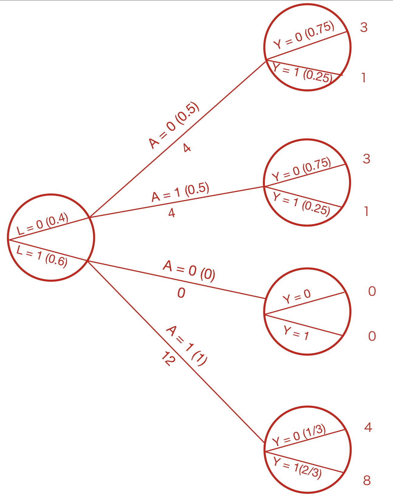
```


---
class: middle

## Consistency (1)

.full-width[.content-box-red[.bold[.med[
Consistency means that 

- **the observed outcome** for every treated individual **equals his/her outcome if had been treated.** 
- **the observed outcome** for every untreated individual **equals his/her outcome if remain untreated. **

$$
Y^a = Y  \text{ (= for all) } a
$$
]]]]


---
class: middle

## Consistency (2)

Actually, there are two components in the consistency condition:

- a precise definition of the counterfactual outcomes $Y^a$ via a detailed specification $a$

- The linkage of the conterfactual outcomes to the observed outcomes 

We will look at these components one by one.


---
class: middle

### Precise definition of $a$

Consider again a randomized experiment on the causal effect of heart transplant $A$ on 5-year mortality $Y$.

- Before enrolling patients, there should be a protocol to define the treatments, precisely in detail: 
<br> heart transplant: $A = 1$
<br> medical therapy: $A = 0$

- details should include: pre-operative procedures, anesthesia, surgical technique, post-operative care, immunosuppressive therapy, etc. 

???

Otherwise, each doctor might conduct a different version of the treatment of "heart transplant"


---
class: middle

### What if there are multiple versions of treatment?

The average causal effect of "heart transplant" may well different between studies in which most doctors used different kinds of approaches: 

- a traditional surgical technique
- a novel surgical technique

Treatment value $a$ are ill-defined $\rightarrow$ the counterfactual outcomes $Y^a$ will be ill-defined $\rightarrow$ the causal effect will be ill-defined.


---
class: middle

### Definition of treatment $a$ is much harder for observational studies

Suppose that a research question asks the causal effect of obesity $A$ at age 40 on the risk of mortality $Y$ by age 50 in a certain population. So what exactly is meant by **"the risk of all individuals had been obese?**

- an individual might be obese at age 40 for 20 years; 
- another might be obese at age 40 for 2 years only. 

There are multiple versions of the treatment $A = 1$ defined by duration, recency, and intensity. 

???

Each of them may have different effects on mortality.

---
class: middle

### For example, $Y^{a = 1}$ can be ill-defined

.pull-left[.med[
- Zeus is obese at age 40 $(A = 1)$ and then had a fatal myocardial infarction at age 49 $(Y =1)$. 
- If we knew that Zeus had genes that predisposed him to large amounts of fat tissue in both waist and coronary arteries. 
- So Zeus died despite exercising moderately, keeping a healthy diet.
]]

.pull-right[.med[
- Zeus became obese after a lifetime of lack of exercise, too many calories intake. But he still alive after age of 50 $(Y = 0)$. 

- So there are two versions of counterfactual outcomes under "being obese at 40"
]]


---
class: middle

### $Y^{a = 0}$ can also be ill-defined

.pull-left[.med[
- A non-obese Zeus would have **died** by age 50 because:
    - exercise <br> (bicycle accident)
    - cigarette smoking <br> (lung cancer)
    - bariatric surgery <br> (adverse reaction to anesthesia)
]]

.pull-right[.med[
- A non-obese Zeus would have **survived** by age 50 because:
    - on a healthy diet for a lifetime
    - safely and moderately exercise
    - without unfavorable genes 
]]


---
class: middle

### Only sufficiently well-defined $a$ is needed

For example, if we want to confirm the causal effect of exercise, running clockwise is considered as the same as running counter clockwise. 

- There is no need to specify the direction of running

- Declaring a treatment **sufficiently well-defined** is a matter of agreement based on the available knowledge

---
class: middle

### Eliminate the vagueness as much as possible

- Today we agree that the direction of running is irrelevant, but future research might prove us wrong

--
<br> .med[*say, some study found evidence that leaning the body to the right, not to the left, while running is harmful for the heart, etc.*] 

- The vagueness is especially high in observational studies 

--
<br> .med[*body weight, LDL-cholesterol, socioeconomic status treatments, etc.*]

???

The term "sufficiently well-defined" treatment relies on expert consensus, which by definition changes over time.

- Refining the causal question, until it is agreed that no meaningful vagueness remains, is a fundamental component of causal inference. 


---
class: middle

## Consistency (3) <br>linkage between counterfactuals and observations $Y^a = Y$


If experts agree that the treatment $a = 1 / 0$ are sufficiently well-defined. Then we should consider another component of consistency, $Y^a = Y$.

Sometimes, when we put too much restrictions on $a$, we might not be able to find enough individuals who actually received this treatment.

???

counterfactual outcomes and observed outcomes


---
class: middle

### Multiple versions of treatments

- Can we assume that the effects of all versions of treatments are identical, or treatment-variation irrelevant?

--
- Good for some cases: 

--
.med[
*high vs. normal blood pressure on risk of stroke.* 
- evidence suggests that lowering blood pressure through different drugs/approaches results in similar outcomes.
]

--
- However, this assumption is often questionable


???

- Some interventions would increase the risk others might decrease the risk. 


---
class: middle, inverse, center

# Chapter 4 <br> Effect modification


---
class: middle


## Outline

- Definition of effect modification

- Stratification to identify effect modification

- Why care about it

- Matching to adjust

- Effect modification and adjustment


---
class: middle

## Purpose 

> Many causal questions are about the subsets of the population. Sometimes you don't care about the variations of the effect across different groups.


.full-width[.content-box-red[.bold[
 The causal effect depends on the characteristics of the particular population under study.
]]]


---
class: middle

## Definition of effect modification (1)

.pull-left[<style type="text/css">
.tg  {border-collapse:collapse;border-color:#bbb;border-spacing:0;}
.tg td{background-color:#E0FFEB;border-color:#bbb;border-style:solid;border-width:1px;color:#594F4F;
  font-family:Arial, sans-serif;font-size:14px;overflow:hidden;padding:10px 5px;word-break:normal;}
.tg th{background-color:#9DE0AD;border-color:#bbb;border-style:solid;border-width:1px;color:#493F3F;
  font-family:Arial, sans-serif;font-size:14px;font-weight:normal;overflow:hidden;padding:10px 5px;word-break:normal;}
.tg .tg-ltxa{background-color:#ffccc9;text-align:left;vertical-align:top}
.tg .tg-0lax{text-align:left;vertical-align:top}
</style>
<table class="tg">
<thead>
  <tr>
    <th class="tg-0lax"></th>
    <th class="tg-ltxa">\[\mathbf{V}\]</th>
    <th class="tg-0lax">\[\mathbf{Y^{a = 0}}\] </th>
    <th class="tg-0lax"> \[\mathbf{Y^{a = 1}}\] </th>
    <th class="tg-0lax"></th>
    <th class="tg-ltxa">\[\mathbf{V}\]</th>
    <th class="tg-0lax"> \[\mathbf{Y^{a = 0}}\] </th>
    <th class="tg-0lax"> \[\mathbf{Y^{a = 1}}\] </th>
  </tr>
</thead>
<tbody>
  <tr>
    <td class="tg-0lax">Rheia</td>
    <td class="tg-ltxa">1</td>
    <td class="tg-0lax">0</td>
    <td class="tg-0lax">1</td>
    <td class="tg-0lax">Leto</td>
    <td class="tg-ltxa">1</td>
    <td class="tg-0lax">0</td>
    <td class="tg-0lax">1</td>
  </tr>
  <tr>
    <td class="tg-0lax">Kronos</td>
    <td class="tg-ltxa">0</td>
    <td class="tg-0lax">1</td>
    <td class="tg-0lax">0</td>
    <td class="tg-0lax">Ares</td>
    <td class="tg-ltxa">0</td>
    <td class="tg-0lax">1</td>
    <td class="tg-0lax">1</td>
  </tr>
  <tr>
    <td class="tg-0lax">Demeter</td>
    <td class="tg-ltxa">1</td>
    <td class="tg-0lax">0</td>
    <td class="tg-0lax">0</td>
    <td class="tg-0lax">Athena</td>
    <td class="tg-ltxa">1</td>
    <td class="tg-0lax">1</td>
    <td class="tg-0lax">1</td>
  </tr>
  <tr>
    <td class="tg-0lax">Hades</td>
    <td class="tg-ltxa">0</td>
    <td class="tg-0lax">0</td>
    <td class="tg-0lax">0</td>
    <td class="tg-0lax">Hephaestus</td>
    <td class="tg-ltxa">0</td>
    <td class="tg-0lax">0</td>
    <td class="tg-0lax">1</td>
  </tr>
  <tr>
    <td class="tg-0lax">Hestia</td>
    <td class="tg-ltxa">1</td>
    <td class="tg-0lax">0</td>
    <td class="tg-0lax">0</td>
    <td class="tg-0lax">Aphrodite</td>
    <td class="tg-ltxa">1</td>
    <td class="tg-0lax">0</td>
    <td class="tg-0lax">1</td>
  </tr>
  <tr>
    <td class="tg-0lax">Poseidon</td>
    <td class="tg-ltxa">0</td>
    <td class="tg-0lax">1</td>
    <td class="tg-0lax">0</td>
    <td class="tg-0lax">Cyclope</td>
    <td class="tg-ltxa">0</td>
    <td class="tg-0lax">0</td>
    <td class="tg-0lax">1</td>
  </tr>
  <tr>
    <td class="tg-0lax">Hera</td>
    <td class="tg-ltxa">1</td>
    <td class="tg-0lax">0</td>
    <td class="tg-0lax">0</td>
    <td class="tg-0lax">Persephone</td>
    <td class="tg-ltxa">1</td>
    <td class="tg-0lax">1</td>
    <td class="tg-0lax">1</td>
  </tr>
  <tr>
    <td class="tg-0lax">Zeus</td>
    <td class="tg-ltxa">0</td>
    <td class="tg-0lax">0</td>
    <td class="tg-0lax">1</td>
    <td class="tg-0lax">Hermes</td>
    <td class="tg-ltxa">0</td>
    <td class="tg-0lax">1</td>
    <td class="tg-0lax">0</td>
  </tr>
  <tr>
    <td class="tg-0lax">Artemis</td>
    <td class="tg-ltxa">1</td>
    <td class="tg-0lax">1</td>
    <td class="tg-0lax">1</td>
    <td class="tg-0lax">Hebe</td>
    <td class="tg-ltxa">1</td>
    <td class="tg-0lax">1</td>
    <td class="tg-0lax">0</td>
  </tr>
  <tr>
    <td class="tg-0lax">Apollo</td>
    <td class="tg-ltxa">0</td>
    <td class="tg-0lax">1</td>
    <td class="tg-0lax">0</td>
    <td class="tg-0lax">Dionysus</td>
    <td class="tg-ltxa">0</td>
    <td class="tg-0lax">1</td>
    <td class="tg-0lax">0</td>
  </tr>
</tbody>
</table>
]


.pull-right[.small[
- We concluded that the average causal effect of was null (Slide [**No. 12**](https://wangcc.me/CausalInference01/#12)).

- 10 out of 20 would have died if they had received the treatment
$\text{Pr}[\mathbf{Y}^{a = 1} = 1] = 10/20 \\ = 0.5$

- 10 out of 20 would have died if they if they had not received the treatment
$\text{Pr}[\mathbf{Y}^{a = 0} = 1] = 10/20 \\ = 0.5$
]]
 
---

### Causal Effect in men/women?


.pull-left[<style type="text/css">
.tg  {border-collapse:collapse;border-color:#bbb;border-spacing:0;}
.tg td{background-color:#E0FFEB;border-color:#bbb;border-style:solid;border-width:1px;color:#594F4F;
  font-family:Arial, sans-serif;font-size:14px;overflow:hidden;padding:10px 5px;word-break:normal;}
.tg th{background-color:#9DE0AD;border-color:#bbb;border-style:solid;border-width:1px;color:#493F3F;
  font-family:Arial, sans-serif;font-size:14px;font-weight:normal;overflow:hidden;padding:10px 5px;word-break:normal;}
.tg .tg-ltxa{background-color:#ffccc9;text-align:left;vertical-align:top}
.tg .tg-0lax{text-align:left;vertical-align:top}
</style>
<table class="tg">
<thead>
  <tr>
    <th class="tg-0lax"></th>
    <th class="tg-ltxa">\[\mathbf{V}\]</th>
    <th class="tg-0lax">\[\mathbf{Y^{a = 0}}\] </th>
    <th class="tg-0lax"> \[\mathbf{Y^{a = 1}}\] </th>
    <th class="tg-0lax"></th>
    <th class="tg-ltxa">\[\mathbf{V}\]</th>
    <th class="tg-0lax"> \[\mathbf{Y^{a = 0}}\] </th>
    <th class="tg-0lax"> \[\mathbf{Y^{a = 1}}\] </th>
  </tr>
</thead>
<tbody>
  <tr>
    <td class="tg-0lax">Rheia</td>
    <td class="tg-ltxa">1</td>
    <td class="tg-0lax">0</td>
    <td class="tg-0lax">1</td>
    <td class="tg-0lax">Leto</td>
    <td class="tg-ltxa">1</td>
    <td class="tg-0lax">0</td>
    <td class="tg-0lax">1</td>
  </tr>
  <tr>
    <td class="tg-0lax">Kronos</td>
    <td class="tg-ltxa">0</td>
    <td class="tg-0lax">1</td>
    <td class="tg-0lax">0</td>
    <td class="tg-0lax">Ares</td>
    <td class="tg-ltxa">0</td>
    <td class="tg-0lax">1</td>
    <td class="tg-0lax">1</td>
  </tr>
  <tr>
    <td class="tg-0lax">Demeter</td>
    <td class="tg-ltxa">1</td>
    <td class="tg-0lax">0</td>
    <td class="tg-0lax">0</td>
    <td class="tg-0lax">Athena</td>
    <td class="tg-ltxa">1</td>
    <td class="tg-0lax">1</td>
    <td class="tg-0lax">1</td>
  </tr>
  <tr>
    <td class="tg-0lax">Hades</td>
    <td class="tg-ltxa">0</td>
    <td class="tg-0lax">0</td>
    <td class="tg-0lax">0</td>
    <td class="tg-0lax">Hephaestus</td>
    <td class="tg-ltxa">0</td>
    <td class="tg-0lax">0</td>
    <td class="tg-0lax">1</td>
  </tr>
  <tr>
    <td class="tg-0lax">Hestia</td>
    <td class="tg-ltxa">1</td>
    <td class="tg-0lax">0</td>
    <td class="tg-0lax">0</td>
    <td class="tg-0lax">Aphrodite</td>
    <td class="tg-ltxa">1</td>
    <td class="tg-0lax">0</td>
    <td class="tg-0lax">1</td>
  </tr>
  <tr>
    <td class="tg-0lax">Poseidon</td>
    <td class="tg-ltxa">0</td>
    <td class="tg-0lax">1</td>
    <td class="tg-0lax">0</td>
    <td class="tg-0lax">Cyclope</td>
    <td class="tg-ltxa">0</td>
    <td class="tg-0lax">0</td>
    <td class="tg-0lax">1</td>
  </tr>
  <tr>
    <td class="tg-0lax">Hera</td>
    <td class="tg-ltxa">1</td>
    <td class="tg-0lax">0</td>
    <td class="tg-0lax">0</td>
    <td class="tg-0lax">Persephone</td>
    <td class="tg-ltxa">1</td>
    <td class="tg-0lax">1</td>
    <td class="tg-0lax">1</td>
  </tr>
  <tr>
    <td class="tg-0lax">Zeus</td>
    <td class="tg-ltxa">0</td>
    <td class="tg-0lax">0</td>
    <td class="tg-0lax">1</td>
    <td class="tg-0lax">Hermes</td>
    <td class="tg-ltxa">0</td>
    <td class="tg-0lax">1</td>
    <td class="tg-0lax">0</td>
  </tr>
  <tr>
    <td class="tg-0lax">Artemis</td>
    <td class="tg-ltxa">1</td>
    <td class="tg-0lax">1</td>
    <td class="tg-0lax">1</td>
    <td class="tg-0lax">Hebe</td>
    <td class="tg-ltxa">1</td>
    <td class="tg-0lax">1</td>
    <td class="tg-0lax">0</td>
  </tr>
  <tr>
    <td class="tg-0lax">Apollo</td>
    <td class="tg-ltxa">0</td>
    <td class="tg-0lax">1</td>
    <td class="tg-0lax">0</td>
    <td class="tg-0lax">Dionysus</td>
    <td class="tg-ltxa">0</td>
    <td class="tg-0lax">1</td>
    <td class="tg-0lax">0</td>
  </tr>
</tbody>
</table>
]


.pull-right[.small[
- The causal risk ratio was $0.5/0.5 = 1$

- The causal risk difference was $0.5 - 0.5 = 0$

- What is the average causal effect in men? and in women?

- To answer this question, we will need to **restrict the analysis to men and women**, respectively.
]]

---
class: middle

### Causal effects in women

.pull-left[.small[
- The risk under treatment is 
<br> $\text{Pr}[Y^{a = 1} | V = 1] = 6/10$
- The risk under no treatment is
<br> $\text{Pr}[Y^{a = 0} | V = 1] = 4/10$
- Therefore, 
  - the causal risk ratio is $0.6/0.4 = 1.5$
  - The causal risk difference is $0.6 - 0.4 = 0.2$

- On average, heart transplant $A$ increases the risk of death $Y$ in women.
]]

.pull-right[
<style type="text/css">
.tg  {border-collapse:collapse;border-color:#bbb;border-spacing:0;}
.tg td{background-color:#E0FFEB;border-color:#bbb;border-style:solid;border-width:1px;color:#594F4F;
  font-family:Arial, sans-serif;font-size:14px;overflow:hidden;padding:10px 5px;word-break:normal;}
.tg th{background-color:#9DE0AD;border-color:#bbb;border-style:solid;border-width:1px;color:#493F3F;
  font-family:Arial, sans-serif;font-size:14px;font-weight:normal;overflow:hidden;padding:10px 5px;word-break:normal;}
.tg .tg-e76x{background-color:#fe996b;text-align:left;vertical-align:top}
.tg .tg-0lax{text-align:left;vertical-align:top}
</style>
<table class="tg">
<thead>
  <tr>
    <th class="tg-0lax"></th>
    <th class="tg-0lax"> \[\mathbf{V}\] </th>
    <th class="tg-0lax"> \[\mathbf{Y^{a = 0}}\] </th>
    <th class="tg-0lax"> \[\mathbf{Y^{a = 1}}\] </th>
  </tr>
</thead>
<tbody>
  <tr>
    <td class="tg-0lax">Rheia</td>
    <td class="tg-0lax">1</td>
    <td class="tg-0lax">0</td>
    <td class="tg-e76x">1</td>
  </tr>
  <tr>
    <td class="tg-0lax">Demeter</td>
    <td class="tg-0lax">1</td>
    <td class="tg-0lax">0</td>
    <td class="tg-0lax">0</td>
  </tr>
  <tr>
    <td class="tg-0lax">Hestia</td>
    <td class="tg-0lax">1</td>
    <td class="tg-0lax">0</td>
    <td class="tg-0lax">0</td>
  </tr>
  <tr>
    <td class="tg-0lax">Hera</td>
    <td class="tg-0lax">1</td>
    <td class="tg-0lax">0</td>
    <td class="tg-0lax">0</td>
  </tr>
  <tr>
    <td class="tg-0lax">Artemis</td>
    <td class="tg-0lax">1</td>
    <td class="tg-e76x">1</td>
    <td class="tg-e76x">1</td>
  </tr>
  <tr>
    <td class="tg-0lax">Leto</td>
    <td class="tg-0lax">1</td>
    <td class="tg-0lax">0</td>
    <td class="tg-e76x">1</td>
  </tr>
  <tr>
    <td class="tg-0lax">Athena</td>
    <td class="tg-0lax">1</td>
    <td class="tg-e76x">1</td>
    <td class="tg-e76x">1</td>
  </tr>
  <tr>
    <td class="tg-0lax">Aphrodite</td>
    <td class="tg-0lax">1</td>
    <td class="tg-0lax">0</td>
    <td class="tg-e76x">1</td>
  </tr>
  <tr>
    <td class="tg-0lax">Persephone</td>
    <td class="tg-0lax">1</td>
    <td class="tg-e76x">1</td>
    <td class="tg-e76x">1</td>
  </tr>
  <tr>
    <td class="tg-0lax">Hebe</td>
    <td class="tg-0lax">1</td>
    <td class="tg-e76x">1</td>
    <td class="tg-0lax">0</td>
  </tr>
</tbody>
</table>
]


---
class: middle

### Causal effects in men


.pull-left[.small[
- The risk under treatment is 
<br> $\text{Pr}[Y^{a = 1} | V = 0] = 4/10$
- The risk under no treatment is
<br> $\text{Pr}[Y^{a = 0} | V = 0] = 6/10$
- Therefore, 
  - the causal risk ratio is $0.4/0.6 = 2/3$
  - The causal risk difference is $0.4 - 0.6 = -0.2$

- On average, heart transplant $A$ decreases the risk of death $Y$ in men.
]]


.pull-right[
<style type="text/css">
.tg  {border-collapse:collapse;border-color:#bbb;border-spacing:0;}
.tg td{background-color:#E0FFEB;border-color:#bbb;border-style:solid;border-width:1px;color:#594F4F;
  font-family:Arial, sans-serif;font-size:14px;overflow:hidden;padding:10px 5px;word-break:normal;}
.tg th{background-color:#9DE0AD;border-color:#bbb;border-style:solid;border-width:1px;color:#493F3F;
  font-family:Arial, sans-serif;font-size:14px;font-weight:normal;overflow:hidden;padding:10px 5px;word-break:normal;}
.tg .tg-e76x{background-color:#fe996b;text-align:left;vertical-align:top}
.tg .tg-0lax{text-align:left;vertical-align:top}
</style>
<table class="tg">
<thead>
  <tr>
    <th class="tg-0lax"></th>
    <th class="tg-0lax">\[\mathbf{V}\]</th>
    <th class="tg-0lax">\[\mathbf{Y^{a = 0}}\] </th>
    <th class="tg-0lax"> \[\mathbf{Y^{a = 1}}\] </th>
  </tr>
</thead>
<tbody>
  <tr>
    <td class="tg-0lax">Kronos</td>
    <td class="tg-0lax">0</td>
    <td class="tg-e76x">1</td>
    <td class="tg-0lax">0</td>
  </tr>
  <tr>
    <td class="tg-0lax">Hades</td>
    <td class="tg-0lax">0</td>
    <td class="tg-0lax">0</td>
    <td class="tg-0lax">0</td>
  </tr>
  <tr>
    <td class="tg-0lax">Poseidon</td>
    <td class="tg-0lax">0</td>
    <td class="tg-e76x">1</td>
    <td class="tg-0lax">0</td>
  </tr>
  <tr>
    <td class="tg-0lax">Zeus</td>
    <td class="tg-0lax">0</td>
    <td class="tg-0lax">0</td>
    <td class="tg-e76x">1</td>
  </tr>
  <tr>
    <td class="tg-0lax">Apollo</td>
    <td class="tg-0lax">0</td>
    <td class="tg-e76x">1</td>
    <td class="tg-0lax">0</td>
  </tr>
  <tr>
    <td class="tg-0lax">Ares</td>
    <td class="tg-0lax">0</td>
    <td class="tg-e76x">1</td>
    <td class="tg-e76x">1</td>
  </tr>
  <tr>
    <td class="tg-0lax">Hephaestus</td>
    <td class="tg-0lax">0</td>
    <td class="tg-0lax">0</td>
    <td class="tg-e76x">1</td>
  </tr>
  <tr>
    <td class="tg-0lax">Cyclope</td>
    <td class="tg-0lax">0</td>
    <td class="tg-0lax">0</td>
    <td class="tg-e76x">1</td>
  </tr>
  <tr>
    <td class="tg-0lax">Hermes</td>
    <td class="tg-0lax">0</td>
    <td class="tg-e76x">1</td>
    <td class="tg-0lax">0</td>
  </tr>
  <tr>
    <td class="tg-0lax">Dionysus</td>
    <td class="tg-0lax">0</td>
    <td class="tg-e76x">1</td>
    <td class="tg-0lax">0</td>
  </tr>
</tbody>
</table>
]


---
class: middle

## Definition of effect modification (2)

We saw that a null average causal effect in the population does not imply a null average causal effect in a subset of the population.

.full-width[.content-box-red[.bold[.med[
$V$ is a modifier of the effect of $A$ on $Y$ when the average causal effect **varies across levels of $V$**.
]]]]

.pull-left[.small[
Additive: <br>
$E[Y^{a = 1}  - Y^{a = 0} | V = 1] \\ \neq E[Y^{a = 1}  - Y^{a = 0} | V = 0]$
]]

.pull-right[.small[
Multiplicative: <br>
$\frac{E[Y^{a = 1} | V = 1]}{E[Y^{a = 0} | V = 1]} \neq \frac{E[Y^{a = 1} | V = 0]}{E[Y^{a = 0} | V = 0]}$
]]


---
class: middle

## Definition of effect modification (3)

In the heart transplant example, there is a **qualitative effect modification** because the average causal effects in the subsets are in the opposite direction.

--
- When qualitative effect modification exists, both additive and multiplicative effect modification exist.

--
- When we don't find qualitative effect modification, there might be effect modification on either scale (additive or multiplicative).

---
class: middle

### Example of effect modification only shown as multiplicative

.pull-left[.small[
- $\text{Pr}[Y^{a = 0} =1 | V = 1] = 0.8$ 
- $\text{Pr}[Y^{a = 1} =1 | V = 1] = 0.9$ 
]]

.pull-right[.small[
- $\text{Pr}[Y^{a = 0} =1 | V = 0] = 0.1$ 
- $\text{Pr}[Y^{a = 1} =1 | V = 0] = 0.2$ 
]]

--
.med[
- Causal risk difference: $0.9 -0.8 = 0.2 - 0.1 = 0.1$ <br>(no additive effect modification)
]

--
.med[
- Causal risk ratio: $0.9 / 0.8 = 1.1 \neq 0.2 / 0.1 = 2$ <br>(multiplicative effect modification)
]

---
class: middle

### Another 20 Romans also particiapted

<style type="text/css">
.tg  {border-collapse:collapse;border-color:#bbb;border-spacing:0;}
.tg td{background-color:#E0FFEB;border-color:#bbb;border-style:solid;border-width:1px;color:#594F4F;
  font-family:Arial, sans-serif;font-size:14px;overflow:hidden;padding:10px 5px;word-break:normal;}
.tg th{background-color:#9DE0AD;border-color:#bbb;border-style:solid;border-width:1px;color:#493F3F;
  font-family:Arial, sans-serif;font-size:14px;font-weight:normal;overflow:hidden;padding:10px 5px;word-break:normal;}
.tg .tg-rpp6{background-color:#67fd9a;border-color:inherit;font-size:15px;font-weight:bold;text-align:left;vertical-align:top}
.tg .tg-dbbi{border-color:inherit;font-size:15px;font-weight:bold;text-align:center;vertical-align:top}
.tg .tg-h6w4{border-color:inherit;font-size:15px;font-weight:bold;text-align:left;vertical-align:top}
.tg .tg-679u{background-color:#9698ed;border-color:inherit;font-size:15px;font-weight:bold;text-align:left;vertical-align:top}
</style>
<table class="tg">
<thead>
  <tr>
    <th class="tg-dbbi" colspan="8">V = 1 (Greeks)</th>
    <th class="tg-dbbi" colspan="8">V = 0 (Romans)</th>
  </tr>
</thead>
<tbody>
  <tr>
    <td class="tg-h6w4"></td>
    <td class="tg-h6w4">L</td>
    <td class="tg-h6w4">A</td>
    <td class="tg-h6w4">Y</td>
    <td class="tg-h6w4"></td>
    <td class="tg-h6w4">L</td>
    <td class="tg-h6w4">A</td>
    <td class="tg-h6w4">Y</td>
    <td class="tg-h6w4"></td>
    <td class="tg-h6w4">L</td>
    <td class="tg-h6w4">A</td>
    <td class="tg-h6w4">Y</td>
    <td class="tg-h6w4"></td>
    <td class="tg-h6w4">L</td>
    <td class="tg-h6w4">A</td>
    <td class="tg-h6w4">Y</td>
  </tr>
  <tr>
    <td class="tg-h6w4">Rheia</td>
    <td class="tg-rpp6">0</td>
    <td class="tg-rpp6">0</td>
    <td class="tg-rpp6">0</td>
    <td class="tg-h6w4">Leto</td>
    <td class="tg-679u">1</td>
    <td class="tg-679u">0</td>
    <td class="tg-679u">0</td>
    <td class="tg-h6w4">Cybele</td>
    <td class="tg-rpp6">0</td>
    <td class="tg-rpp6">0</td>
    <td class="tg-rpp6">0</td>
    <td class="tg-h6w4">Latona</td>
    <td class="tg-679u">1</td>
    <td class="tg-679u">0</td>
    <td class="tg-679u">0</td>
  </tr>
  <tr>
    <td class="tg-h6w4">Kronos</td>
    <td class="tg-rpp6">0</td>
    <td class="tg-rpp6">0</td>
    <td class="tg-rpp6">1</td>
    <td class="tg-h6w4">Ares</td>
    <td class="tg-679u">1</td>
    <td class="tg-679u">1</td>
    <td class="tg-679u">1</td>
    <td class="tg-h6w4">Saturn</td>
    <td class="tg-rpp6">0</td>
    <td class="tg-rpp6">0</td>
    <td class="tg-rpp6">1</td>
    <td class="tg-h6w4">Mars</td>
    <td class="tg-679u">1</td>
    <td class="tg-679u">1</td>
    <td class="tg-679u">1</td>
  </tr>
  <tr>
    <td class="tg-h6w4">Demeter</td>
    <td class="tg-rpp6">0</td>
    <td class="tg-rpp6">0</td>
    <td class="tg-rpp6">0</td>
    <td class="tg-h6w4">Athena</td>
    <td class="tg-679u">1</td>
    <td class="tg-679u">1</td>
    <td class="tg-679u">1</td>
    <td class="tg-h6w4">Ceres</td>
    <td class="tg-rpp6">0</td>
    <td class="tg-rpp6">0</td>
    <td class="tg-rpp6">0</td>
    <td class="tg-h6w4">Minerva</td>
    <td class="tg-679u">1</td>
    <td class="tg-679u">1</td>
    <td class="tg-679u">1</td>
  </tr>
  <tr>
    <td class="tg-h6w4">Hades</td>
    <td class="tg-rpp6">0</td>
    <td class="tg-rpp6">0</td>
    <td class="tg-rpp6">0</td>
    <td class="tg-h6w4">Hephaestus</td>
    <td class="tg-679u">1</td>
    <td class="tg-679u">1</td>
    <td class="tg-679u">1</td>
    <td class="tg-h6w4">Pluto</td>
    <td class="tg-rpp6">0</td>
    <td class="tg-rpp6">0</td>
    <td class="tg-rpp6">0</td>
    <td class="tg-h6w4">Vulcan</td>
    <td class="tg-679u">1</td>
    <td class="tg-679u">1</td>
    <td class="tg-679u">1</td>
  </tr>
  <tr>
    <td class="tg-h6w4">Hestia</td>
    <td class="tg-rpp6">0</td>
    <td class="tg-rpp6">1</td>
    <td class="tg-rpp6">0</td>
    <td class="tg-h6w4">Aphrodite</td>
    <td class="tg-679u">1</td>
    <td class="tg-679u">1</td>
    <td class="tg-679u">1</td>
    <td class="tg-h6w4">Vesta</td>
    <td class="tg-rpp6">0</td>
    <td class="tg-rpp6">1</td>
    <td class="tg-rpp6">0</td>
    <td class="tg-h6w4">Venus</td>
    <td class="tg-679u">1</td>
    <td class="tg-679u">1</td>
    <td class="tg-679u">1</td>
  </tr>
  <tr>
    <td class="tg-h6w4">Poseidon</td>
    <td class="tg-rpp6">0</td>
    <td class="tg-rpp6">1</td>
    <td class="tg-rpp6">0</td>
    <td class="tg-h6w4">Cyclope</td>
    <td class="tg-679u">1</td>
    <td class="tg-679u">1</td>
    <td class="tg-679u">1</td>
    <td class="tg-h6w4">Neptune</td>
    <td class="tg-rpp6">0</td>
    <td class="tg-rpp6">1</td>
    <td class="tg-rpp6">0</td>
    <td class="tg-h6w4">Seneca</td>
    <td class="tg-679u">1</td>
    <td class="tg-679u">1</td>
    <td class="tg-679u">1</td>
  </tr>
  <tr>
    <td class="tg-h6w4">Hera</td>
    <td class="tg-rpp6">0</td>
    <td class="tg-rpp6">1</td>
    <td class="tg-rpp6">0</td>
    <td class="tg-h6w4">Persephone</td>
    <td class="tg-679u">1</td>
    <td class="tg-679u">1</td>
    <td class="tg-679u">1</td>
    <td class="tg-h6w4">Juno</td>
    <td class="tg-rpp6">0</td>
    <td class="tg-rpp6">1</td>
    <td class="tg-rpp6">1</td>
    <td class="tg-h6w4">Proserpina</td>
    <td class="tg-679u">1</td>
    <td class="tg-679u">1</td>
    <td class="tg-679u">1</td>
  </tr>
  <tr>
    <td class="tg-h6w4">Zeus</td>
    <td class="tg-rpp6">0</td>
    <td class="tg-rpp6">1</td>
    <td class="tg-rpp6">1</td>
    <td class="tg-h6w4">Hermes</td>
    <td class="tg-679u">1</td>
    <td class="tg-679u">1</td>
    <td class="tg-679u">0</td>
    <td class="tg-h6w4">Jupiter</td>
    <td class="tg-rpp6">0</td>
    <td class="tg-rpp6">1</td>
    <td class="tg-rpp6">1</td>
    <td class="tg-h6w4">Mercury</td>
    <td class="tg-679u">1</td>
    <td class="tg-679u">1</td>
    <td class="tg-679u">0</td>
  </tr>
  <tr>
    <td class="tg-h6w4">Artemis</td>
    <td class="tg-679u">1</td>
    <td class="tg-679u">0</td>
    <td class="tg-679u">1</td>
    <td class="tg-h6w4">Hebe</td>
    <td class="tg-679u">1</td>
    <td class="tg-679u">1</td>
    <td class="tg-679u">0</td>
    <td class="tg-h6w4">Diana</td>
    <td class="tg-679u">1</td>
    <td class="tg-679u">0</td>
    <td class="tg-679u">0</td>
    <td class="tg-h6w4">Juventas</td>
    <td class="tg-679u">1</td>
    <td class="tg-679u">1</td>
    <td class="tg-679u">0</td>
  </tr>
  <tr>
    <td class="tg-h6w4">Apollo</td>
    <td class="tg-679u">1</td>
    <td class="tg-679u">0</td>
    <td class="tg-679u">1</td>
    <td class="tg-h6w4">Dionysus</td>
    <td class="tg-679u">1</td>
    <td class="tg-679u">1</td>
    <td class="tg-679u">0</td>
    <td class="tg-h6w4">Phoebus</td>
    <td class="tg-679u">1</td>
    <td class="tg-679u">0</td>
    <td class="tg-679u">1</td>
    <td class="tg-h6w4">Bacchus</td>
    <td class="tg-679u">1</td>
    <td class="tg-679u">1</td>
    <td class="tg-679u">0</td>
  </tr>
</tbody>
</table>

---
class: middle

### Population risk under treatment or not <br> by stratification on $L$, critical condition

.smaller[
- $\text{Pr}[Y = 1 | L = 0, A = 0] = 2/8$
- $\text{Pr}[Y = 1 | L = 0, A = 1] = 3/8$
- $\text{Pr}[Y = 1 | L = 1, A = 0] = 3/6$
- $\text{Pr}[Y = 1 | L = 1, A = 1] = 12/18$
]

--
.smaller[
- Risk under treatment, $\text{Pr}[Y^{a = 1} = 1] = \frac{3}{8}\times \frac{16}{40} + \frac{12}{18}\times \frac{24}{40} = 0.55$
]

--
.smaller[
- Risk under no treatment, $\text{Pr}[Y^{a = 0} = 1] = \frac{2}{8} \times \frac{16}{40} + \frac{3}{6} \times \frac{24}{40} = 0.40$
]

--
.smaller[
- The average causal risk difference is $0.55 - 0.4 = 0.15$
- The average causal risk ratio is $0.55 / 0.4 = 1.375$
- In this Greeks + Romans population, heart transplant increases the mortality risk.
]

---
class: middle

## Whether nationality $V$ modifies the effect of $A$ on $Y$

.med[
- The goal is to compute the following two causal effects:
    - In Greeks: $\text{Pr}[Y^{a = 1} = 1 | V = 1] - \text{Pr}[Y^{a = 0} = 1 | V = 1]$
    - In Romans: $\text{Pr}[Y^{a = 1} = 1 | V = 0] - \text{Pr}[Y^{a = 0} = 1 | V = 0]$
- If these two causal risk difference differ, we say that there is an **additive effect modification** by $V$. 
- Similarly for causal risk ratios if interested in multiplicative effect modification.
]

---
class: middle

### Two causal effects computed for $V$

.med[
- In Greeks, $V = 1$ 
    - causal risk difference was $0$
    - causal risk ratio was $1$ 
- In Romans, $V = 0$ similarly (by standardization or IPW):
    - causal risk difference was $0.3$
    - causal risk ratio was $2.0$
]

--
.med[
- There is evidence that both additive and multiplicative effect modification by nationality $V$ on the effect of $A$ on $Y$.
- However, this effect modification is **not qualitative**, because the effect was null or harmful in both strata.
]

---
class: middle

### However, we don't know the true mechanism of this effect modification

- It is possible that nationality is simply a marker for the effect modification.

--
- For example, maybe the surgery technique is better in Greece than in Rome. 

--
- Nationality is called: **surrogate effect modifier** 
- Sometimes we may just say: "effect heterogeneity across strata of $V$".
- Quality of surgery is the real **causal effect modifier**

---
class: middle

## Why care about effect modification?

.med[
- To identify those who might benefit from the treatment, who might not, and who might get hurt.
- To better understand the mechanisms. 
- To see whether transportability of causal effects from one to another population would be valid.
]

--
.pull-left[.small[
- Causal effect of heart transplant on mortality differs between men and women, Greeks and Romans.
- Health effect of cholesterol-lowering drugs in Europeans can be transported to Asians.
]]

--
.pull-right[.small[
- Health effect of increasing household income by $100 in Ethiopia cannot be transported to the UK.
]]

---
class: middle

## Stratification as a form of adjustment (1)

.med[
Normally, 
- standardization or IPW $\rightarrow$ adjust for $L$
- stratification $\rightarrow$ identify effect modification by $V$
]

--
.med[
But, sometimes stratification was (mis-)used as adjustment.
- stratification can only provide stratum-specific effects 
- none of them quantifies the average causal effect in the entire population.
- in the example, **exchangeability holds in $L$ but not in $V$**<br> $L$ (severity) was adjusted under each strata of $V$ (nationality).
]


---
class: middle

## Stratification as a form of adjustment (2)


<style type="text/css">
.tg  {border-collapse:collapse;border-color:#bbb;border-spacing:0;}
.tg td{background-color:#E0FFEB;border-color:#bbb;border-style:solid;border-width:1px;color:#594F4F;
  font-family:Arial, sans-serif;font-size:14px;overflow:hidden;padding:10px 5px;word-break:normal;}
.tg th{background-color:#9DE0AD;border-color:#bbb;border-style:solid;border-width:1px;color:#493F3F;
  font-family:Arial, sans-serif;font-size:14px;font-weight:normal;overflow:hidden;padding:10px 5px;word-break:normal;}
.tg .tg-rpp6{background-color:#67fd9a;border-color:inherit;font-size:15px;font-weight:bold;text-align:left;vertical-align:top}
.tg .tg-dbbi{border-color:inherit;font-size:15px;font-weight:bold;text-align:center;vertical-align:top}
.tg .tg-h6w4{border-color:inherit;font-size:15px;font-weight:bold;text-align:left;vertical-align:top}
.tg .tg-679u{background-color:#9698ed;border-color:inherit;font-size:15px;font-weight:bold;text-align:left;vertical-align:top}
</style>
<table class="tg">
<thead>
  <tr>
    <th class="tg-dbbi" colspan="8">V = 1 (Greeks)</th>
    <th class="tg-dbbi" colspan="8">V = 0 (Romans)</th>
  </tr>
</thead>
<tbody>
  <tr>
    <td class="tg-h6w4"></td>
    <td class="tg-h6w4">L</td>
    <td class="tg-h6w4">A</td>
    <td class="tg-h6w4">Y</td>
    <td class="tg-h6w4"></td>
    <td class="tg-h6w4">L</td>
    <td class="tg-h6w4">A</td>
    <td class="tg-h6w4">Y</td>
    <td class="tg-h6w4"></td>
    <td class="tg-h6w4">L</td>
    <td class="tg-h6w4">A</td>
    <td class="tg-h6w4">Y</td>
    <td class="tg-h6w4"></td>
    <td class="tg-h6w4">L</td>
    <td class="tg-h6w4">A</td>
    <td class="tg-h6w4">Y</td>
  </tr>
  <tr>
    <td class="tg-h6w4">Rheia</td>
    <td class="tg-rpp6">0</td>
    <td class="tg-rpp6">0</td>
    <td class="tg-rpp6">0</td>
    <td class="tg-h6w4">Leto</td>
    <td class="tg-679u">1</td>
    <td class="tg-679u">0</td>
    <td class="tg-679u">0</td>
    <td class="tg-h6w4">Cybele</td>
    <td class="tg-rpp6">0</td>
    <td class="tg-rpp6">0</td>
    <td class="tg-rpp6">0</td>
    <td class="tg-h6w4">Latona</td>
    <td class="tg-679u">1</td>
    <td class="tg-679u">0</td>
    <td class="tg-679u">0</td>
  </tr>
  <tr>
    <td class="tg-h6w4">Kronos</td>
    <td class="tg-rpp6">0</td>
    <td class="tg-rpp6">0</td>
    <td class="tg-rpp6">1</td>
    <td class="tg-h6w4">Ares</td>
    <td class="tg-679u">1</td>
    <td class="tg-679u">1</td>
    <td class="tg-679u">1</td>
    <td class="tg-h6w4">Saturn</td>
    <td class="tg-rpp6">0</td>
    <td class="tg-rpp6">0</td>
    <td class="tg-rpp6">1</td>
    <td class="tg-h6w4">Mars</td>
    <td class="tg-679u">1</td>
    <td class="tg-679u">1</td>
    <td class="tg-679u">1</td>
  </tr>
  <tr>
    <td class="tg-h6w4">Demeter</td>
    <td class="tg-rpp6">0</td>
    <td class="tg-rpp6">0</td>
    <td class="tg-rpp6">0</td>
    <td class="tg-h6w4">Athena</td>
    <td class="tg-679u">1</td>
    <td class="tg-679u">1</td>
    <td class="tg-679u">1</td>
    <td class="tg-h6w4">Ceres</td>
    <td class="tg-rpp6">0</td>
    <td class="tg-rpp6">0</td>
    <td class="tg-rpp6">0</td>
    <td class="tg-h6w4">Minerva</td>
    <td class="tg-679u">1</td>
    <td class="tg-679u">1</td>
    <td class="tg-679u">1</td>
  </tr>
  <tr>
    <td class="tg-h6w4">Hades</td>
    <td class="tg-rpp6">0</td>
    <td class="tg-rpp6">0</td>
    <td class="tg-rpp6">0</td>
    <td class="tg-h6w4">Hephaestus</td>
    <td class="tg-679u">1</td>
    <td class="tg-679u">1</td>
    <td class="tg-679u">1</td>
    <td class="tg-h6w4">Pluto</td>
    <td class="tg-rpp6">0</td>
    <td class="tg-rpp6">0</td>
    <td class="tg-rpp6">0</td>
    <td class="tg-h6w4">Vulcan</td>
    <td class="tg-679u">1</td>
    <td class="tg-679u">1</td>
    <td class="tg-679u">1</td>
  </tr>
  <tr>
    <td class="tg-h6w4">Hestia</td>
    <td class="tg-rpp6">0</td>
    <td class="tg-rpp6">1</td>
    <td class="tg-rpp6">0</td>
    <td class="tg-h6w4">Aphrodite</td>
    <td class="tg-679u">1</td>
    <td class="tg-679u">1</td>
    <td class="tg-679u">1</td>
    <td class="tg-h6w4">Vesta</td>
    <td class="tg-rpp6">0</td>
    <td class="tg-rpp6">1</td>
    <td class="tg-rpp6">0</td>
    <td class="tg-h6w4">Venus</td>
    <td class="tg-679u">1</td>
    <td class="tg-679u">1</td>
    <td class="tg-679u">1</td>
  </tr>
  <tr>
    <td class="tg-h6w4">Poseidon</td>
    <td class="tg-rpp6">0</td>
    <td class="tg-rpp6">1</td>
    <td class="tg-rpp6">0</td>
    <td class="tg-h6w4">Cyclope</td>
    <td class="tg-679u">1</td>
    <td class="tg-679u">1</td>
    <td class="tg-679u">1</td>
    <td class="tg-h6w4">Neptune</td>
    <td class="tg-rpp6">0</td>
    <td class="tg-rpp6">1</td>
    <td class="tg-rpp6">0</td>
    <td class="tg-h6w4">Seneca</td>
    <td class="tg-679u">1</td>
    <td class="tg-679u">1</td>
    <td class="tg-679u">1</td>
  </tr>
  <tr>
    <td class="tg-h6w4">Hera</td>
    <td class="tg-rpp6">0</td>
    <td class="tg-rpp6">1</td>
    <td class="tg-rpp6">0</td>
    <td class="tg-h6w4">Persephone</td>
    <td class="tg-679u">1</td>
    <td class="tg-679u">1</td>
    <td class="tg-679u">1</td>
    <td class="tg-h6w4">Juno</td>
    <td class="tg-rpp6">0</td>
    <td class="tg-rpp6">1</td>
    <td class="tg-rpp6">1</td>
    <td class="tg-h6w4">Proserpina</td>
    <td class="tg-679u">1</td>
    <td class="tg-679u">1</td>
    <td class="tg-679u">1</td>
  </tr>
  <tr>
    <td class="tg-h6w4">Zeus</td>
    <td class="tg-rpp6">0</td>
    <td class="tg-rpp6">1</td>
    <td class="tg-rpp6">1</td>
    <td class="tg-h6w4">Hermes</td>
    <td class="tg-679u">1</td>
    <td class="tg-679u">1</td>
    <td class="tg-679u">0</td>
    <td class="tg-h6w4">Jupiter</td>
    <td class="tg-rpp6">0</td>
    <td class="tg-rpp6">1</td>
    <td class="tg-rpp6">1</td>
    <td class="tg-h6w4">Mercury</td>
    <td class="tg-679u">1</td>
    <td class="tg-679u">1</td>
    <td class="tg-679u">0</td>
  </tr>
  <tr>
    <td class="tg-h6w4">Artemis</td>
    <td class="tg-679u">1</td>
    <td class="tg-679u">0</td>
    <td class="tg-679u">1</td>
    <td class="tg-h6w4">Hebe</td>
    <td class="tg-679u">1</td>
    <td class="tg-679u">1</td>
    <td class="tg-679u">0</td>
    <td class="tg-h6w4">Diana</td>
    <td class="tg-679u">1</td>
    <td class="tg-679u">0</td>
    <td class="tg-679u">0</td>
    <td class="tg-h6w4">Juventas</td>
    <td class="tg-679u">1</td>
    <td class="tg-679u">1</td>
    <td class="tg-679u">0</td>
  </tr>
  <tr>
    <td class="tg-h6w4">Apollo</td>
    <td class="tg-679u">1</td>
    <td class="tg-679u">0</td>
    <td class="tg-679u">1</td>
    <td class="tg-h6w4">Dionysus</td>
    <td class="tg-679u">1</td>
    <td class="tg-679u">1</td>
    <td class="tg-679u">0</td>
    <td class="tg-h6w4">Phoebus</td>
    <td class="tg-679u">1</td>
    <td class="tg-679u">0</td>
    <td class="tg-679u">1</td>
    <td class="tg-h6w4">Bacchus</td>
    <td class="tg-679u">1</td>
    <td class="tg-679u">1</td>
    <td class="tg-679u">0</td>
  </tr>
</tbody>
</table>

???

- In this data example, we used nationality variable V as stratification, but critical condition L as adjustment. 
- The difference is that L is guaranteed with exchangeability but V is not. 

---
class: middle

## What does this mean?

.med[
- It means that when we are doing stratification to estimate the effect of heart transplant in the previous table,

- We must compute the effect <br> in Romans with $L = 1$, in Greeks with $L = 1$ <br> in Romans with $L = 0$, in Greeks with $L = 0$.
- We cannot calculate the effect simply in Romans and Greeks. 
- Because nationality $V$ itself is not sufficient to guarantee conditional exchangeability.
]

---
class: middle

## Additional problems


- The use of stratification are non-collapsible for certain effect measures such as the odds ratio.

- Sometimes investigators can only compute causal effect in only some of the strata and call this restriction. For causal inference, stratification requires positivity in addition to exchangeability.

???

The causal effect cannot but commputed in subsets in which there are only treated or untreated individuals.


---
class: middle

## Matching as another form of adjustment

.pull-left[.med[
- Matching is used to construct a subset of population in which the variable(s) $L$ have the same distribution in both treated and untreated.
- Matching ensures positivity.
- Can be one-to-one, or one-to-many
]]

.pull-right[
<style type="text/css">
.tg  {border-collapse:collapse;border-color:#bbb;border-spacing:0;}
.tg td{background-color:#E0FFEB;border-color:#bbb;border-style:solid;border-width:1px;color:#594F4F;
  font-family:Arial, sans-serif;font-size:14px;overflow:hidden;padding:10px 5px;word-break:normal;}
.tg th{background-color:#9DE0AD;border-color:#bbb;border-style:solid;border-width:1px;color:#493F3F;
  font-family:Arial, sans-serif;font-size:14px;font-weight:normal;overflow:hidden;padding:10px 5px;word-break:normal;}
.tg .tg-0lax{text-align:left;vertical-align:top}
</style>
<table class="tg">
<thead>
  <tr>
    <th class="tg-0lax"></th>
    <th class="tg-0lax">L</th>
    <th class="tg-0lax">A</th>
    <th class="tg-0lax">Y</th>
    <th class="tg-0lax"></th>
    <th class="tg-0lax">L</th>
    <th class="tg-0lax">A</th>
    <th class="tg-0lax">Y</th>
  </tr>
</thead>
<tbody>
  <tr>
    <td class="tg-0lax">Rheia</td>
    <td class="tg-0lax">0</td>
    <td class="tg-0lax">0</td>
    <td class="tg-0lax">0</td>
    <td class="tg-0lax">Hestia</td>
    <td class="tg-0lax">0</td>
    <td class="tg-0lax">1</td>
    <td class="tg-0lax">0</td>
  </tr>
  <tr>
    <td class="tg-0lax">Kronos</td>
    <td class="tg-0lax">0</td>
    <td class="tg-0lax">0</td>
    <td class="tg-0lax">1</td>
    <td class="tg-0lax">Poseidon</td>
    <td class="tg-0lax">0</td>
    <td class="tg-0lax">1</td>
    <td class="tg-0lax">0</td>
  </tr>
  <tr>
    <td class="tg-0lax">Demeter</td>
    <td class="tg-0lax">0</td>
    <td class="tg-0lax">0</td>
    <td class="tg-0lax">0</td>
    <td class="tg-0lax">Hera</td>
    <td class="tg-0lax">0</td>
    <td class="tg-0lax">1</td>
    <td class="tg-0lax">0</td>
  </tr>
  <tr>
    <td class="tg-0lax">Hades</td>
    <td class="tg-0lax">0</td>
    <td class="tg-0lax">0</td>
    <td class="tg-0lax">0</td>
    <td class="tg-0lax">Zeus</td>
    <td class="tg-0lax">0</td>
    <td class="tg-0lax">1</td>
    <td class="tg-0lax">1</td>
  </tr>
  <tr>
    <td class="tg-0lax">Artemis</td>
    <td class="tg-0lax">1</td>
    <td class="tg-0lax">0</td>
    <td class="tg-0lax">1</td>
    <td class="tg-0lax">Ares</td>
    <td class="tg-0lax">1</td>
    <td class="tg-0lax">1</td>
    <td class="tg-0lax">1</td>
  </tr>
  <tr>
    <td class="tg-0lax">Apollo</td>
    <td class="tg-0lax">1</td>
    <td class="tg-0lax">0</td>
    <td class="tg-0lax">1</td>
    <td class="tg-0lax">Aphrodite</td>
    <td class="tg-0lax">1</td>
    <td class="tg-0lax">1</td>
    <td class="tg-0lax">1</td>
  </tr>
  <tr>
    <td class="tg-0lax">Leto</td>
    <td class="tg-0lax">1</td>
    <td class="tg-0lax">0</td>
    <td class="tg-0lax">0</td>
    <td class="tg-0lax">Hermes</td>
    <td class="tg-0lax">1</td>
    <td class="tg-0lax">1</td>
    <td class="tg-0lax">0</td>
  </tr>
</tbody>
</table>
]


---
class: middle

## Matching to adjust (1) 

.pull-left[.med[
- We refer to each untreated and corresponding treated individual as a **matched pair**, and to the variable $L$ as the **matching factor(s)**.
- In this dataset, the proportion (distribution) of individuals in critical condition $L = 1$ is the same in the treated and untreated.
]]

.pull-right[
<style type="text/css">
.tg  {border-collapse:collapse;border-color:#bbb;border-spacing:0;}
.tg td{background-color:#E0FFEB;border-color:#bbb;border-style:solid;border-width:1px;color:#594F4F;
  font-family:Arial, sans-serif;font-size:14px;overflow:hidden;padding:10px 5px;word-break:normal;}
.tg th{background-color:#9DE0AD;border-color:#bbb;border-style:solid;border-width:1px;color:#493F3F;
  font-family:Arial, sans-serif;font-size:14px;font-weight:normal;overflow:hidden;padding:10px 5px;word-break:normal;}
.tg .tg-0lax{text-align:left;vertical-align:top}
</style>
<table class="tg">
<thead>
  <tr>
    <th class="tg-0lax"></th>
    <th class="tg-0lax">L</th>
    <th class="tg-0lax">A</th>
    <th class="tg-0lax">Y</th>
    <th class="tg-0lax"></th>
    <th class="tg-0lax">L</th>
    <th class="tg-0lax">A</th>
    <th class="tg-0lax">Y</th>
  </tr>
</thead>
<tbody>
  <tr>
    <td class="tg-0lax">Rheia</td>
    <td class="tg-0lax">0</td>
    <td class="tg-0lax">0</td>
    <td class="tg-0lax">0</td>
    <td class="tg-0lax">Hestia</td>
    <td class="tg-0lax">0</td>
    <td class="tg-0lax">1</td>
    <td class="tg-0lax">0</td>
  </tr>
  <tr>
    <td class="tg-0lax">Kronos</td>
    <td class="tg-0lax">0</td>
    <td class="tg-0lax">0</td>
    <td class="tg-0lax">1</td>
    <td class="tg-0lax">Poseidon</td>
    <td class="tg-0lax">0</td>
    <td class="tg-0lax">1</td>
    <td class="tg-0lax">0</td>
  </tr>
  <tr>
    <td class="tg-0lax">Demeter</td>
    <td class="tg-0lax">0</td>
    <td class="tg-0lax">0</td>
    <td class="tg-0lax">0</td>
    <td class="tg-0lax">Hera</td>
    <td class="tg-0lax">0</td>
    <td class="tg-0lax">1</td>
    <td class="tg-0lax">0</td>
  </tr>
  <tr>
    <td class="tg-0lax">Hades</td>
    <td class="tg-0lax">0</td>
    <td class="tg-0lax">0</td>
    <td class="tg-0lax">0</td>
    <td class="tg-0lax">Zeus</td>
    <td class="tg-0lax">0</td>
    <td class="tg-0lax">1</td>
    <td class="tg-0lax">1</td>
  </tr>
  <tr>
    <td class="tg-0lax">Artemis</td>
    <td class="tg-0lax">1</td>
    <td class="tg-0lax">0</td>
    <td class="tg-0lax">1</td>
    <td class="tg-0lax">Ares</td>
    <td class="tg-0lax">1</td>
    <td class="tg-0lax">1</td>
    <td class="tg-0lax">1</td>
  </tr>
  <tr>
    <td class="tg-0lax">Apollo</td>
    <td class="tg-0lax">1</td>
    <td class="tg-0lax">0</td>
    <td class="tg-0lax">1</td>
    <td class="tg-0lax">Aphrodite</td>
    <td class="tg-0lax">1</td>
    <td class="tg-0lax">1</td>
    <td class="tg-0lax">1</td>
  </tr>
  <tr>
    <td class="tg-0lax">Leto</td>
    <td class="tg-0lax">1</td>
    <td class="tg-0lax">0</td>
    <td class="tg-0lax">0</td>
    <td class="tg-0lax">Hermes</td>
    <td class="tg-0lax">1</td>
    <td class="tg-0lax">1</td>
    <td class="tg-0lax">0</td>
  </tr>
</tbody>
</table>
]


---
class: middle

## Matching to adjust (2)

.pull-left[.med[
- After matching on $L$, now the treated and untreated are exchangeable. 
- Now we can calculate the average outcomes and compare directly:
  - risk in the treated: 3/7
  - risk in the untreated: 3/7
- Causal risk difference is 0, causal risk ratio is 1.
]]


.pull-right[
<style type="text/css">
.tg  {border-collapse:collapse;border-color:#bbb;border-spacing:0;}
.tg td{background-color:#E0FFEB;border-color:#bbb;border-style:solid;border-width:1px;color:#594F4F;
  font-family:Arial, sans-serif;font-size:14px;overflow:hidden;padding:10px 5px;word-break:normal;}
.tg th{background-color:#9DE0AD;border-color:#bbb;border-style:solid;border-width:1px;color:#493F3F;
  font-family:Arial, sans-serif;font-size:14px;font-weight:normal;overflow:hidden;padding:10px 5px;word-break:normal;}
.tg .tg-0lax{text-align:left;vertical-align:top}
</style>
<table class="tg">
<thead>
  <tr>
    <th class="tg-0lax"></th>
    <th class="tg-0lax">L</th>
    <th class="tg-0lax">A</th>
    <th class="tg-0lax">Y</th>
    <th class="tg-0lax"></th>
    <th class="tg-0lax">L</th>
    <th class="tg-0lax">A</th>
    <th class="tg-0lax">Y</th>
  </tr>
</thead>
<tbody>
  <tr>
    <td class="tg-0lax">Rheia</td>
    <td class="tg-0lax">0</td>
    <td class="tg-0lax">0</td>
    <td class="tg-0lax">0</td>
    <td class="tg-0lax">Hestia</td>
    <td class="tg-0lax">0</td>
    <td class="tg-0lax">1</td>
    <td class="tg-0lax">0</td>
  </tr>
  <tr>
    <td class="tg-0lax">Kronos</td>
    <td class="tg-0lax">0</td>
    <td class="tg-0lax">0</td>
    <td class="tg-0lax">1</td>
    <td class="tg-0lax">Poseidon</td>
    <td class="tg-0lax">0</td>
    <td class="tg-0lax">1</td>
    <td class="tg-0lax">0</td>
  </tr>
  <tr>
    <td class="tg-0lax">Demeter</td>
    <td class="tg-0lax">0</td>
    <td class="tg-0lax">0</td>
    <td class="tg-0lax">0</td>
    <td class="tg-0lax">Hera</td>
    <td class="tg-0lax">0</td>
    <td class="tg-0lax">1</td>
    <td class="tg-0lax">0</td>
  </tr>
  <tr>
    <td class="tg-0lax">Hades</td>
    <td class="tg-0lax">0</td>
    <td class="tg-0lax">0</td>
    <td class="tg-0lax">0</td>
    <td class="tg-0lax">Zeus</td>
    <td class="tg-0lax">0</td>
    <td class="tg-0lax">1</td>
    <td class="tg-0lax">1</td>
  </tr>
  <tr>
    <td class="tg-0lax">Artemis</td>
    <td class="tg-0lax">1</td>
    <td class="tg-0lax">0</td>
    <td class="tg-0lax">1</td>
    <td class="tg-0lax">Ares</td>
    <td class="tg-0lax">1</td>
    <td class="tg-0lax">1</td>
    <td class="tg-0lax">1</td>
  </tr>
  <tr>
    <td class="tg-0lax">Apollo</td>
    <td class="tg-0lax">1</td>
    <td class="tg-0lax">0</td>
    <td class="tg-0lax">1</td>
    <td class="tg-0lax">Aphrodite</td>
    <td class="tg-0lax">1</td>
    <td class="tg-0lax">1</td>
    <td class="tg-0lax">1</td>
  </tr>
  <tr>
    <td class="tg-0lax">Leto</td>
    <td class="tg-0lax">1</td>
    <td class="tg-0lax">0</td>
    <td class="tg-0lax">0</td>
    <td class="tg-0lax">Hermes</td>
    <td class="tg-0lax">1</td>
    <td class="tg-0lax">1</td>
    <td class="tg-0lax">0</td>
  </tr>
</tbody>
</table>
]

---
class: middle

## Summary

- Standardization, IPW, stratification/restriction, and matching are different approaches to estimate average causal effect but they estimate different types of causal effects. 

--
  - standardization and IPW can be used to compute either marginal or conditional effects
  - stratification/restriction and matching can be used only to compute conditional effects.
  - if there is no effect modification, four approaches will be equal


---
class: middle, inverse, center

# Chapter 5 <br> Interaction

---
class: middle

## Outline

1. Interaction requires a joint intervention

2. Identifying interaction

3. Counterfactual response types and interactions

4. Sufficient causes

5. Sufficient causes interaction

6. Counterfactuals or sufficient-component causes?

---
class: middle

### Interaction requires a **joint intervention**

.small[
- **Joint intervention**, for example:
  - $A = 1$: heart transplant; <br> $A = 0$: no heart transplant
  - $E = 1$: multivitamin supplement provided; <br> $E = 0$: no vitamin provided

- 4 types of treatments:
  $$(A = 1, E = 1), (A = 0, E = 1)  \\(A = 1, E = 0), (A = 0, E = 0)$$
  
- 4 types of potential outcomes: 
  $$Y^{a = 1, e = 1}, Y^{a = 0, e = 1} \\Y^{a = 1, e = 0}, Y^{a = 0, e = 0}$$
]

---
class: middle 
### Interaction requires a **joint intervention**


.full-width[.content-box-red[.bold[.small[
Definition under **counterfactual framework**: <br>
There is **interaction** between two treatments $A, E$ if: 
<br> the causal effect of $A$ on $Y$ when set $E = 1$ differs 
<br> the causal effect of $A$ on $Y$ when set $E = 0$
]]]] 

.small[
- On the risk difference (additive) scale, there is interaction between A and E if 

$$\text{Pr}[Y^{a = 1, \color{red}{e = 1}} = 1] - \text{Pr}[Y^{a = 0, \color{red}{e = 1}} = 1] \neq\\\text{Pr}[Y^{a = 1, \color{red}{e = 0}} =1] - \text{Pr}[Y^{a = 0, \color{red}{e=0}} = 1]$$

$$\text{Or,}$$ 
$$\text{Pr}[Y^{\color{red}{a = 1}, {e = 1}} = 1] - \text{Pr}[Y^{\color{red}{a = 1}, {e = 0}} =1] \neq\\\text{Pr}[Y^{\color{red}{a = 0}, {e = 1}} = 1] - \text{Pr}[Y^{\color{red}{a = 0}, {e=0}} = 1]$$
]


???

There would an interaction between transplant A and vitamins E of the causal effect of transplant on survival had everybody taken vitamins were different from the causal effect of transplant on survival had nobody taken vitamins. 


---
class: middle

### Interaction requires a **joint intervention**

.full-width[.content-box-red[.bold[.small[
Difference between **interaction** and **effect modification**: <br>
- Variable $V$ is a modifier of the effect of $A$ on $Y$ <br>when the effect of $A$ on $Y$ differs across different levels of $V$ <br>
$\rightarrow$ sex was an modifier of the effect of heart transplant on survival, but we **never discuss effect of sex on survival** 

- Interaction between $A$ and $E$, means that we consider $E$ and $A$ equally, they are both interventions with potential outcomes <br>
$\rightarrow$ refers to the joint causal effect of two (or more) treatments
]]]]  

---
class: middle

### Technical Point 5.1 (P57)


.small[
Interaction on the **additive scale**:
$$\text{Pr}[Y^{a = 1, {e = 1}} = 1] - \text{Pr}[Y^{a = 0, {e = 1}} = 1] \neq \text{Pr}[Y^{a = 1, {e = 0}} =1] - \text{Pr}[Y^{a = 0, {e=0}} = 1]$$
]

--
.small[Can be re-written as:

$$\text{Pr}[Y^{a = 1, e= 1} = 1] \neq \{ \text{Pr}[Y^{a = 1, {e = 0}} =1] - \text{Pr}[Y^{a = 0, {e=0}} = 1] \} + \text{Pr}[Y^{a = 0, {e = 1}} = 1]$$
]

--
.small[Subtracting $\text{Pr}[Y^{a = 0, {e=0}} = 1]$ from both sides we can get:

$$\color{blue}{\text{causal risk difference }\text{Pr}[Y^{a = 1, e= 1} = 1] - \text{Pr}[Y^{a = 0, {e=0}} = 1]} \neq \\ \{ \text{Pr}[Y^{a = 1, {e = 0}} =1] - \text{Pr}[Y^{a = 0, {e=0}} = 1] \} + \{\text{Pr}[Y^{a = 0, {e = 1}} = 1] - \text{Pr}[Y^{a = 0, {e=0}} = 1]\}$$


- if $\neq$ can be replaced with $>$: **superadditive**
- if $\neq$ can be replaced with $<$: **subadditive**
]

???
- is additive because it can be written as the sum of the causal risk difference that measures the effect of A in the absence of E, and the effect of E in the absence of A. 

---
class: middle

### Identifying interaction

.med[
- **Exchangeability, positivity, and consistency** are required for both $A, E$

- When $E$ was assigned randomly, $E$ are considered to be exchangeable. <br>Then, **definition of interaction conincides effect modification**: ]

.med[
$$\text{Pr}[Y^{a = 1, {e = 1}} = 1] - \text{Pr}[Y^{a = 0, {e = 1}} = 1] \neq\\ \text{Pr}[Y^{a = 1, {e = 0}} =1] - \text{Pr}[Y^{a = 0, {e=0}} = 1]$$
$$\Leftrightarrow \text{Pr}[Y^{a = 1} = 1 | E =1] - \text{Pr}[Y^{a = 0} = 1| E =1] \neq\\ \text{Pr}[Y^{a = 1} =1| E =0] - \text{Pr}[Y^{a = 0} = 1| E =0]$$

]


---
class: middle

### Identifying interaction

.med[
- When $E$ was not randomly assigned
    - Rather than viewing $A$ and $E$ separately, we can view $AE$ as one treatment with four levels: $(11, 01, 10, 00)$
    - Then we can use standardization, IPW, as usual but longer lists to compute
]

--
.med[
- When conditional exchangeability is assumed for $A$ but not $E$
    - We cannot assess interaction between $A$ and $E$; 
    - But we can still assess effect modification by $E$ 
    - Because we don't need exchangeability, positivity, consistency to assess effect modification
    - So it is possible that there is effect modification but without interaction
]


---
class: middle

### Counterfactual response types 

.med[
- There are four types of people by their response: 
    - **Doomed:** $Y^a = 1$ regardless of which treatment; 
    - **Helped:** $Y^a = 1$ only if untreated;
    - **Hurt:** $Y^a = 1$ only if treated;
    - **Immune:** $Y^a = 0$ regardless of which treatment
]


<style type="text/css">
.tg  {border:none;border-collapse:collapse;border-color:#bbb;border-spacing:0;}
.tg td{background-color:#E0FFEB;border-color:#bbb;border-style:solid;border-width:0px;color:#594F4F;
  font-family:Arial, sans-serif;font-size:14px;overflow:hidden;padding:10px 5px;word-break:normal;}
.tg th{background-color:#9DE0AD;border-color:#bbb;border-style:solid;border-width:0px;color:#493F3F;
  font-family:Arial, sans-serif;font-size:14px;font-weight:normal;overflow:hidden;padding:10px 5px;word-break:normal;}
.tg .tg-baqh{text-align:center;vertical-align:top}
.tg .tg-c3ow{border-color:inherit;text-align:center;vertical-align:top}
.tg .tg-0pky{border-color:inherit;text-align:left;vertical-align:top}
.tg .tg-0lax{text-align:left;vertical-align:top}
</style>
<table class="tg">
<thead>
  <tr>
    <th class="tg-0pky"></th>
    <th class="tg-c3ow">\[Y^{a = 0}\]</th>
    <th class="tg-c3ow">\[Y^{a = 1}\]</th>
  </tr>
</thead>
<tbody>
  <tr>
    <td class="tg-0pky">Doomed</td>
    <td class="tg-c3ow">1</td>
    <td class="tg-c3ow">1</td>
  </tr>
  <tr>
    <td class="tg-0pky">Helped</td>
    <td class="tg-c3ow">1</td>
    <td class="tg-c3ow">0</td>
  </tr>
  <tr>
    <td class="tg-0pky">Hurt</td>
    <td class="tg-c3ow">0</td>
    <td class="tg-c3ow">1</td>
  </tr>
  <tr>
    <td class="tg-0lax">Immune</td>
    <td class="tg-baqh">0</td>
    <td class="tg-baqh">0</td>
  </tr>
</tbody>
</table>

---
class: middle

### Counterfactual response types 


.pull-Halfleft[
.small[
- When there are two dichotomous treatments, there are 16 possible response types:

    - Type 1 are **doomed**;
    
    - Type 16 are **immune**; 
    
    - If everyone are either type 1 or 16 <br> neither $A$ or $E$ has any causal effect on $Y$

]


]

.pull-halfhalfright[
.tiny[<style type="text/css">
.tg  {border:none;border-collapse:collapse;border-color:#bbb;border-spacing:0;}
.tg td{background-color:#E0FFEB;border-color:#bbb;border-style:solid;border-width:0px;color:#594F4F;
  font-family:Arial, sans-serif;font-size:14px;overflow:hidden;padding:10px 5px;word-break:normal;}
.tg th{background-color:#9DE0AD;border-color:#bbb;border-style:solid;border-width:0px;color:#493F3F;
  font-family:Arial, sans-serif;font-size:14px;font-weight:normal;overflow:hidden;padding:10px 5px;word-break:normal;}
.tg .tg-r74k{border-color:inherit;color:#cb0000;text-align:right;vertical-align:top}
.tg .tg-l5kv{background-color:#9de0ad;border-color:inherit;font-size:13px;text-align:left;vertical-align:top}
.tg .tg-idhl{border-color:inherit;color:#cb0000;font-size:13px;text-align:right;vertical-align:top}
.tg .tg-56tm{background-color:#9de0ad;border-color:inherit;text-align:left;vertical-align:top}
.tg .tg-lca9{background-color:#9de0ad;border-color:inherit;font-size:13px;text-align:center;vertical-align:top}
.tg .tg-znh0{border-color:inherit;font-size:13px;text-align:right;vertical-align:top}
.tg .tg-76qt{border-color:inherit;font-size:13px;text-align:center;vertical-align:top}
.tg .tg-4td6{background-color:#9de0ad;border-color:inherit;font-size:13px;text-align:right;vertical-align:top}
.tg .tg-h8ki{border-color:inherit;color:#cb0000;font-size:13px;text-align:center;vertical-align:top}
.tg .tg-dvpl{border-color:inherit;text-align:right;vertical-align:top}
</style>
<table class="tg">
<thead>
  <tr>
    <th class="tg-znh0"></th>
    <th class="tg-76qt" colspan="9">\[Y^{a,e} \text{ for each } a, e \text{ value}\]</th>
  </tr>
</thead>
<tbody>
  <tr>
    <td class="tg-4td6">Type</td>
    <td class="tg-lca9">(1, 1)</td>
    <td class="tg-lca9">(0, 1)</td>
    <td class="tg-lca9">(1, 0)</td>
    <td class="tg-lca9">(0, 0)</td>
    <td class="tg-56tm">Type</td>
    <td class="tg-l5kv">(1, 1)</td>
    <td class="tg-l5kv">(0, 1)</td>
    <td class="tg-l5kv">(1, 0)</td>
    <td class="tg-l5kv">(0, 0)</td>
  </tr>
  <tr>
    <td class="tg-idhl">1</td>
    <td class="tg-h8ki">1</td>
    <td class="tg-h8ki">1</td>
    <td class="tg-h8ki">1</td>
    <td class="tg-h8ki">1</td>
    <td class="tg-dvpl">9</td>
    <td class="tg-76qt">0</td>
    <td class="tg-76qt">1</td>
    <td class="tg-76qt">1</td>
    <td class="tg-76qt">1</td>
  </tr>
  <tr>
    <td class="tg-znh0">2</td>
    <td class="tg-76qt">1</td>
    <td class="tg-76qt">1</td>
    <td class="tg-76qt">1</td>
    <td class="tg-76qt">0</td>
    <td class="tg-dvpl">10</td>
    <td class="tg-76qt">0</td>
    <td class="tg-76qt">1</td>
    <td class="tg-76qt">1</td>
    <td class="tg-76qt">0</td>
  </tr>
  <tr>
    <td class="tg-znh0">3</td>
    <td class="tg-76qt">1</td>
    <td class="tg-76qt">1</td>
    <td class="tg-76qt">0</td>
    <td class="tg-76qt">1</td>
    <td class="tg-dvpl">11</td>
    <td class="tg-76qt">0</td>
    <td class="tg-76qt">1</td>
    <td class="tg-76qt">0</td>
    <td class="tg-76qt">1</td>
  </tr>
  <tr>
    <td class="tg-znh0">4</td>
    <td class="tg-76qt">1</td>
    <td class="tg-76qt">1</td>
    <td class="tg-76qt">0</td>
    <td class="tg-76qt">0</td>
    <td class="tg-dvpl">12</td>
    <td class="tg-76qt">0</td>
    <td class="tg-76qt">1</td>
    <td class="tg-76qt">0</td>
    <td class="tg-76qt">0</td>
  </tr>
  <tr>
    <td class="tg-znh0">5</td>
    <td class="tg-76qt">1</td>
    <td class="tg-76qt">0</td>
    <td class="tg-76qt">1</td>
    <td class="tg-76qt">1</td>
    <td class="tg-dvpl">13</td>
    <td class="tg-76qt">0</td>
    <td class="tg-76qt">0</td>
    <td class="tg-76qt">1</td>
    <td class="tg-76qt">1</td>
  </tr>
  <tr>
    <td class="tg-znh0">6</td>
    <td class="tg-76qt">1</td>
    <td class="tg-76qt">0</td>
    <td class="tg-76qt">1</td>
    <td class="tg-76qt">0</td>
    <td class="tg-dvpl">14</td>
    <td class="tg-76qt">0</td>
    <td class="tg-76qt">0</td>
    <td class="tg-76qt">1</td>
    <td class="tg-76qt">0</td>
  </tr>
  <tr>
    <td class="tg-znh0">7</td>
    <td class="tg-76qt">1</td>
    <td class="tg-76qt">0</td>
    <td class="tg-76qt">0</td>
    <td class="tg-76qt">1</td>
    <td class="tg-dvpl">15</td>
    <td class="tg-76qt">0</td>
    <td class="tg-76qt">0</td>
    <td class="tg-76qt">0</td>
    <td class="tg-76qt">1</td>
  </tr>
  <tr>
    <td class="tg-znh0">8</td>
    <td class="tg-76qt">1</td>
    <td class="tg-76qt">0</td>
    <td class="tg-76qt">0</td>
    <td class="tg-76qt">0</td>
    <td class="tg-r74k">16</td>
    <td class="tg-h8ki">0</td>
    <td class="tg-h8ki">0</td>
    <td class="tg-h8ki">0</td>
    <td class="tg-h8ki">0</td>
  </tr>
</tbody>
</table>

]


]


---
class: middle

### Counterfactual response types 


.pull-Halfleft[
.small[
- When there are two dichotomous treatments, there are 16 possible response types:

    - Type 4 would only die if treated with $E$ (vitamins), regardless of $A$
    
    - Type 13 would only die if un-treated with $E$ (vitamins), regardless of $A$
    
    - Type 6 would only die if treated with $A$ (heart transplant), regardless of $E$
    
    - Type 11 would only die if untreated with $A$ (heart transplant), regardless of $E$
]


]

.pull-halfhalfright[
.tiny[
<style type="text/css">
.tg  {border:none;border-collapse:collapse;border-color:#bbb;border-spacing:0;}
.tg td{background-color:#E0FFEB;border-color:#bbb;border-style:solid;border-width:0px;color:#594F4F;
  font-family:Arial, sans-serif;font-size:14px;overflow:hidden;padding:10px 5px;word-break:normal;}
.tg th{background-color:#9DE0AD;border-color:#bbb;border-style:solid;border-width:0px;color:#493F3F;
  font-family:Arial, sans-serif;font-size:14px;font-weight:normal;overflow:hidden;padding:10px 5px;word-break:normal;}
.tg .tg-b7v7{border-color:inherit;color:#000000;text-align:right;vertical-align:top}
.tg .tg-2e88{border-color:inherit;color:#000000;font-size:13px;text-align:right;vertical-align:top}
.tg .tg-qbv6{background-color:#f8ff00;border-color:inherit;text-align:right;vertical-align:top}
.tg .tg-l5kv{background-color:#9de0ad;border-color:inherit;font-size:13px;text-align:left;vertical-align:top}
.tg .tg-3d4a{background-color:#f8ff00;border-color:inherit;font-size:13px;text-align:center;vertical-align:top}
.tg .tg-56tm{background-color:#9de0ad;border-color:inherit;text-align:left;vertical-align:top}
.tg .tg-67fy{background-color:#ffccc9;border-color:inherit;font-size:13px;text-align:center;vertical-align:top}
.tg .tg-lca9{background-color:#9de0ad;border-color:inherit;font-size:13px;text-align:center;vertical-align:top}
.tg .tg-znh0{border-color:inherit;font-size:13px;text-align:right;vertical-align:top}
.tg .tg-76qt{border-color:inherit;font-size:13px;text-align:center;vertical-align:top}
.tg .tg-4td6{background-color:#9de0ad;border-color:inherit;font-size:13px;text-align:right;vertical-align:top}
.tg .tg-0hoh{border-color:inherit;color:#000000;font-size:13px;text-align:center;vertical-align:top}
.tg .tg-dvpl{border-color:inherit;text-align:right;vertical-align:top}
.tg .tg-ywvm{background-color:#ffccc9;border-color:inherit;text-align:right;vertical-align:top}
.tg .tg-eooz{background-color:#f8ff00;border-color:inherit;font-size:13px;text-align:right;vertical-align:top}
.tg .tg-zvgn{background-color:#ffccc9;border-color:inherit;font-size:13px;text-align:right;vertical-align:top}
</style>
<table class="tg">
<thead>
  <tr>
    <th class="tg-znh0"></th>
    <th class="tg-76qt" colspan="9">\[Y^{a,e} \text{ for each } a, e \text{ value}\]</th>
  </tr>
</thead>
<tbody>
  <tr>
    <td class="tg-4td6">Type</td>
    <td class="tg-lca9">(1, 1)</td>
    <td class="tg-lca9">(0, 1)</td>
    <td class="tg-lca9">(1, 0)</td>
    <td class="tg-lca9">(0, 0)</td>
    <td class="tg-56tm">Type</td>
    <td class="tg-l5kv">(1, 1)</td>
    <td class="tg-l5kv">(0, 1)</td>
    <td class="tg-l5kv">(1, 0)</td>
    <td class="tg-l5kv">(0, 0)</td>
  </tr>
  <tr>
    <td class="tg-2e88">1</td>
    <td class="tg-0hoh">1</td>
    <td class="tg-0hoh">1</td>
    <td class="tg-0hoh">1</td>
    <td class="tg-0hoh">1</td>
    <td class="tg-b7v7">9</td>
    <td class="tg-0hoh">0</td>
    <td class="tg-0hoh">1</td>
    <td class="tg-0hoh">1</td>
    <td class="tg-0hoh">1</td>
  </tr>
  <tr>
    <td class="tg-znh0">2</td>
    <td class="tg-76qt">1</td>
    <td class="tg-76qt">1</td>
    <td class="tg-76qt">1</td>
    <td class="tg-76qt">0</td>
    <td class="tg-dvpl">10</td>
    <td class="tg-76qt">0</td>
    <td class="tg-76qt">1</td>
    <td class="tg-76qt">1</td>
    <td class="tg-76qt">0</td>
  </tr>
  <tr>
    <td class="tg-znh0">3</td>
    <td class="tg-76qt">1</td>
    <td class="tg-76qt">1</td>
    <td class="tg-76qt">0</td>
    <td class="tg-76qt">1</td>
    <td class="tg-ywvm">11</td>
    <td class="tg-67fy">0</td>
    <td class="tg-67fy">1</td>
    <td class="tg-67fy">0</td>
    <td class="tg-67fy">1</td>
  </tr>
  <tr>
    <td class="tg-eooz">4</td>
    <td class="tg-3d4a">1</td>
    <td class="tg-3d4a">1</td>
    <td class="tg-3d4a">0</td>
    <td class="tg-3d4a">0</td>
    <td class="tg-dvpl">12</td>
    <td class="tg-76qt">0</td>
    <td class="tg-76qt">1</td>
    <td class="tg-76qt">0</td>
    <td class="tg-76qt">0</td>
  </tr>
  <tr>
    <td class="tg-znh0">5</td>
    <td class="tg-76qt">1</td>
    <td class="tg-76qt">0</td>
    <td class="tg-76qt">1</td>
    <td class="tg-76qt">1</td>
    <td class="tg-qbv6">13</td>
    <td class="tg-3d4a">0</td>
    <td class="tg-3d4a">0</td>
    <td class="tg-3d4a">1</td>
    <td class="tg-3d4a">1</td>
  </tr>
  <tr>
    <td class="tg-zvgn">6</td>
    <td class="tg-67fy">1</td>
    <td class="tg-67fy">0</td>
    <td class="tg-67fy">1</td>
    <td class="tg-67fy">0</td>
    <td class="tg-dvpl">14</td>
    <td class="tg-76qt">0</td>
    <td class="tg-76qt">0</td>
    <td class="tg-76qt">1</td>
    <td class="tg-76qt">0</td>
  </tr>
  <tr>
    <td class="tg-znh0">7</td>
    <td class="tg-76qt">1</td>
    <td class="tg-76qt">0</td>
    <td class="tg-76qt">0</td>
    <td class="tg-76qt">1</td>
    <td class="tg-dvpl">15</td>
    <td class="tg-76qt">0</td>
    <td class="tg-76qt">0</td>
    <td class="tg-76qt">0</td>
    <td class="tg-76qt">1</td>
  </tr>
  <tr>
    <td class="tg-znh0">8</td>
    <td class="tg-76qt">1</td>
    <td class="tg-76qt">0</td>
    <td class="tg-76qt">0</td>
    <td class="tg-76qt">0</td>
    <td class="tg-b7v7">16</td>
    <td class="tg-0hoh">0</td>
    <td class="tg-0hoh">0</td>
    <td class="tg-0hoh">0</td>
    <td class="tg-0hoh">0</td>
  </tr>
</tbody>
</table>
]


]


---
class: middle

### Counterfactual response type and interaction

.med[
- Type 1, 4, 6, 11, 13, 16 are considered as **no additive interaction** between $A$ and $E$ because they are either:

    - causal effect of $A$ on $Y$ is the same regardless of $E$, or 
    - causal effect of $E$ on $Y$ is the same regardless of $A$

]


---
class: middle

### Counterfactual response type and interaction


.pull-Halfleft[
.small[
- There are three kinds of conditions that implies additive interactions between $A$ and $E$: 
  
    - $Y = 1$ under only 1 of the 4 combinations <br> Type 8, 12, 14, 15
    - $Y = 1$ under 2 of the 4 combinations, with effect of $A$ and $E$ completely opposite <br> Type 7 and 10
    - $Y = 1$ under 3 of the 4 combinations <br> Type 2, 3, 5, 9
    


]


]

.pull-halfhalfright[
.tiny[
<style type="text/css">
.tg  {border:none;border-collapse:collapse;border-color:#bbb;border-spacing:0;}
.tg td{background-color:#E0FFEB;border-color:#bbb;border-style:solid;border-width:0px;color:#594F4F;
  font-family:Arial, sans-serif;font-size:14px;overflow:hidden;padding:10px 5px;word-break:normal;}
.tg th{background-color:#9DE0AD;border-color:#bbb;border-style:solid;border-width:0px;color:#493F3F;
  font-family:Arial, sans-serif;font-size:14px;font-weight:normal;overflow:hidden;padding:10px 5px;word-break:normal;}
.tg .tg-b7v7{border-color:inherit;color:#000000;text-align:right;vertical-align:top}
.tg .tg-00du{background-color:#cbcefb;border-color:inherit;font-size:13px;text-align:right;vertical-align:top}
.tg .tg-3x7e{background-color:#34cdf9;border-color:inherit;font-size:13px;text-align:right;vertical-align:top}
.tg .tg-4yx3{background-color:#e0ffeb;border-color:inherit;font-size:13px;text-align:right;vertical-align:top}
.tg .tg-2e88{border-color:inherit;color:#000000;font-size:13px;text-align:right;vertical-align:top}
.tg .tg-n1r3{background-color:#67fd9a;border-color:inherit;font-size:13px;text-align:center;vertical-align:top}
.tg .tg-l5kv{background-color:#9de0ad;border-color:inherit;font-size:13px;text-align:left;vertical-align:top}
.tg .tg-56tm{background-color:#9de0ad;border-color:inherit;text-align:left;vertical-align:top}
.tg .tg-lca9{background-color:#9de0ad;border-color:inherit;font-size:13px;text-align:center;vertical-align:top}
.tg .tg-znh0{border-color:inherit;font-size:13px;text-align:right;vertical-align:top}
.tg .tg-76qt{border-color:inherit;font-size:13px;text-align:center;vertical-align:top}
.tg .tg-4td6{background-color:#9de0ad;border-color:inherit;font-size:13px;text-align:right;vertical-align:top}
.tg .tg-0hoh{border-color:inherit;color:#000000;font-size:13px;text-align:center;vertical-align:top}
.tg .tg-u2ef{background-color:#67fd9a;border-color:inherit;color:#000000;text-align:right;vertical-align:top}
.tg .tg-hssd{background-color:#67fd9a;border-color:inherit;color:#000000;font-size:13px;text-align:center;vertical-align:top}
.tg .tg-2ahk{background-color:#67fd9a;border-color:inherit;font-size:13px;text-align:right;vertical-align:top}
.tg .tg-z115{background-color:#cbcefb;border-color:inherit;text-align:right;vertical-align:top}
.tg .tg-a10r{background-color:#cbcefb;border-color:inherit;font-size:13px;text-align:center;vertical-align:top}
.tg .tg-u2hw{background-color:#e0ffeb;border-color:inherit;text-align:right;vertical-align:top}
.tg .tg-4cf4{background-color:#e0ffeb;border-color:inherit;font-size:13px;text-align:center;vertical-align:top}
.tg .tg-v47l{background-color:#34cdf9;border-color:inherit;text-align:right;vertical-align:top}
.tg .tg-wrkj{background-color:#34cdf9;border-color:inherit;font-size:13px;text-align:center;vertical-align:top}
</style>
<table class="tg">
<thead>
  <tr>
    <th class="tg-znh0"></th>
    <th class="tg-76qt" colspan="9">\[Y^{a,e} \text{ for each } a, e \text{ value}\]</th>
  </tr>
</thead>
<tbody>
  <tr>
    <td class="tg-4td6">Type</td>
    <td class="tg-lca9">(1, 1)</td>
    <td class="tg-lca9">(0, 1)</td>
    <td class="tg-lca9">(1, 0)</td>
    <td class="tg-lca9">(0, 0)</td>
    <td class="tg-56tm">Type</td>
    <td class="tg-l5kv">(1, 1)</td>
    <td class="tg-l5kv">(0, 1)</td>
    <td class="tg-l5kv">(1, 0)</td>
    <td class="tg-l5kv">(0, 0)</td>
  </tr>
  <tr>
    <td class="tg-2e88">1</td>
    <td class="tg-0hoh">1</td>
    <td class="tg-0hoh">1</td>
    <td class="tg-0hoh">1</td>
    <td class="tg-0hoh">1</td>
    <td class="tg-u2ef">9</td>
    <td class="tg-hssd">0</td>
    <td class="tg-hssd">1</td>
    <td class="tg-hssd">1</td>
    <td class="tg-hssd">1</td>
  </tr>
  <tr>
    <td class="tg-2ahk">2</td>
    <td class="tg-n1r3">1</td>
    <td class="tg-n1r3">1</td>
    <td class="tg-n1r3">1</td>
    <td class="tg-n1r3">0</td>
    <td class="tg-z115">10</td>
    <td class="tg-a10r">0</td>
    <td class="tg-a10r">1</td>
    <td class="tg-a10r">1</td>
    <td class="tg-a10r">0</td>
  </tr>
  <tr>
    <td class="tg-2ahk">3</td>
    <td class="tg-n1r3">1</td>
    <td class="tg-n1r3">1</td>
    <td class="tg-n1r3">0</td>
    <td class="tg-n1r3">1</td>
    <td class="tg-u2hw">11</td>
    <td class="tg-4cf4">0</td>
    <td class="tg-4cf4">1</td>
    <td class="tg-4cf4">0</td>
    <td class="tg-4cf4">1</td>
  </tr>
  <tr>
    <td class="tg-4yx3">4</td>
    <td class="tg-4cf4">1</td>
    <td class="tg-4cf4">1</td>
    <td class="tg-4cf4">0</td>
    <td class="tg-4cf4">0</td>
    <td class="tg-v47l">12</td>
    <td class="tg-wrkj">0</td>
    <td class="tg-wrkj">1</td>
    <td class="tg-wrkj">0</td>
    <td class="tg-wrkj">0</td>
  </tr>
  <tr>
    <td class="tg-2ahk">5</td>
    <td class="tg-n1r3">1</td>
    <td class="tg-n1r3">0</td>
    <td class="tg-n1r3">1</td>
    <td class="tg-n1r3">1</td>
    <td class="tg-u2hw">13</td>
    <td class="tg-4cf4">0</td>
    <td class="tg-4cf4">0</td>
    <td class="tg-4cf4">1</td>
    <td class="tg-4cf4">1</td>
  </tr>
  <tr>
    <td class="tg-4yx3">6</td>
    <td class="tg-4cf4">1</td>
    <td class="tg-4cf4">0</td>
    <td class="tg-4cf4">1</td>
    <td class="tg-4cf4">0</td>
    <td class="tg-v47l">14</td>
    <td class="tg-wrkj">0</td>
    <td class="tg-wrkj">0</td>
    <td class="tg-wrkj">1</td>
    <td class="tg-wrkj">0</td>
  </tr>
  <tr>
    <td class="tg-00du">7</td>
    <td class="tg-a10r">1</td>
    <td class="tg-a10r">0</td>
    <td class="tg-a10r">0</td>
    <td class="tg-a10r">1</td>
    <td class="tg-v47l">15</td>
    <td class="tg-wrkj">0</td>
    <td class="tg-wrkj">0</td>
    <td class="tg-wrkj">0</td>
    <td class="tg-wrkj">1</td>
  </tr>
  <tr>
    <td class="tg-3x7e">8</td>
    <td class="tg-wrkj">1</td>
    <td class="tg-wrkj">0</td>
    <td class="tg-wrkj">0</td>
    <td class="tg-wrkj">0</td>
    <td class="tg-b7v7">16</td>
    <td class="tg-0hoh">0</td>
    <td class="tg-0hoh">0</td>
    <td class="tg-0hoh">0</td>
    <td class="tg-0hoh">0</td>
  </tr>
</tbody>
</table>
]


]


---
class:

### Sufficient causes 

- Treatment $A$ is not the only variable that determines whether or not the outcome $Y$ occurs.

<style type="text/css">
.tg  {border:none;border-collapse:collapse;border-color:#bbb;border-spacing:0;}
.tg td{background-color:#E0FFEB;border-color:#bbb;border-style:solid;border-width:0px;color:#594F4F;
  font-family:Arial, sans-serif;font-size:14px;overflow:hidden;padding:10px 5px;word-break:normal;}
.tg th{background-color:#9DE0AD;border-color:#bbb;border-style:solid;border-width:0px;color:#493F3F;
  font-family:Arial, sans-serif;font-size:14px;font-weight:normal;overflow:hidden;padding:10px 5px;word-break:normal;}
.tg .tg-baqh{text-align:center;vertical-align:top}
.tg .tg-c3ow{border-color:inherit;text-align:center;vertical-align:top}
.tg .tg-0pky{border-color:inherit;text-align:left;vertical-align:top}
.tg .tg-0lax{text-align:left;vertical-align:top}
</style>
<table class="tg">
<thead>
  <tr>
    <th class="tg-0pky"></th>
    <th class="tg-c3ow">\[Y^{a = 0}\]</th>
    <th class="tg-c3ow">\[Y^{a = 1}\]</th>
  </tr>
</thead>
<tbody>
  <tr>
    <td class="tg-0pky">Doomed</td>
    <td class="tg-c3ow">1</td>
    <td class="tg-c3ow">1</td>
  </tr>
  <tr>
    <td class="tg-0pky">Helped</td>
    <td class="tg-c3ow">1</td>
    <td class="tg-c3ow">0</td>
  </tr>
  <tr>
    <td class="tg-0pky">Hurt</td>
    <td class="tg-c3ow">0</td>
    <td class="tg-c3ow">1</td>
  </tr>
  <tr>
    <td class="tg-0lax">Immune</td>
    <td class="tg-baqh">0</td>
    <td class="tg-baqh">0</td>
  </tr>
</tbody>
</table>


???

- some individuals die when they are treated, others when they are not treated, others die no matter what, and others do not die no matter what. 

---
class: 

### Sufficient causes

.med[
- $U_1$: the smallest set of background factors that, **together with $A = 1$**, are sufficient to inevitably cause $Y = 1$
.small[
$\star$ example: <br> $A = 1$ (heart transplant) + $U_1 = 1$ (allergy to anesthesia)
]
]


--
.med[
- $U_2$: the smallest set background factors that, **together with $A = 0$**, are sufficient to inevitably cause $Y = 1$
.small[
$\star$ example: <br> $A = 0$ (no heart transplant) + $U_2 = 1$ (ejection fraction $< 20\%$)
]]

--
.med[
- $U_0$: the smallest set background factors that will cause $Y = 1$, **regardless of treatment $A$**
.small[
$\star$ example: $U_0 = 1$ (pancreatic cancer)
]
]

---

### Sufficient causes

.med[
- Graphically, 3 sufficient causes to $Y =1$ are:
]

```{r echo=FALSE,  dpi=300, fig.align='center'}
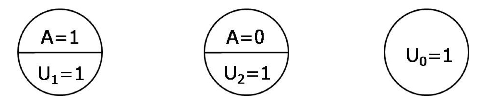
```

--
.med[
- When there are 2 dichotomous treatments $A, E$
]

```{r echo=FALSE,  dpi=335, fig.align='center'}
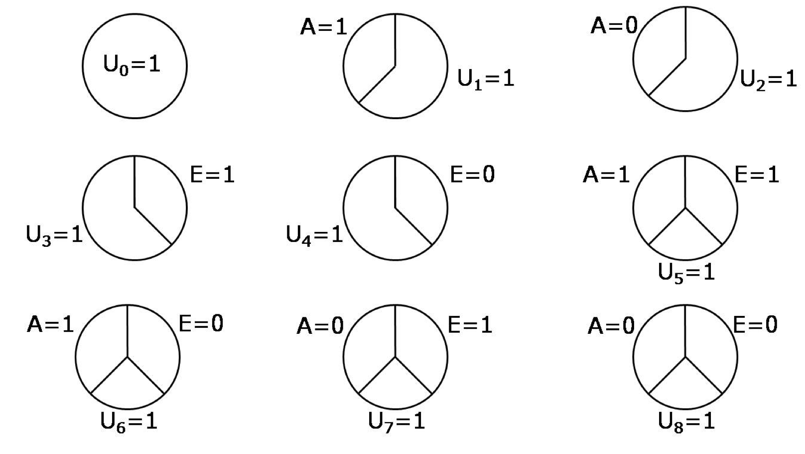
```

???

1. by treatment A (treatment E is irrelevant)
2. by the absence of treatment A (treatment E is irrelevant)
3. by treatment E (treatment A is irrelevant)
4. by the absence of treatment E (treatment A is irrelevant)
5. by both treatments A and E
6. by treatment A and the absence of E
7. by treatment E and the absence of A
8. by the absence of both A and E
9. by other mechanisms (both treatments A and E are irrelevant)

---

### Sufficient cause interaction

.med[
- Interaction within the sufficient-component-cause framework
]

--
.med[
- A sufficient cause interaction presents if $A$ and $E$ **occur together** in a sufficient cause. 
.small[
$\star$ example: individuals with background $U_5 = 1$ will have $Y = 1$ when receiving both treatments $A,E$; but will have $Y=0$ when receiving only one of the two treatments.
]
]

--
.med[
- Sufficient cause interaction can be either synergistic or antagonisic
    - **Synergistic**: $A = 1, E = 1$ presents in the same sufficient cause 
    - **Antagonistic**: $A = 1, E = 0$ or $A = 0, E = 1$ in the same sufficient cause
]

---

### Counterfactuals or sufficient-component causes?

- **Counterfactual framework** and **sufficient-component causes framework** address different questions. 

- Counterfactual framework: <br> what happens?

- Sufficient-component causes framework: <br> how does it happen?


---
class: center, inverse, middle

# Chapter 6 <br> Graphical representation of causal effects

---
class: top

## Outline

- Causal diagrams

- Causal diagrams and marginal independence

- Causal diagrams and conditional independence 

- Structural classification of bias

- Structure of effect modification

---
class: top

## Causal diagrams

```{r echo=FALSE,  dpi=200, fig.align='center'}
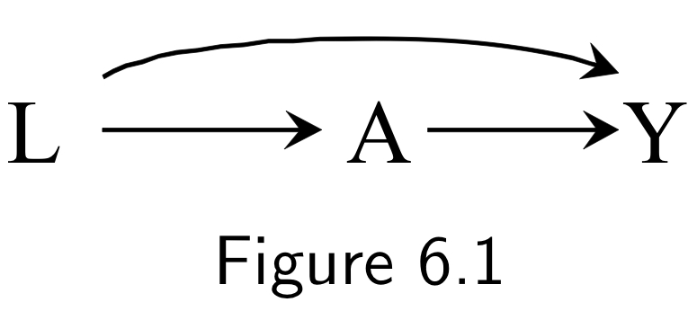
```

.small[
- 3 nodes (random variables): $L, A, Y$
- 3 edges (arrows): from left to right, $L$ (disease severity), $A$ (heart transplant), $Y$ (death).
- Arrow means that there is a direct causal effect between the two nodes.
- No arrow between nodes means that we believe there is no direct causal effect.
- Arrow from $L$ to $A$: disease severity affects the prob of receiving a heart transplant
- It is known as "directed acyclic (= no cycles) graphs, DAGs"
]

???

- A standard causal diagram does not distinguish whether an arrow represents a harmful effect or a protective effect.

---
class: top 

### Conditionally or Marginally Randomized experiment? 


.pull-halfhalfleft[
```{r echo=FALSE,  dpi=250, fig.align='center'}

```
<br>
<br>
```{r echo=FALSE,  dpi=380, fig.align='center'}
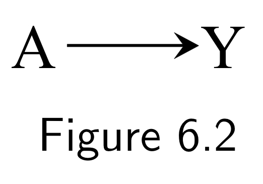
```
]

.pull-halfright[.small[
- Conditionally randomized experiment: 
    - Randomly assign $A$ by different prob depends on $L$ (severity) 
    - $L$ is a common cause of $A$ and $Y$
    - common cause needs to be included in DAG

- Marginally randomized experiment:
    - Randomly assign $A$ regardless of $L$
    - $L$ is not a common cause 
    - $L$ can be excluded from DAG
]]


---
class: top

#### Assumptions for observation study setting
```{r echo=FALSE,  dpi=250, fig.align='center'}

```

.med[
- This figure may also represent an observational study, assumptions in this figure include: 
  - $A \rightarrow Y$ causal relation
  - $L \rightarrow A$ causal relation
  - $L \rightarrow Y$ also causal relation
  - $L$ is the only common cause for both $A,Y$
  
$$Y^a \perp \!\!\! \perp A |L = 1 \forall a$$
]

???

- can be translated into conditional exchangeability assumption


---
class: top 

## Causal diagrams and marginal independence - follow your intuition
```{r echo=FALSE,  dpi=300, fig.align='center'}

```

.small[
- We know that use of aspirin $A$ can prevent heart disease $Y$
- This figure means we can design an RCT in which aspirin $A$ is randomly, unconditionally assigned

$$\text{Pr}[Y^{a = 1} = 1] \neq \text{Pr}[Y^{a = 0} = 1]$$
- Our intuition tell us that $A$ and $Y$ are "associated"
]

---
class: top

## Causal diagrams and marginal independence - follow your intuition

```{r echo=FALSE,  dpi=250, fig.align='center'}
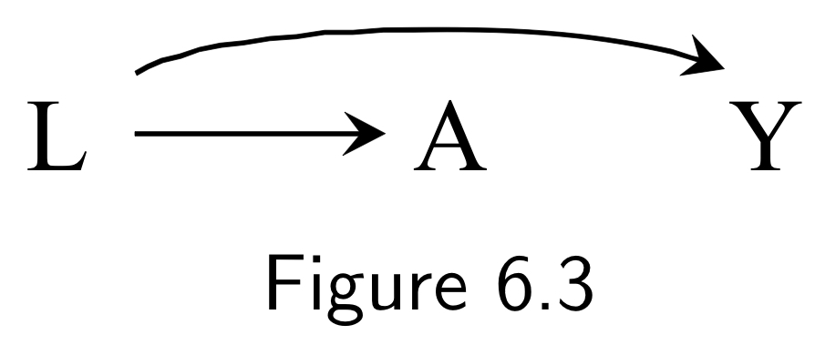
```

.small[
- We know that carrying a lighter $A$ has no causal effect to lung cancer $Y$ 
    - There is no arrow between $A$ and $Y$
- But smoking $L$ has causal effect on both $A$ and $Y$

$$\text{Pr}[Y^{a = 1} = 1] = \text{Pr}[Y^{a = 0} = 1]$$

- However, our intuition also tell us that $A$ and $Y$ are "associated"
]


---
class: top

#### Why do we feel that $A$ and $Y$ are associated?

```{r echo=FALSE,  dpi=250, fig.align='center'}

```

.small[
- If we conduct a study to see the effect of "carrying a lighter" $A$ on the risk of "lung cancer" $Y$
- We could ask whether they carry lighters, and follow a large cohort to see the difference of lung cancer risks among the two groups. 
- Because carrying lighters $A = 1$ might indicates that someone is probably a smoker $L = 1$, and they could higher risk of lung cancer.

$$\text{Pr}[Y = 1 | A = 1] \neq \text{Pr}[Y = 1 | A = 0]$$


- Our intuition is probably correct.
]

---
class: top 

### Prediction $\approx$ Association 
```{r echo=FALSE,  dpi=250, fig.align='center'}

```

.small[
- Having information about $A$ (carrying a lighter) improves our ability to **predict**  the outcome $Y$ - lung cancer.

- But we will make a mistake if we conclude that carrying lighters $(A)$ will cause lung cancer $(Y)$ just because they are associated.

- So this figure actually confirms our intuition. 
    - $A$ and $Y$ are associated because there is a flow of association from $A$ (through $L$) to $Y$
]

---
class: top

### Collider 

```{r echo=FALSE,  dpi=200, fig.align='center'}
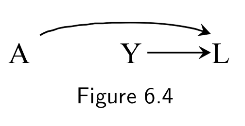
```
.small[
- We know that some genetic haplotype $A$ has no causal effect to whether people will become a smoker $Y$.
    - There is no arrow from $A$ to $Y$
- But both genetic haplotype $A$ and smoking $Y$ have causal effect on the risk of heart disease $L$.
    - $L$ is the **common effect** of $A$ and $Y$ - a **collider** between $A$ and $Y$ 
    
    $$A\rightarrow L \leftarrow Y$$
]


---
class: top

### So are $A$ and $Y$ associated?


```{r echo=FALSE,  dpi=200, fig.align='center'}

```

.small[
- If we conduct a study to look for effect of haplotype $A$ on the risk of becoming a smoker $Y$. 
- We could recruit a lot of children and check if they have haplotype $A$ or not, and follow them to see if their risk of becoming a smoker $Y$ is different.
- But knowing that someone has (not) the haplottype $A$ does not help improving our ability to precdict the outcome $Y$. 

$$\text{Pr}[ Y = 1 | A = 0] = \text{Pr}[Y = 1 | A = 1]$$
- Our intuition tell us that they are not associated (blocked by the collider): $A \perp \!\!\! \perp Y$

]


???

- The knowledge that both A and Y cause heart disease L is irrelevant when considering the association between A and Y. (because the collider blocks the association)


---
class: top

## Mediator


.pull-halfhalfleft[
```{r echo=FALSE,  dpi=380, fig.align='center'}

```
<br>
<br>

```{r echo=FALSE,  dpi=200, fig.align='center'}
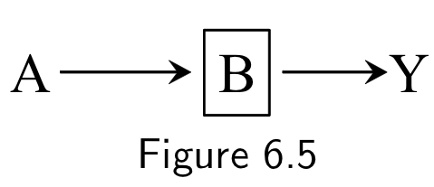
```


]

.pull-halfright[.small[
- We expect that use of aspirin $A$ and heart disease $Y$ are associated
    - because we know that aspirin $A$ has a causal effect on heart disease $Y$
    
- Now suppose that we have more information.
    - Aspirin $A$ reduced platelet aggregation $B$ and therefore can reduce the risk of heart disease $Y$
    - This $B$ is a **mediator** between $A$ and $Y$
    
    
  - When we have more information about $B$, can it improve our ability to predict $Y$?
]]


---
class: top

### Mediator - conditional independence 


```{r echo=FALSE,  dpi=200, fig.align='center'}

```

.small[
- We can conduct a study to collect these three variables from a large number of individuals.
- And restrict the analysis to subset of $B$, for example:
    - individuals with low platelet aggregation $B = 0$;
    - individuals with high platelet aggregation $B = 1$
]

--
.small[
- In fact, individuals with low platelet aggregation $B = 0$, have lower than average risk of heart disease $Y$
    - For people with $B = 0$, regardless of his/her treatment $A$, we already know that his/her risk of heart disease is low.
    - $A$ and $Y$ are conditionally independent (unassociated) given $B$
]


---
class: top

### What if we condition on the common cause?


.pull-halfhalfleft[

```{r echo=FALSE,  dpi=300, fig.align='center'}

```
<br>
<br>

```{r echo=FALSE,  dpi=200, fig.align='center'}
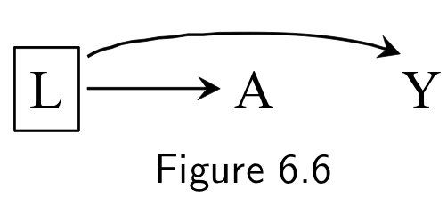
```


]

.pull-halfright[.small[
- whether carrying a lighter $A$ is associated with lung cancer $Y$, condition on the common cause - smoking status $L$?
    - When we know that someone is a smoker $L = 1$, does the information about carrying a lighter $A$ predict the risk of lung cancer $Y$?
    
- If we restrict study to smokers $L = 1$.
    - Regardless of carrying a lighter or not, risk of lung cancer is high.
    - When we know smoking information, carrying lighter or not is not important anymore. 
    
]]


---
class: top

### What if we condition on the collider (common effect)?


.pull-halfhalfleft[

```{r echo=FALSE,  dpi=200, fig.align='center'}

```
<br>
<br>

```{r echo=FALSE,  dpi=200, fig.align='center'}
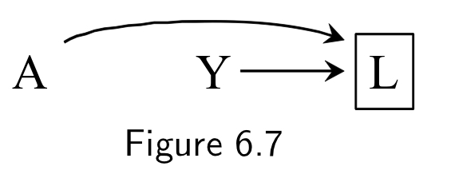
```


]

.pull-halfright[.small[
- $A\rightarrow L \leftarrow Y$, heart disease $L$ is the common effect (collider) of haplotype $A$ and smoking $Y$
    - we concluded that collider blocks the association, $A \perp \!\!\! \perp Y$

- We can restrict study to individuals who have heart disease $L=1$
    - Knowing that someone had a heart disease $L= 1$, we then know that he/she might be a smoker $Y = 1$, and he/she might not have the haplotype $A=0$
    - $A, Y$ are now **inversely associated**.
]]

???
- conditioning on a collider, opens the association that was blocked. 
- out intuition might be, two causes of an outcome (event) might not associated, but when we know the outcome, the two causes will become as if they are associated.

---
class: top

### What if we condition on the consequence of a collider?

```{r echo=FALSE,  dpi=200, fig.align='center'}
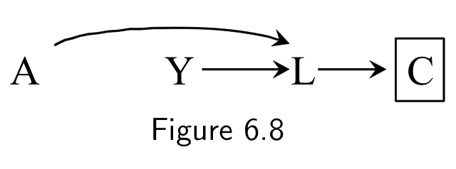
```

.small[
- When patient is diagnosed with heart disease $L = 1$, he/she will be prescribe with a drug $C$

- So knowing that someone is taking the drug $C$, indicates that he/she might already be diagnosed with heart disease, $C$ is also a common effect (collider) between $A$ and $Y$

- Conditioning on the consequence of the collider also opens the path $A\rightarrow L \leftarrow Y$, and show a possibly "fake" association.
]


---
class: top, center
background-image: url("./fig/Fig6_2_8.png")
background-position: 50% 50%
background-size: contain

???

- So the asociation between A and Y can be organized in a table like this one.


---
class: top

## Structural classification of bias


```{r echo=FALSE,  dpi=300, fig.align='center'}

```

.small[
- Common causes: When treatment and outcome share a common cause, the association effect generally differs from the effect measure. This is called **confounding bias**.
]


```{r echo=FALSE,  dpi=200, fig.align='center'}

```

.small[
- Conditioning on common effects: this is often called **selection bias**.
]


---
class: top

## Structure of effect modification

```{r echo=FALSE,  dpi=200, fig.align='center'}
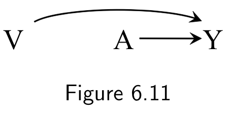
```

.small[
- We want to see whether the causal effect of heart transplant $A$ on mortality $Y$ varies by the quality of medical care $V$.
- However, this figure cannot help us to distinguish different situations about effect modification:
    - causal effect of $A$ on $Y$ in the same direction for stratums $V = 0/ V = 1$
    - causal effect of $A$ on $Y$ in the opposite direction for stratums $V = 0/ V = 1$
    - causal effect exist in only one stratum of $V$.
]


---
class: top, center
background-image: url("./fig/DAGIEApubmed.png")
background-position: 50% 50%
background-size: contain
